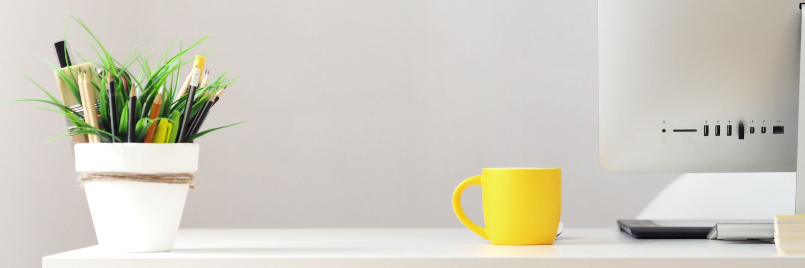

# Motivate yourself

If there was a magical button that would make a smoker stop smoking or the obese get in shape, most of them would press it. Yet most people don't change their behaviour. Motivation is the skill of changing your behaviour. It is the superpower that can give you a lean body, a sharp mind and great satisfaction.

**Principles for self-motivation**
- Step 1: quantify your goals
- Step 2: write down the reward & punishment
- Step 3: create a path of least resistance
- Step 4: set up accountability
- Motivation is not a feeling
- Inspiration is temporary
- Defeat procrastination

**In this chapter**

- Why you can't rely on 'feeling motivated'
- How to use your emotions in your favour
- Creating trackable goals
- Making it fun to keep going and painful to stop
- How I used a local spa as a study room

## Step 1: quantify your goals

Good goals can be measured in a clear way. The goal "I want more money" is not a good goal. If I give you a cent/penny it will be fulfilled. A good financial goal is "I want to have an investment portfolio worth €400,000".

Measurable goals are key for motivating yourself for 2 reasons:

- They make the finish line clear
- They allow you to track your progress

Depending on your nature, you can either gently track your progress or go nuts on it. Tracking your weight by the week, for example, is fine for some people who want to shed fat. I know of others who measure twice daily on a smart scale and use the resulting graph in the accompanying app as motivation.

## Step 2: write down the reward & punishment

Regardless of what you want, there is great power in expressing why you want something as well as the price of not achieving it. Say, for example, you want to learn a new language.

You want this because:

- It will make you feel smart
- You know your friends will think highly of you
- The people in your favourite holiday country will appreciate you for speaking their language
- You will feel like you proved wrong your cousin who said you can't do it

If you fail to complete the challenge:

- You will feel mediocre
- Your friends will think you are a quitter
- The people in St. Holiday will think you another dumb tourist
- Your cousin will hold this over your head

By expressing these things clearly and reminding yourself of them you can create motivation. Whenever it's the end of a long day and you don't want to do your daily language practice, imagine how you will feel when you achieve it, and imagine the face of your cousin as they will laugh at your failure.

## Step 3: create a path of least resistance

Another step in motivating yourself is to make the right path the easiest path to choose. That involves two parts:

1. Making it pleasurable to do the task
2. Making it painful not to do the task

Take the writing of this book, for example. I took concrete steps to make writing it more pleasurable. For me, that meant writing it in a markup language called Markdown in a writing program called Byword.

Likewise, I took steps to make it painful not to progress. I sent my blog readers and friends an email asking them to join a mailing list that would remind them on a weekly basis to check whether I made 7 updates to my book that week. I specifically asked them to publicly shame me on social media if I didn't make it and to give me kind words if I managed.

This meant that writing this book was pleasurable and gave me a weekly boost of 'I made it!'. Likewise, not updating my book 7 times carried the pain of being judged by people I care about, my friends and readers.

There are many things to make your desired task easier, and not doing it too painful to consider. Find what makes you happy and make it a reward, find what makes you uncomfortable and make that a punishment.

## Step 4: Set up accountability

An important key in the above is accountability. Humans are very sensitive to negative stimuli. By our nature, we fear loss more than gain appeals to us. This is referred to as the human tendency of loss aversion[^See Wikipedia entry on [Loss Aversion](https://en.wikipedia.org/wiki/Loss_aversion)]. For example, consider two scenarios:

- You receive €10 for no reason
- You receive €20 for no reason and later that day someone steals €10 from you

From experiments, we know that the first scenario makes people happy, whereas the second makes them very unhappy.

Likewise, consider:

- You avoid having to pay €5 for a meal
- You paid the meal earlier but someone gives you €5 later

In experiments on humans, the first one makes us much happier.

Of course, there are exceptions, but in most situations humans **hate losing** more than they **like winning**. For motivational purposes, it is often incredibly effective to set up monetary accountability like:

- **If you fail:** an automated donation to a charity you hate. See the [Stickk](http://www.stickk.com/) website where you appoint an honest but stern friend to keep track of your progress
- **A betting pool:** where a number of people commit money (small amount, but painful enough if you lose it) to sticking to a new habit and those who make the deadline get rewarded with the money of those who don't
- **Whatever works for you:** you could take the route of a blogger called Maneesh Sethi and [hire someone to slap you in the face](https://www.huffingtonpost.com/2012/10/18/maneesh-sethi-blogger-hires-craigslist-slapper-to-hit-him-unproductive_n_1980274.html) if you don't stick to your intention.

Humans being social animals, one of the most powerful influences on us is the judgement of others. Embrace that part of our psychology and turn it to your advantage:

- For habits in groups. Get some friends together and hold each other accountable
- Have friends/family keep track of you and either shame/support you based on progress

## Motivation is not a feeling

Motivation is the expression of one simple question: why are you doing this? Consider an extreme thought experiment where a psychopath holds a gun to your head and tells you to burn down your house. Assuming you are sane and choose your life over your house, what motivated you to comply? Did you simply "feel motivated to burn down the house that day"? No, there was a cue in the outside world that gave you a reason, a motivation to do something. This motivation was not a randomly arising feeling. It was the result of many factors, including the gun to your head.

More realistic scenarios like getting work done are no different. You can't rely on motivation to strike you, it is up to you to engineer the environment that will help you stick to your goals.

Motivation can take many forms. Many people split these into intrinsic and extrinsic motivation. Where intrinsic motivation is 'I want to do this because I like it' and extrinsic motivation is 'my friend will give me a cookie if I do this'.

I don't care much for that distinction. It's quite arbitrary. In my view, both are a case of "if I do X I am rewarded with Y". In the case of intrinsic motivation, the Y is simply a feeling instead of a thing. So what I've found a more effective perspective is emotional versus material motivation.

Emotional motivation is a form where you do something to gain or avoid a feeling. Like working out because it makes you feel better about yourself. Material motivation is a form where you will get an object in return for your action. For example, getting paid in cash for washing a car.

Emotional motivation is the most powerful type. It is the desire to feel some things like pleasure, pride and satisfaction or to avoid feelings of pain, insecurity and fear. Motivation is not a feeling. It is a desire to create a certain outcome. Maybe the outcome you desire is not being shot by a psychopath, maybe you want someone to respect you.

Either way, motivating yourself is about making clear to yourself what reward you seek and to keep in mind how badly you want that reward. In my humble opinion, that reward is most effective when it has a strong emotional component.

## Inspiration is temporary

You know those moments (or even days) when you feel this emotional drive to get things done? Most people mix up this feeling of inspiration with motivation. Inspiration is the spark you feel when watching an inspiring movie, listening to inspiring music or whatever gets you going. Motivation is a force that gets you to do something, regardless of what or how you feel.

If you feel inspired to lose weight, for example, that is not the time to go for a workout. That is the time to plan your workouts for the coming 3 weeks and set up accountability measures.

Inspiration is fickle and temporary. You can't rely on it. If you wake up tomorrow and don't feel inspired, that would mean you could get nothing done that day.

The fact of the matter is that self-motivating people don't feel inspired all the time. They get things done regardless of how they feel. Through discipline and self-management. This is easier than it sounds, especially if you harness feelings of inspiration to set up motivational structures.

## Dealing with procrastination

You know what happens when humans feel overwhelmed? We freeze. It's fight-flight mode from there. This leads to the common occurrence of procrastination. But guess what, doing things later still means they are the same things.

The key to overcoming this is threefold:

- Break the problem down into smaller goals
- Start for 5 minutes and allow yourself to quit
- Make common procrastination tools unavailable

Breaking the problem down sounds simple but is incredibly powerful. Wanting to learn conversational Spanish can seem very overwhelming, for example. But if you research your options you can find concrete ways of breaking down this problem. In this instance, you might break it down into doing 1 lesson from the Michel Thomas series on Spanish a day.

The second is the most ridiculous superpower. For most people, keeping going with a task is not all that hard, but starting is. If you find yourself shying away from a task, tell yourself:

> I will do it for 5 minutes. If I don't want to keep going after, I am allowed to stop.

Nine out of ten times those 5 minutes are all you need to get into a flow that will carry on for a good hour. This goes for work tasks, but also, for example, household tasks.

The last and final ingredient is to make procrastination tools unavailable. It is like the above paragraph on the path of least resistance. If you know that your house has too many distractions, go to work in a cafe. If you are on social media a lot, get a browser plugin that blocks them during certain hours. Make it easy to do the right thing and hard to do the wrong.

## Getting started

Especially when you are used to low levels of motivation, getting started can seem quite daunting. The key to gaining momentum is to start small and snowball from there. The most important principles in this chapter with regard to getting started are:

1. Quantify a small but specific goal
1. Set up the path of least resistance
1. Start for 5 minutes

You are welcome to optimise much further using the other principles, but the above is enough for you to get started 5 minutes from now. Let's say you want to get better at studying:

1. Decide you want to spend 30 minutes a day deeply focussed on studying
1. Choose the right environment, for example, a library, and disable distractions like phone notifications and other things you know yourself to have a weakness for (social media? Netflix? News?)
1. Decide you will go for 5 minutes and if after those 5 minutes you can't do it, give yourself permission to go home

There is of course much more you can do, from a study buddy to betting money that you can do this. The above, however, should be enough of a start to help you develop your motivational structures further.

Another common example is doing exercise:

1. You want to do 30 minutes of exercise 2 times a week
1. You choose a sports facility close to your home and ask one of the employees there to hold on to €50 and that they can keep it if you don't show up on Tuesday and Thursday
1. On those two days, you show up and start your workout, with permission to go home if after 5 minutes you are not feeling it

Both of these instances have a very high chance of success. The key to getting started is to make the goals relatively small (this is specific to you) and to give yourself permission to stop. In practice, you will probably get in a flow and easily make your goal. If you sit down in a library and open a book for 5 minutes, you will easily lose track of time and spend 30 minutes. Likewise, being in a gym and doing your 5-minute warmup will put you in the mindset to keep going.

## Using a spa as a study room

Throughout university, I would often find myself naked and sweating preparing for tests. You see, 5 minutes from my house there was a new spa that was usually empty during the day. I had negotiated a favourable unlimited access deal with the owner and would come there often with printed out summaries of my courses. Studying for tests was incredibly relaxing. I'd rotate between sessions of Finnish sauna, cold plunge baths, whirlpools and reading the study materials for whatever test I was taking.

I had come to the conclusion that motivation shouldn't be hard per se. Sure, there are mornings where you want to stay in bed, but progressing towards goals shouldn't be a struggle that makes you feel unhappy. Creating the path of least resistance for me meant eliminating distractions and making studying as easy as possible. To achieve that goal, I tried to construct:

1. A distraction-free study environment
2. Effective learning materials

The first came in the form of the sauna complex. No technology was allowed inside, so all I could bring were printed study materials. In addition, the ambience was one of silence and relaxation.

The learning materials was a different challenge. I knew I liked reading summaries but did not like creating them as much. This hurdle was solved by splitting the burden of summaries amongst my fellow students.

The years prior to university had been a struggle of trial and error. Some of the things I tried to motivate myself worked well. I still attribute my drive to graduate high school with good grades to a photoshopped copy of my diploma to be hanging in my room. Some things did not work as well, like taking a quick break to watch an episode of Doctor Who. Great show as it was, 10 minutes usually turned into an hour or more, and I didn't feel more motivated afterwards.

I soon learned that there were two aspects to motivating my personal psyche. Step 1 was getting started, step 2 was keeping going. I stopped looking at motivation as an external force, but rather saw it as a state you can create. It's like relaxation. Sure, sometimes it is easier to reach than other times but there are always actions you can take to reach that state.

This was for me the biggest turning point. Once I acknowledged that motivation was not a force that comes and goes but a choice, life became a lot easier. It also prompted me to read the writings of others who had written on the subject. Mostly this came down to bloggers and the odd book or two. Most of it was fluff, but the basic rules were similar in all of them.

At this point, I feel in control of my own motivated state. That is not to say that I always manage to motivate myself to do things. But when I fail, I can trace back the cause very clearly and choose to take steps to prevent it from happening again.

An example of this is my daily exercise routine. It works great when I'm at home, but is harder to maintain when I travel. Nine out of ten times this is due to it being harder to get started. The excuses are easy: There is no space, I have to get to the next event, I'll do it later.

The solution is to simply look back at the principles. Create a path of least resistance and then follow it. In hotels, that means that as soon as I get in I move around furniture so that there is space for push-ups and handstands. When I feel resistance to get started I decide to do only half the workout. In the worst case, some workout beats no workout, but usually I end up doing the full thing anyway once I get started.

You'd think that this is all quite a lot of work. But it doesn't take up all that much energy. It's actually the case that once you make sure you facilitate the right circumstances to get motivated, you expend less energy. Don't forget that failing to do what you want to do has an emotional price.
