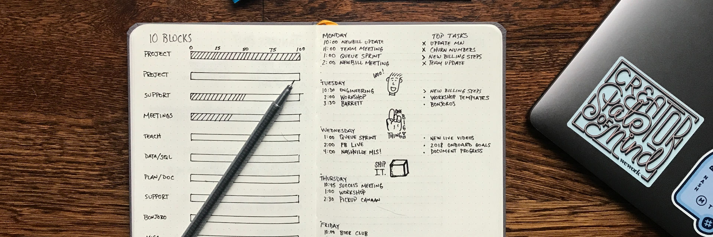
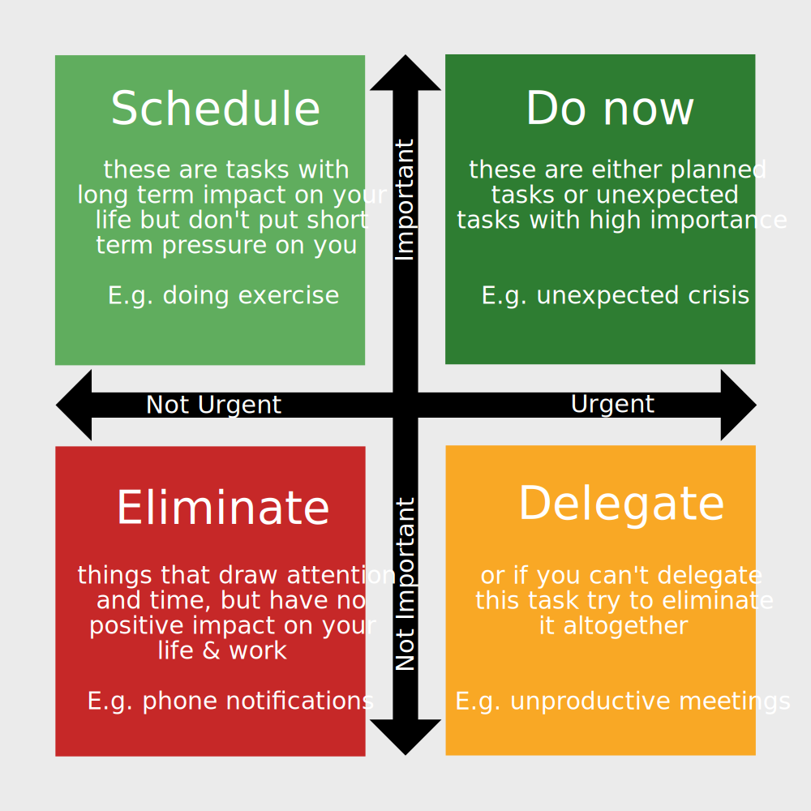

# Work productively and effectively

Productivity is not about working harder, it is about doing more with less effort. Some people use it to move mountains of work, others use it to free up time for more leisure time. There really is no downside to being able to work productively.

**Principles to work productively**

1. Prioritise effectiveness over productivity
1. Assign no more time than you need
1. Prioritise based on urgency and importance
1. Collaborate and delegate where possible
1. Automate everything possible

**In this chapter**

- Automation tools you can use to let machines do your work
- Finding the 20% of tasks that generate 80% of output
- Why you never finish far ahead of a deadline
- President Eisenhower's prioritisation process
- "Everybody wins" scenarios in collaboration
- How I went from hating structure to thriving on it

## Prioritise effectiveness over productivity

Imagine you are on a little boat with a hole in it. You could spend your energy on finding the best bucket to remove water from your vessel. This kind of optimisation is productivity, the optimisation of doing a certain task faster. You could instead also take a moment to think and instead decide to plug the hole. This is called effectiveness, the optimisation of an outcome by choosing the right task.

Many people are very good at optimising their productivity, but fail to spend time first deciding what tasks are effective to the extent that they deserve your attention. Even if you do them slower, choosing effective tasks will help you beat hyper-productive but ineffective people.

**80/20 principle**

A helpful principle to keep in mind is the Pareto principle, also known as the 80/20 rule. It observes that in many cases 20% of input is responsible for 80% of output. For example, with 20% of words in a language, you can have 80% of conversations. 20% of customers generate 80% of profits for a business. And indeed, 20% of tasks result in 80% of the effective outcome.

The following questions will help you prioritise doing the right things (effectiveness), rather than doing the wrong things more quickly (productivity).

- Is there any task that will make other tasks obsolete? Start there.
- Which of my tasks will affect me long term? Do them first.
- Can I drop any tasks without serious consequences? Excuse yourself from them.
- Are there any tasks that don't require my expertise? Outsource or delegate them.

**5 Why's**

An important element to choosing your tasks effectively is taking time to reflect what you are truly trying to achieve. Taiichi Ohno, who revolutionised the Toyota Production System back in the day, is attributed the technique of asking 'why' five times in order to get to the root of a problem. For example, let's say the problem you are diagnosing is that you spend too much time on managing emails:

- Why? Because I have emails to reply to.
- Why? Because I get a large volume of emails.
- Why? Because I am the only one in the company who knows how to do X.
- Why? Because there is no other person or resource that can solve X.
- Why? Because I haven't taken the time to either write down my knowledge or train someone else.

Your conclusion from this might be to either 1) hire another person or 2) write an internal document detailing the things you are often asked about.

## Assign no more time than you need

Parkinson's Law states that "Work expands so as to fill the time available for its completion"[^Supposedly it is modelled after the fact that a gas will fill any space you allow it to, see [Wikipedia](https://en.wikipedia.org/wiki/Parkinson%27s_law)]. While this principle started as part of a comedy piece, it rings true. If you give yourself a week to finish writing a piece, it will take a week. If you give yourself a month, it will only be done in a month.

Don't give tasks more time than they need. I recommend formulating how much time you allocate to a task based on how much time you:

- Think you need
- Are at most willing to spend

For example, set a 30-minute timer to process your email inbox, or setting yourself deadlines for larger assignments.

## Prioritise tasks based on importance and urgency

"I have two kinds of problems, the urgent and the important. The urgent are not important, and the important are never urgent."  ~ Dwight Eisenhower

When it comes to tasks that have a significant impact on your life and happiness they tend to be important but not urgent. By using a matrix based on Eisenhower's quote you can prioritise the things that really matter.

This is the Eisenhower Matrix:

It might take some time getting used to, but it pays off to take 5 minutes in the morning to look at your plans for that day and to apply the matrix.

## Collaborate where possible

With every task, ask yourself: are more people doing this? If the answer is yes, organise a collaboration to eliminate duplicate work. It also pays off to check if someone else already started a collaboration, for example, online. No area of your life is off limits. Work, household, recreational clubs and so on. Approaches I like:

- **Find checklists:** no matter what kind of job you have, there is most likely someone out there on the internet who created a useful checklist. I personally find more than one checklist and combine them together. This technique works best for well-defined tasks like [marketing a blog](https://duckduckgo.com/?q=blog+marketing+checklist), [travel](https://duckduckgo.com/?q=travel+checklist) or [planning a meeting](https://duckduckgo.com/?q=meeting+checklist)
- **Look for summaries:** you can check with people around you (colleagues/friends) but often the internet is a more reliable option. From [book summaries](https://duckduckgo.com/?q=7+habits+of+highly+effective+people+summary) to [the second world war](https://duckduckgo.com/?q=second+world+war+summary), there are summaries for almost anything.
- **Best practices:** is more common in professional spheres than personal. Regardless of your industry there is likely a person/company/government that published a best practices document. Examples include [driving](https://duckduckgo.com/?q=driving+best+practices) and [programming](https://duckduckgo.com/?q=programming+best+practices).
- **Common mistakes:** doing something well is sometimes just avoiding messing up. You'd be surprised what people write about online. From [cooking mistakes](https://duckduckgo.com/?q=cooking+common+mistakes) to [losing weight](https://duckduckgo.com/?q=weight+loss+mistakes) to [studying](https://duckduckgo.com/?q=studying+mistakes), it's out there.

While collaboration might not have the exact outcome as you doing the work personally, often the result is good enough. If you surround yourself with fantastic people, the result will be better than what you could have made on your own.

Note that you shouldn't care about freeloaders who leech off of your work but don't contribute. Purely look at your own outcome. If working together saves you 50% of time, who cares that someone who didn't do anything benefits. You are better off now than before, that matters.

Consider an example of a college student named Robin, taking a course called Contemporary World History, a course being taken by 100 students at the same time. Robin puts out a call online for everyone to collaborate on writing a summary of the whole 8-week course using a Google Docs document. 10 people end up actively contributing to the creation of this master summary. After the creation, 80 students used the document to prepare for the exam. Is this unfair? That is the wrong question. Robin now:

- Saved 90% of study time by sharing the workload of summarising
- Had high-quality study materials because 10 people reviewed each other's summaries
- Gained a reputation of being a helpful person

Note also what the large group of freeloaders did not:

- They didn't cost any time
- They didn't cause a decrease in outcome (good grade)

There are only upsides. Many of us have been trained to feel bad about freeloaders. Let go of this feeling. You will save time, build a reputation and build productive relationships.

## Automate everything possible

Every task you complete should be subject to the question of whether you can automate it, or make it faster in the future. After a while, these automations will allow you to spend more time on things that matter.

When it comes to investments in equipment, do the math. For a €200 dishwasher for example:

- It saves you 20 minutes a day
- Over a year that is 121.67 hours
- Is your time worth more than 200 / 121.67 = €1.64 an hour?

Look at the big picture. 5 minutes saved in a daily task is 30 hours per year or about 4 full-time work days.

Little things matter.

**Text expander**

If you type the same thing a lot, use a text expander like [aText](http://www.trankynam.com/atext/) (Mac) or [PhraseExpress](http://www.phraseexpress.com) (Windows) to automatically type things with shortcuts. When I type $bank, for example, my keyboard automatically types my bank account number. $plan types a standard invitation to have a Skype meeting.

**Clipboard manager**

Use a clipboard manager like [Copy'em Paste](https://itunes.apple.com/us/app/copyem-paste-clipboard-mgr/id876540291) (Mac) or [ditto](http://ditto-cp.sourceforge.net) (Windows) to save everything you copy. Very useful if you copy-paste text a lot and want to avoid accidentally losing what you copied.

**Backup and sync**

Make sure that all your useful documents and files are backed up using a service like [Dropbox](https://www.dropbox.com), [Google Drive](https://drive.Google.com/) or [Onedrive](https://onedrive.live.com). This synchronises files across devices so you always have up to date versions everywhere and it makes sure that if your devices stop working your files are fine.

**Pocket**

If you read articles and/or blogs a lot use [Pocket](https://getpocket.com/) to save articles into a reading stack. The articles save to your e-reader (Kindle/Kobo/tablet) as well. I use this to save articles I find and want to read at a later point.

**Window orientation**

Having two windows on your screen side by side is very useful, for example, a note-taking app on the left of your screen and a document you are reading on the right. On Windows, press the Windows button plus an arrow key to align screens automatically. For Mac, download an app called [Divvy](https://mizage.com/divvy/).

**Screen colour**

[Flux](https://justgetflux.com) (Mac/Windows) reduces the blue light coming from your screen when the sun sets. This prevents your screen from messing with your sleep cycle. Pair with automatic screen brightness for full effect. Android and iPhone systems also have a night mode. If you want to go diehard, I personally use [CF.lumen](https://play.Google.com/store/apps/details?id=eu.chainfire.lumen) to turn my screen red at night using Tasker (see below).

**Robot vacuum**

Having a daily cursory clean of your floor saves quite a bit of time in cleaning the house. I like to run mine an hour before I wake up. You can get [cheap €50 ones](https://www.aliexpress.com/wholesale?SearchText=robot+vacuum+cleaner) from China or go for more premium models like the [Roomba](http://www.irobot.com/For-the-Home/Vacuuming/Roomba.aspx) series. The differences lie in how smart they are. The cheap ones randomly run around and will probably clean most of your floor whereas the newer ones generate a map of your house and clean it strategically.

**Generalised automation tools**

There are lovely non-code tools out there that will allow you to set up workflows. My two favourite tools are [IFTTT](https://ifttt.com) and [Tasker](https://play.Google.com/store/apps/details?id=net.dinglisch.android.taskerm).

The free IFTTT (and paid Zapier) can be used to link cloud services. Think automated backups of your Facebook pictures to Dropbox, or getting a text message when you get an email with a certain keyword.

Tasker is an Android-only automation tool that lets you use anything in your phone as a trigger. Putting your phone on silent when you put it in your pocket, going into airplane mode when you leave the country, and so on.

## Getting started

The core of this chapter is to prioritise effectiveness, in other words, to choose your tasks well rather than doing them quickly/efficiently. A slow worker doing important things all day will outperform someone who replies to menial emails with superhuman speed. Combine this with an urgency and importance rating and you will do infinitely better.

The specifics below might not apply to your line of work, but the same principles apply. To get started:

1. Make a list of things you do on a daily/weekly basis or use [Rescuetime](https://www.rescuetime.com) to automatically diagnose (at least your digital) behaviour.
1. Rate the things on that list as (un)important as defined by 'will this activity impact my life 2-8 weeks from now' and (not) urgent as defined by the deadline
1. Looking at this list, find the things that generate the best results (e.g. 2 hours of email resulted in nothing tangible, half an hour writing/programming/painting resulted in measurable output)
1. Schedule a lot of time in your day to the things that are important and generate the most output

Many people fear that taking time away from unimportant things will break their day. "But I can't just ignore email!" and "these tasks are really urgent!" are common responses. The fact of the matter is that this is simply how you have been conditioned. Interestingly, when you stop focussing on urgent things you will come to realise that they don't matter as much.

For example, many people report great results from opening their email only once or twice a day at set times. Some (including me) even add a line in their email signature stating at what times they open their email so other people know what to expect.

Structurally important tasks always outperform urgent busywork. 

After you get your priorities in order, start incorporating automation and collaboration into your routines. It is likely that you will notice the busywork you once found so urgent is often a ripe target for automation.

## My journey to productivity

People who know me now would never guess how teenage me was. On multiple occasions, I showed up to trampolining competitions in a different country without my gear. Likewise, I never knew where to find school notes older than a week or so.

I remember my English teacher trying to persuade me to keep structured records and showcasing her cupboard filled with filing cabinets and folders. Back then the prospect of such a rigid structure horrified me.

Teenage me was cursed with fortunate circumstance. My genetics and parents had unwittingly instilled me with systems thinking (seeing the relation between things), though I didn't call it that at the time. This systems thinking meant I never memorised things (which is why I failed at languages) and instead built intuitive networks of principles in my mind. This created a reality where:

- I could function perfectly fine without structure
- Those who applauded structure didn't understand systems, so I dismissed them

Only later did I discover for myself that systems thinking and structured thinking (having a predefined thinking process) were two powerful tools that when combined well create new worlds of possibility. The transition for me started when I failed a grade in high school.

17-year-old me was very upset at being forced to redo a year because of a mediocre grade in Dutch. I had been clashing with close-minded teachers who didn't want to answer my questions. Specifically, one question: "but why?" All except my biology teacher who always answered (guess what I went on to study in university).

Ironically, the final straw was a grade I got due to having forgotten to bring a specific paper to a test. The teacher was, unfortunately, a closed-minded woman who didn't care that my Dutch was perfectly fine. Rules are rules you know.

That summer break I was angry. Angry and frustrated. In a conversation with my mother, I voiced how I basically felt a destructive urge to ignore school altogether. I felt betrayed and wanted nothing to do with teachers and their idiotic rules. My mother asked a very simple question: "but how is that going to make your life any better?"

Just like that, I went from hot to cold. Looking back it may have been a moment of mild sociopathy. I decided to use every tool at my disposal to show my teachers that they were wrong. Although the trigger might not have been exactly healthy it did cause me to take interest in productivity. Whereas before I saw structure as an imposed force from the outside, I learned to see it as a powerful tool. My methods were crude compared to what I know now, but they laid the foundation for how I work now. Later that year, in a spiteful moment as only teenagers can produce, my physics teacher reacted to my (silent) contempt for his teaching by telling me I was welcome to not come to class and work in the hallway instead. I did, aced the test and he admitted defeat by asking me to come back to the class.

This was also the year where I learned the value of structure and self-motivation. Once I ignored the advice of my teachers on structure and made one that suited me, life suddenly became a lot easier. The last year of high school I had three jobs and still graduated with A's.

After high school, I spent a few months in China doing kung fu at a school in the mountains. As far as discipline goes, it was next level. It gave me a valuable perspective on things people regularly consider hard. There is something sobering about getting up at 5 to do 2 hours of training before breakfast. I didn't learn much Chinese while I was there, except for the words 'water' and 'pain'. My teacher would always let us drink water, but when we were in pain from the so manyeth round of 50 push-ups he would laughingly respond "Ha! I game over you! Fifty more push-ahp!".

University served as a playground to develop my skills further. It is where I learned the value of collaboration. By year 2 I had set up a department-wide dropbox folder where we shared summaries for all available courses. I still keep those summaries and read through them once in a while.

I experimented with a great deal of productivity and health protocols those years. Ranging from the Everyman sleep cycle (5 hours of sleep a day) to intermittent fasting and more productivity software than I can count.

Everything came together in my second year on the job market, when I decided to keep freelancing and launching products but also do a full-time masters degree. For a year I got up at 6, spent the whole day working and learning and then got home between 6 and 10 at night. I still made time for exercise, meditation, reading books and learning new programming languages.

When I write it like this it sounds like hell, but it was actually a lot of fun (you can read about it [here](https://www.skillcollector.com/post/how-i-survive-multiple-full-time-engagements/)). As I'm writing this I'm not doing an insane amount of work. But knowing that I'm capable of moving mountains and remain happy is a feeling that is hard to describe.
