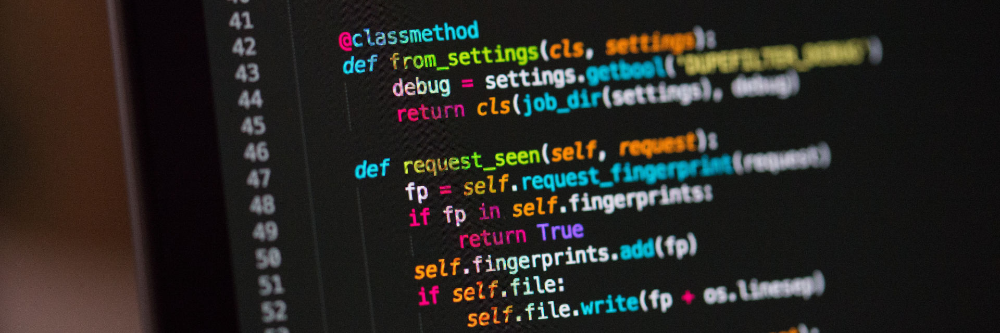

# Enhance your cognition

Would you take a pill that gave you intense focus and a boost in intelligence? What if it wasn't a pill but a combination of safe and well-studied nutrients and practices? The feeling of reaching a flow of focus and understanding is one that humans universally enjoy. You know these feelings as sparks of sudden understanding (aha moments) and total concentration (I lost track of time). The human body and mind are complex machines that function based on a set of reasonably predictable circumstances. By allowing your body and mind the things they need you can increase your cognitive capabilities significantly.

**Principles for cognitive enhancement**

- Draw a line between your software and hardware
- Hardware (body)
    - Treat sleep as work
    - Control blood sugar levels
    - Use caffeine together with l-theanine
    - Supplement Omega 3's
    - Supplement creatine
    - Consider Nootropics
- Software (mind)
    - Make targeted use of meditation
    - Practice professional mnemonic (memory) techniques

**In this chapter**

- Calibrating your sleep to your actual needs
- How to amplify the positive effects of coffee
- Supplementing DHA oil for structural brain changes
- Memory tricks used by competitive memorisers
- My journey for a magic potion that ended in Japan

## Hardware versus software

What we experience as our mind can be viewed from two angles:

- The hardware (brain)
- The software (mental processes)

They are very much linked, but very much separate. Consider the following:

- How good can a person with good math software (a mathematician) perform math when the hardware is debilitated (he is massively drunk)?
- How well can an Olympic athlete (good hardware) solve linear algebra without any math education (no software)?

In order to perform at your best, it is important to tackle both elements of mental performance. That also means that you need to pick your battles:

- No amount of supplements will replace education & discipline
- No amount of genius can replace physical needs

Of course, there is a balance between these two. A genius who only eats doughnuts will still outperform a health-conscious gardener. But the genius in question is not using the full potential at his disposal, it's like driving with the handbrake on.

Take both the software and the hardware seriously. Optimise both, but do not exclusively focus on one or the other.

## Treat sleep as work

Sleep is not wasted time, quite the contrary. It is what enables optimum performance in the waking hours. A mildly sleep-deprived person has similar cognitive impairments to an 80kg/18-lb adult who has drunk 2 shots of tequila[^See [Moderate sleep deprivation produces impairments in cognitive and motor performance equivalent to legally prescribed levels of alcohol intoxication](https://www.ncbi.nlm.nih.gov/pmc/articles/PMC1739867/)]. Similarly to drinking, many people will deny feeling impaired when impaired.

A traditionally sleep-deprived demographic is doctors-in-training, who tend to insist they are performing just fine. The intense work schedule of doctors, or in this case doctors-in-training, caused a 36% increase in serious medical errors[^See [The Phantom Menace of Sleep-Deprived Doctors](http://www.nytimes.com/2011/08/07/magazine/the-phantom-menace-of-sleep-deprived-doctors.html)]. In other words, being treated by a tired person makes it significantly more likely mistakes will be made in your treatment.

Sleep is not a passive process. It is a very active collection of processes. We are not entirely sure how it works, but we know now that it has very concrete effects. Some of my favourite effects of sleep and their specific benefits:

| Activity | Beneficial for |
| -------- | --------------- |
| Clears metabolic byproducts like reactive oxygen species from the brain | Protecting brain health |
| Store energy in the brain as glycogen | Assuring mental energy & improved mood during the day |
| Explicit memory development (slow wave sleep) | Long-term storage of facts |
| Procedural memory development (REM sleep) | Improving automatic skills like driving or playing the piano |
| Growth hormone secretion | Support body growth and recovery |

Sleep deprivation on the other hand causes[^See the sleep deprivation [Wikipedia page](https://en.wikipedia.org/wiki/Sleep_deprivation)]:

- Cognitive impairment (concentration, mood)
- Weakened immunity
- Obesity risk due to hormonal changes
- Cardiovascular disease risk increase
- Stunted growth hormone levels (growth, recovery)

There is no set sleep need that applies to all humans. Average sleep durations fluctuate between 7 and 8.5 hours per day. For good sleep I personally have had good results with the following principles:

- **Calibrate the amount of sleep you need:** take 2-6 weeks where you plan to be in bed for over 10 hours at the same time. Preferably set an alarm clock only after 10 hours of sleep and wake up naturally. In the beginning, you will spend a lot of time in bed, but as the weeks progress, you will stabilise around a time. Pro-tip: make sure to have light exposure in the morning, or your body will have trouble figuring out when the day begins.
- **Have a set time at which you get up:** respect your biological circadian rhythm. Neglecting your physiological sleep/wake cycle or shifting it during the week has been described as 'social jet lag', which has detrimental effects on health and prevents you from feeling rested[^See the book [Internal Time: Chronotypes, Social Jet Lag, and Why You're So Tired](https://www.goodreads.com/book/show/13598053-internal-time) by Roenneberg].
- **Set your cycle using (sun)light:** the body clock is set based on light. Increase your light exposure in the morning, and decrease it at night. Preferably sit in a brightly lit location during the day (near a window for example) and decrease blue light exposure at night. I recommend turning down the brightness of your screens and installing an app like [Flux](https://justgetflux.com) that filters blue light out of your screen later in the day. I also enjoy having an alarm clock that simulates sunrise ([Philips wake-up light](https://www.usa.philips.com/a-w/search.html#q=wake-up+light&filter=PS_CONTENTTYPE_KEY%3Dproduct)).
- **Went to bed late? Nap.:** if you went to bed late, don't sleep in but rather have a nap in the middle of the day. This prevents you from breaking your rhythm but allows you to compensate for the lost sleep. Try to nap earlier on in the day (before 17:00) but well after you have gotten up and have exposed yourself to bright (sun)light.
- **Have a bedtime routine:** in an ideal situation you set an alarm at night that reminds you to start winding down. No more screens, low light, no mentally stimulating input. I personally have a short stretch routine, meditate and read fiction.
- **Make your bedroom sleep-conducive:** especially at night have low light and low (but not freezing) temperatures. During sleep time assure a constant temperature and no light whatsoever. Ideally, condition your mind to view the bed as a place of sleep and nothing else. Do this by only using the bed for sex, sleep and pre-sleep routines like reading fiction. Personally, I use earplugs and a sleep mask, often even if I don't need them, purely as a conditioned response for my mind.
- **Take caffeine and alcohol early rather than late:** both interfere with sleep quality by suppressing specific sleep processes and/or cycles (even if you fall asleep fine). Caffeine has a half-life in the blood of 3-7 hours in healthy adults and a clearance time of 8-24 hours. Preferably use it only in the morning. Alcohol suppresses REM sleep so is preferably avoided.

Note that aside from the above you may want to consider strategic napping. Daytime naps have been shown to increase the retention of knowledge and boost energy levels throughout the day. Milage varies per person as some people (especially the sleep-deprived) will find it hard to wake up after a nap.

## Control blood sugar levels

Where sleep is usually a once a day occurrence that influences your functioning, every time you eat can be a window to either support or destroy your capacity to function optimally.

Low blood sugar is known to make people grumpy and lethargic. But why do many people report low energy after meals? Shouldn't blood sugar be high? Your cognition depends on your brain. Your brain depends on energy. No energy means no performance. Energy can reach the brain in two main ways[^See the [Wikipedia entry on brains](https://en.wikipedia.org/wiki/Brain#Metabolism), the nuance here is that there are some more molecules that can provide energy to the brain but the below are two biggest ones.]:

1. Glucose
2. Ketones

If you have not heard of the ketogenic diet and generally eat more than once every 24 hours, you will basically rely on glucose in most situations. Glucose is the type of sugar your body uses for energy all over. In general, all carbohydrates are eventually converted to glucose during digestion. Glucose is kept within a certain bandwidth.

- Very high blood glucose (hyperglycaemia) can cause permanent damage to your body
- Very low blood glucose (hypoglycaemia) deprives your body of energy

Having optimal levels of glucose does not mean you should eat every 30 minutes to keep your body supplied with energy. Your body is very capable of regulating your blood sugar if you give it the food it was evolved to consume.

There are three components to blood sugar levels:

- Input/increase through food
- Storage/decrease through insulin
- Usage/decrease through usage

The key here is that insulin is released to store high blood sugar levels. If you cause a sharp rise in blood sugar your body will respond with a drastic insulin response potentially causing your glucose levels to drop below what they were before.

To keep your blood sugar within productive levels, the concept of glycemic index (GI) and load (GL) are very important. Both are a value assigned to a meal/food to predict the blood sugar spike they will cause. They are at length discussed in the weight loss chapter. For now, it is enough to know these generalisations:

- High GI causes a blood sugar spike. In general the sweeter and less fibre-rich a food, the worse it is.
- Low GI foods are fat, protein and fibre-rich.

You can look up GI lists online very easily. Consider the following scenarios as examples of the effect of GI on cognition:

| Scenario | Effect | Cognitive performance |
| -------- | ------ | --------------------- |
| Large soda (high GI, high quantity) while working behind a computer (low energy) | Short lived higher blood glucose followed by an insulin-induced crash | Short-term increase, long-term reduction |
| Tab of glucose (high GI, low quantity) while in the middle of a heavy workout | Small glucose boost, offset by high glucose usage by muscles[^And high glucose absorption due to GLUT-4 migration in muscle membranes] | Neutral/positive depending on initial levels |
| Low GI breakfast | Gradual and sustained blood glucose support | No decline the entire morning[^See ["A low glycemic index breakfast cereal preferentially prevents children's cognitive performance from declining throughout the morning"](https://www.sciencedirect.com/science/article/pii/S0195666306006398)] |
| No breakfast | Waking up with low blood glucose, no external stimulation. | Lower performance, unless adapted. |

Note that the last entry seems a bit vague. The fact of the matter is that different people are better or worse at self-regulating glucose levels. This is a combination of genetics and conditioning. I personally fast every day, usually until 14:00 or later. This intermittent fasting approach (see longevity chapter) has conditioned my body to more effectively regulate blood glucose and rely more on ketones.

 As a general rule keep the following principles in mind:

| Principle | Why |
| --------- | --- |
| Eat low GI foods | Prevents a high insulin response. |
| Don't drink calories | Sodas, fruit juices etc usually have high sugar content and especially when consumed alone cause a blood sugar spike. If you are having one, keep the quantity in check and consume it slowly. |
| Eat protein, fat and fibre-rich foods | These generally have lower GI ratings. |
| Consume high GI in low quantities | Your body can handle even pure sugar if you don't consume too much. A little pick me up is not per se bad, but consume low quantities. Ideally, choose a low GI alternative. |

Guidelines for meals:

- Reduce the glycemic load by eating low GI foods and combining higher GI foods with low GI foods and fibre.
- Reduce size to mitigate insulin response, the more you eat the more your body needs to work to handle the blood sugar response (of course mitigated by GI/GL).
- Reduce the speed at which you eat so your body doesn't have to handle everything at once.
- Do some mild exercise before and after eating. Ideally also 60-90 minutes after the meal. By doing this you mitigate the need for glucose since muscle movement decreases the need for insulin and increases insulin sensitivity.

## Use caffeine in concert with l-theanine

Caffeine is one of the most used and abused substances in the world. The problem is that many people do not use it in a productive way to increase their performance but rather use it to cover up deficiencies in the management of sleep and blood sugar.

Caffeine:

- Does not provide energy, it blocks the effect of adenosine in the brain. In essence it prevents feeling tired, at least as a result of adenosine levels.
- In low dosages has healthy effects but in excess causes a host of issues[^See [Effects of Habitual Coffee Consumption on Cardiometabolic Disease, Cardiovascular Health, and All-Cause Mortality](http://www.onlinejacc.org/content/62/12/1043)].
- In many people causes anxiety and nervousness to varying degrees.
- Has been shown to cause a peak of experienced energy, but after 2 hours also results in measurably lower levels of energy/focus than before using it[^See [Differential cognitive effects of energy drink ingredients: Caffeine, taurine, and glucose](https://www.sciencedirect.com/science/article/pii/S0091305712001980)].

To use caffeine effectively:

- Fix your sleep
- Fix your blood sugar
- Use it in the morning only
- Combine it with l-theanine

L-theanine is an amino acid found in green tea (and is also available as a supplement). The dosage of theanine depends very much on the tea type and quality. An average green tea bag will not contain much, whereas a high-grade Matcha tea will contain far more.

Before going into the details, please note that:

- Caffeine, coffeine and theine are the same substance
- Theanine is not thymine or tiamine
- L-theanine can be metabolised by humans, d-theanine can't (as far as we know)
- When you read theanine without a prefix, l-theanine is implied

Theanine is an amino acid that can cross the blood-brain barrier and thus (like caffeine) affects the brain directly. Some effects of theanine can be described as the opposite of caffeine:

- A calming effect and stress reduction
- Increased alpha waves in the brain (focus)
- No crash after usage

Some effects are similar to what is experienced with caffeine:

- Better memory
- Improved attention
- Increased learning ability
- No increase in drowsiness

In short, one might say that where caffeine causes a restless and short-lived perceived energy spike, theanine offers a calm longer-term focus. In combination, caffeine lifts the calmer energy levels of theanine up, and theanine keeps caffeine from running out of control.

Combining the two has proven very effective for many people seeking to improve their cognitive performance with easily accessible materials. For effective usage:

- Experiment with 2:1 to 4:1 theanine:caffeine ratio
- Do not use this as frequently as coffee, I don't do this more than once a day (the effect is long-lasting)

If you have the habit of drinking coffee all day, consider switching to tea or decaf. You do not want to overload your system.

A note on safety: this combination is generally lauded as the safest cognitive enhancer on the market. The ingredients are easy to find and the side effects are considered to be due to the caffeine usage rather than the combination.

## Supplement omega-3's

The human brain consists for nearly 60% out of fats (excluding water)[^See [Essential fatty acids and human brain](https://www.ncbi.nlm.nih.gov/pubmed/20329590)]. Depending on what type of brain matter you look at 7-20% is cholesterol[^See [Lipid composition of the normal human brain: grey matter, white matter, and myelin](http://www.jlr.org/content/6/4/537.abstract)]. You can draw a simple conclusion from this: fats have a structural effect on the brain. There are fats that will have a structurally positive effect on your brain and those that will have a negative effect. An example of positive fats are omega-3 fatty acids. An example of negative fats are trans-fats.

There are three types of omega-3's relevant for human biology:

1. α-linolenic acid, ALA
2. Eicosapentaenoic acid, EPA
3. Docosahexaenoic acid, DHA

ALA is found mostly in plants. EPA and DHA are found abundantly in oil from sea organisms including fish and algae. Note that omega-3's are also found in meats and more so in grass-fed than grain-fed. The concentrations though often make it more practical and overall healthy to go with fish sources.

There are studies in which EPA and DHA show cognitive benefits, but also studies that show no benefit at all. The reason for that only became clear once those studies were compared. Studies supplementing under 500mg of DHA usually showed no benefit, whereas those in the 750-1500mg range did[^See [Omega-3s and Cognition: Dosage Matters](http://goedomega3.com/index.php/blog/2015/08/omega-3s-and-cognition-dosage-matters)].

In other words, if a researcher tests whether one push-up a day increases muscle mass and finds no results and another tests if 20 push-ups a day and finds positive muscle gain results, which one is right? The first, concluding push-ups have no effect on muscle mass or the second concluding that they do?

From here we can create a supplementation strategy:

1. We need DHA because it is the dominant omega-3 in the neurological system
2. We need a minimum of 750-1000mg DHA a day for effect

One important thing to note is that omega-3 supplements are often made from fish. This is not a bad thing per se, but in case you didn't get the memo, you should know our oceans are polluted with plastics and heavy metals because of bad life choices of the human race.

Supplement oil is filtered for toxins, but not all countries hold the same standards. Milk from the US is, for example, banned in the EU because of the entirely irrational health standards with regards to, for example, hormone usage. For this reason, when buying omega-3 supplements keep in mind the following guidelines:

1. Make sure it is according to EU standards which are currently the highest
2. Smaller fish lower on the food chain are preferential since they accumulate fewer toxins
3. Algae sources are of high quality, but often prohibitively expensive

Personally, I use a Scandinavian brand that blends oils from anchovies, sardines and herring. Remember to check what the DHA dosage is in your supplement and to take s sufficient amount to reach 1000+ mg DHA per day. Often this exceeds the recommended amount since they are often based on old standards that differ widely by country.

## Supplement Creatine

Creatine is a very common and well researched[^See [Safety of Creatine Supplementation](https://link.springer.com/chapter/10.1007/978-1-4020-6486-9_14#citeas) and [Effect of Short-term High-Dose Creatine Supplementation on Measured GFR in a Young Man With a Single Kidney](http://www.ajkd.org/article/S0272-6386\(09\)01459-0/abstract)] fitness supplement used to increase strength & power output for athletes[^See [Creatine Supplementation and Athletic Performance](https://www.jospt.org/doi/abs/10.2519/jospt.2003.33.10.615?code=jospt-site) & [Effects of creatine supplementation on performance and training adaptations](https://link.springer.com/article/10.1023/A:1022465203458)]. Creatine is a primary way in which cells, including muscle cells, store short-term energy. For athletes, this means an increase in power output, but for the brain it means a cognitive function increase.

In times of activity, the brain drains its stores of creatine to keep levels of ATP (energy) high[^See [Effect of photic stimulation on human visual cortex lactate and phosphates using 1H and 31P magnetic resonance spectroscopy.](https://www.ncbi.nlm.nih.gov/pubmed/1618937)]. By supplementing, creatine levels in the brain rise[^See [Increase of total creatine in human brain after oral supplementation of creatine-monohydrate.](https://www.ncbi.nlm.nih.gov/pubmed/10484486)]. A 2009 study found effects on a number of cognitive performance tests, including IQ test performance, for subjects who supplemented creatine for 2 weeks[^See [Cognitive effects of creatine ethyl ester supplementation.](https://www.ncbi.nlm.nih.gov/pubmed/19773644)]. A 2010 study found increased memory span in creatine users[^See [Dietary supplementation of creatine monohydrate reduces the human fMRI BOLD signal.](https://www.ncbi.nlm.nih.gov/pubmed/20570601)]. Contrarily, a 2008 study confirmed that for a number of other cognitive test measures did not improve[^See [Creatine supplementation does not improve cognitive function in young adults](https://www.sciencedirect.com/science/article/abs/pii/S0031938408001571)] suggesting that creatine is most effective for tasks that involve complex reasoning. Interestingly, sleep-deprived and elderly individuals experience enhanced executive function with creatine supplementation[^See [Use of creatine in the elderly and evidence for effects on cognitive function in young and old](https://link.springer.com/article/10.1007/s00726-011-0855-9)].

For optimal dosing take 0.3 grams for every kilogram of body weight per day for a week and after that switch to 0.03 grams per kilogram of body weight per day. For a person weighing 80kg that comes down to 24 grams per day in the first week and 2.4 grams after[^See [Pharmacokinetics of the Dietary Supplement Creatine](https://link.springer.com/article/10.2165/00003088-200342060-00005)]. In the buildup phase, it is most effective to split the full dose into 4 smaller doses. Personally, I only supplement creatine in times where I for a number of weeks need to perform on an elevated physical and/or mental level.

## Consider Nootropics

Once you have optimised the basics (diet, sleep, blood sugar, supplements), you may consider nootropics. These are compounds used to improve brain function. I will not dive deep into them here as many are experimental and their long-term effect is often unclear. If you are interested in using nootropics I recommend having a look at the reddit Nootropic community that wrote a very helpful [getting started manual](https://www.reddit.com/r/nootropics/wiki/beginners).

## Make targeted use of meditation

Meditation is like a stretching routine for the mind. Where in physical exercise muscles go tense and fatigued, the use of the mind too creates tensions and tiredness. We can stretch muscles to ease out tensions, prevent injury and increase range of motion. We can meditate to calm the mind, prevent breakdowns and increase stress resilience.

The premise of meditation is simple: focus on one thing and let distractions pass by like clouds in the sky. The focus element can be implemented in many ways, some common examples are focusing on:

- Your breathing
- A word or phrase
- A physical sensation

Meditation is about as religious as yoga, meaning it isn't. Both are linked to spiritual traditions, but historically almost everything has religious ties. If you like exploring spirituality please do, but also feel free to use meditation as a practical tool the same way you would choose to lift weights or stretch your muscles.

### Learning meditation

If you have never meditated or would like to learn meditation in a structured way I recommend following an intro program. Great examples of these are:

- The 10-day intro course by the [Headspace app](https://www.headspace.com)
- The free guided meditation [Calm app](https://www.calm.com)
- Check out local meditation courses

If you just want to give it a shot without committing to a program or downloading an app, I recommend trying the following:

0. Find a calm environment where you can sit comfortably (any position)
1. Set a 5-minute timer and commit to meditating until the timer goes
2. Close your eyes
3. Breathe calmly and count your breaths
4. When thoughts arise don't interact with them, just bring your focus back to your breath

The above are a good place to start, but taking a multi-day intro course through an app or an offline course is very much worth your time.

### My favourite meditations

I like meditating twice a day, once in the morning to prepare my mind for a good day and once at night to wind down and prepare for sleep. In the morning I take 10 minutes after my morning workout and at night I take 20 minutes before bed.

In the morning I meditate to put myself in a good mood and set my mind to a sharp and attentive state. It makes self-motivation near effortless for me. Even if before meditating I don't feel like it, I never regret doing it afterwards. My morning meditation looks like this:

- Put in silicone earplugs to block out any sound
- Set a timer for 10 minutes (I use an app called [Meditation](https://play.Google.com/store/apps/details?id=com.clay.meditation))
- Count 50 breaths without interacting with my thoughts, reset the count if I get caught up in a thought and lose track of my breathing
- Visualise the people that love me, telling me they love me
- Mentally tell people I care about that I love them and wish them well
- Go through things I am grateful for

It usually ends with a smile on my face.

My meditation at night is geared towards slowing down my mind and taking it from a convergent productivity mode into a divergent creativity and dreaming mode. It looks like this:

- Put in silicone earplugs
- Set a 20-minute timer
- Count 100 breaths without interacting with my thoughts, reset the count if I get caught up in a thought and lose track of my breathing
- Focus on the visual imagery that my mind spins up, don't interact with it and don't try to change it other than trying to make it more solid
- Towards the end, my mind is often calm and solid enough that I can 'walk around' in these visual daydreams

The above works very well for me probably because I have a visual mind. Note that in the beginning, it was a struggle to even focus on any visual aspect for longer than half a second. With practice, I find that this meditation puts me in a sleep-ready state.

## Practice professional mnemonic techniques

Sometimes you just need to brute force some knowledge into your head. Shopping lists, credit card numbers and so on are not part of a system, meaning the aforementioned usual learning techniques don't apply. The solution to this problem comes from the competitive field of mnemonics. Memory championships basically.

As it turns out, with a few basic techniques you can learn to memorise seemingly random things. For an in-depth overview, I recommend having a look at the book [Moonwalking with Einstein](https://en.wikipedia.org/wiki/Moonwalking_with_Einstein).

### Memory palace

Let's say you need to remember a sequence of things, for example, the sections of a presentation you are going to give. The memory palace is one of the most well-known techniques for sequential memory. It relies on using a physical space you know very well in order to memorise a list of things. Take, for example, your house (palace) which has a number of distinct places:

1. front door
2. hallway
3. living room
4. kitchen
5. and so on

The memory palace technique works by linking unusual images to these locations so you can 'walk' through the list. Say, for example, you are going to do a work presentation and need to cover:

- the sales figures for the last quarter
- unexpected costs
- what customers brought in the most revenue
- plans for the next quarter

You can use the memory palace to remember these in a visual way:

1. You walk up to your front door and see a big sign above it proclaiming 'SALE!'
2. You enter the hallway which is covered in a stack of receipts to your knees
3. You walk to the living room where a group of people in fur coats are throwing money at you
4. You enter the kitchen where the walls are covered in calendars

While giving your presentation you can easily progress from topic to topic knowing you covered all topics in the right order.

The key to this technique is to have a 'palace' that is large enough and memorable. It doesn't have to be a house, it could just as well be your drive to work where you store ideas at landmarks and points of interest.

### Sequential technique

This one is good for lists where you don't need to know at what place an item is. For example, a grocery list. It is similar to the memory palace but doesn't rely on your memory of a physical place. The principle is simple:

1. Make a list
2. Visualise each item in a crazy way
3. Connect the items in a weird way

For example, take the following list:

- Apples
- Cayenne pepper
- Cheese
- Coffee
- Mushrooms

The human mind usually doesn't like random things, it likes to see connections. It also doesn't remember most unremarkable things but likes remembering remarkable things. So in order to have our mind store the random unremarkable list, we need to make it a connected remarkable list.

We do this by creating a visual chain of remarkable images, where remarkable is anything unusual. Weirder is better, for example:

- We imagine a blood red **apple**, covered in a red liquid that may or not be blood
- This blood red apple starts growing spikes like a pufferfish which turn into pointy **cayenne peppers**. The apple explodes and the cayenne peppers shoot out like dangerous projectiles
- The peppers get stuck in a huge block of **cheese** turning it into a cheese-cayenne pincushion
- The cheese pincushion starts to mould into a mush of black fungus which dries up into **ground coffee**
- From the ground coffee **mushrooms** start growing

Visualise the above sequence and I guarantee that as you are walking the store running through it will be a trivially easy endeavour.

For the best results, make the visualisations explicit and as weird as possible. Your mind will spin up a whole bunch of weird stuff over time, just let it roam free.

### Memorising numbers

What if you want to memorise numbers? Perhaps you are sick of having to look up your credit card number when ordering things online, or you want to be able to remember a telephone number as soon as someone mentions it to you. Numbers don't have shapes like physical objects so our previous technique is off the table. Or so it seems. We can fix this issue by giving numbers a physical manifestation:

1. Assign sounds to numbers
2. Use the sounds to assign objects
3. Chain the objects like we did before

For example:

- The number 1 is 't'
- We make the number one the object 'tie'
- We can memorise 1 as a tie

Step one is assigning sounds to numbers 1 through 0. The sounds are phonetic, meaning T and D are the same etc. It's about sounds as opposed to letters

1. **T/D**, it looks a bit like a 1
2. **N**, on its side, looks like an 2
3. **M**, on its side, looks like an 3
4. **R**, 4 mirrored it looks like an R without its leg
5. **L**, a sloppy 5 looks like an upside down l
6. **Sh/Ch**, a 6 is curled up like a cat (shhh, let it sleep)
7. **K/G**, a seven and upside down seven together look like a k, which in English sounds similar to a g (e.g. cable and grab)
8. **F/V**, an 8 is four v's stacked like < > < >
9. **P/B**, it looks like a mirrored 9
10. (zero) **S**, zero is nothing, like **s**ilence

Using the above we can turn any series of numbers into sounds, and thus into objects. Take, for example, this seemingly random string of numbers (which could be a telephone number for example):

98475234985 (I literally jammed my keyboard to generate random numbers here), they translate to PV RK LN MR PVL. Now we just think of a series of words using these consonants:

- **b**u**f**f
- **r**a**ck**
- a**l**o**n**e
- **m**o**r**e
- **b**u**f**fa**l**o

Note that since the sound of a P and B are the same in English, we can remember PV and BF interchangeably since the sound of P (puh) and B (buh) sound the same. This is useful if you can't think of a word with the one sound but can with the other.

From here we can create a visual chain like we did before. So long as we memorised the sounds of the numbers we can now translate back and forth.

### Memorising lists out of order

What if you want to be able to answer the question "which item is in the 19th place in the list of 30 we memorised?" The above techniques will become quite impractical. To make this work we are going to layer some levels of artificial structure on top of each other:

- Give numbers objects based on their sound
- Link the objects in our list to these objects

Let's give the numbers 1 through 10 some default objects, these are permanent associations you will make in your mind:

1. **T**ie
2. **N**ail
3. **M**an
4. **R**oad
5. **L**amp
6. **Ch**ange
7. **K**ettle
8. **V**eal
9. **P**otato
10. **T**oe**S**

You can choose your own if you'd like. I do recommend having some default ones for this particular technique. Now let's say we memorise the following list:

- Coconut
- House
- Grass
- Hat
- Tomato

We link them to their position visually:

1. Tie + coconut = a woman wearing a tie with coconuts growing from it
2. Nail + house = a house pierced by a nail twice its size
3. Man + grass = a construction worker eating grass
4. Road + hat = a long road lined with pink top hats
5. Lamp + tomato = a huge dripping tomato being used as a lamp

Now when someone asks you what was item 3 on the list, you can retrieve it from memory by tracing 3 > man > construction worker eating grass > grass.

In the competitive spheres, this technique is often implemented as a person-action-object (PAO) list. Meaning the numbers are people who are memorable to you and they perform an action on the objects you are memorising.

## Getting started

It is very tempting to look for a magic bullet that will lift you to the next level. In practice, this will only hurt you and led to long-term failure. Get the basics right and take it from there. If you do nothing else, in order of importance:

1. Sleep 8+ hours a day
1. Eat food that keeps your blood sugar levels from fluctuating
1. Meditate

These are the most powerful techniques for nearly everyone. They are likely to lift your mood, improve your focus and make your reasoning clearer.

The first two especially are about designing your daily routines, refer back to the habit chapter for tips on doing this. Both of them have compounding effects in that they make everything you do in a day more effective. It's like upgrading from dial-up internet to 21st century wifi. No matter what you do after, everything will be faster, better and of higher quality.

To make them easier I have found the following techniques to be most helpful:

- Sleep
    - Set a bedtime alarm
    - No screens 1 hour before sleep and/or wear blue light blocking glasses
    - Calculate in 30 minutes of time to fall asleep
- Eat well
    - Have a predefined breakfast, make it low in sugar (eggs, salad, unflavoured yoghurt)
    - Ensure access to healthy food (bring lunch to work, buy groceries for the week on a full stomach)
    - Plan the meals of the week ahead of time to prevent bad 'in the moment' decisions
- Meditate
    - Do the free 10-day [headspace course](https://www.headspace.com) through the app
    - Commit to meditating just for 5 minutes a day at a time you know yourself to have low energy/mood/focus

There is little glamour to these recommendations, no sparks or fire. It will take you a week or two to get them instituted properly and see results. They are however the most powerful things you can do to get started. From there optimise further.

The most common counterproductive responses I see from people on these recommendations are:

- **I can't sleep that much, I need more hours in a day not fewer:** which misses the mark by a mile. Which would you rather have, a pill that allowed you to stay awake for an hour longer every day with low energy levels or a pill that forced you to sleep 2 more hours but gave you perfect focus the entire day? You don't need more time, you need more focus and energy to get things done and enjoy life.
- **Eating healthy is hard:** the effort of eating right is far less than the pain of suffering through suboptimal mental states your whole life. What is hard is changing habits. But while it is not easy, it is far from impossible and entirely worth it.
- **I don't have time to meditate:** similar to the argument of not being able to sleep more. Every minute you spend meditating will effectively double the value of your time after (at least in my experience). Before sleep it will improve your rest, at work it will improve your focus and when you feel overwhelmed it will make you more able to deal with the pressure.

## How I went from magic potions to Japanese tea

As a kid, it seems like the adults have everything figured out. They are infinitely wise creatures that understand things about how the world works. As the years go by you come to realise that adults are really just kids who managed not to die for a number of years. The disillusionment is quite confrontational.

I had always expected growing up meant I too would get the superpowers of an adult. To be able to understand nearly anything and to know the inner workings of the world. It was quite disappointing to find out there were no superpowers in store for me. It lead me to try and find ways to gain the superpowers that were so rudely stripped from my expectations.

When I was a toddler I would try to make magical potions with berries and plants from the garden, but luckily decided against actually drinking them. My teenage years were spent exploring meditation, hypnosis and supplements of all kinds. As teenagers do I was looking for the easy way out, a silver bullet that would take my mind to the next level.

As the experiments came and went I slowly came to the conclusion that there was no easy fix. At the same time, a hope developed that a slow fix was indeed possible. For example, a little meditation didn't give me the power of perfect memory, but over time it increased my ability to focus and see connections. Likewise, eliminating certain foods wasn't as glamorous as a magic potion, but it increased my capacity to work for longer periods of time.

As I grew out of my juvenile desire for a magic pill, I found out that there was a whole world of possibilities that would allow me to boost my mind's performance. Don't get me wrong, there is a part of me that is still looking for magical potions. From exotic Matcha tea to Scandinavian mushroom extracts, I'm game so long as there is some reasonable science I can read and evaluate.

Some experiments work out very well. Matcha tea, for example, is to this day my favourite way to ingest caffeine and theanine together. Other experiments worked out reasonably well but proved unsustainable, like following a polyphasic sleep schedule. And then there are those that end with the need to puke, like freshly juiced garlic and cayenne pepper on an empty stomach.

In the end, my most meaningful transformation was going from a desire for an instant fix to the knowledge that small changes implemented consistently outperform big temporary actions. The body and mind are a system and by expanding our understanding of it we can tweak it. The 21st century gave us a great many tools to improve what we can achieve with our minds and will only continue to give us more. The coming decades will be a golden age for those of us actively trying to improve our minds.
