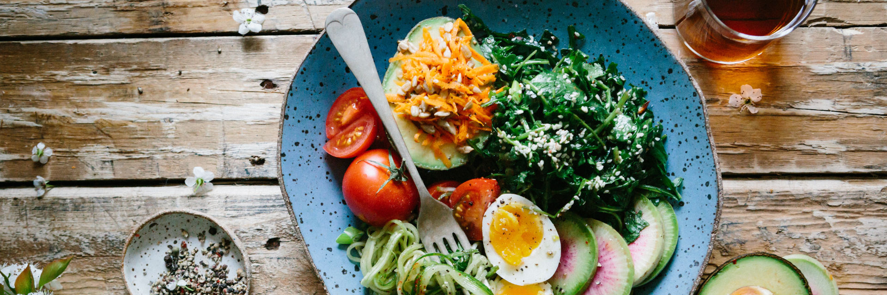

# Lose weight

Weight and body fat is not just about health, it is about emotion. Looking into the mirror should feel like an affirmation that you are doing well. A confirmation of your powerful and focused will. It's not about competing with bodybuilders, it is about setting your goals and achieving them.

**Principles to lose/maintain weight**

1. Eat fewer calories than your body uses
1. Eat food that makes you feel full
1. Minimise the number of choices you have to make
1. Institute habits that make it easy to make the right choices
1. Set up accountability measures that keep you motivated

**In this chapter**

- How to calculate how many calories your body burns
- How to estimate the calories in the food you eat
- What foods make you feel full (satiety index)
- What foods are absorbed quickly/slowly (glycemic index & load)
- Effective accountability and motivation tactics
- How a bet with my mother got me obsessed with weight loss for a few weeks

## Eat fewer calories than your body uses

Weight-loss is simple.

The human body is a complex system, but it handles energy in accordance with the laws of thermodynamics.

> Weight change = energy intake - energy expenditure

Humans measure the energy they consume in calories[^Or more specifically kilocalories (kcal).]. The above means simply that:

- If you eat more energy than you expend: you gain weight
- If you eat less energy than you expend: you lose weight

There are other dimensions to body recomposition, but those are mostly psychological. How to tackle those we will handle later on.

For anyone that thinks their body does not conform to this principle: If this were true, your body would be breaking the laws of physics. I assure you it is not.

That said, there are people whose genetics make it easier or harder to lose weight. This is often due to their genetic food preferences[^Fun fact. People who grew up hungry have a higher risk of diabetes because their body responded by increasing food cravings. See [Famine Exposure in the Young and the Risk of Type 2 Diabetes in Adulthood](http://diabetes.diabetesjournals.org/content/61/9/2255)].

The main principle for weight loss is thus simply:

> To lose weight, eat fewer calories than you expend. To gain weight eat more calories than you expend.

### Losing weight happens in the kitchen

Your body needs energy to stay alive. The majority of the energy you use every day is used to pump blood, keep you warm and have your brain running.

The energy used to keep you alive is called Base Metabolic Rate (BMR). BMR energy expenditure is far greater than the energy you expend doing sports.

The average BMR can be estimated with this calculation[^See the wikipedia page on [Basal metabolic rate](https://en.wikipedia.org/wiki/Basal_metabolic_rate#BMR_estimation_formulas)]:

- 370 + ( 21.6 x lean body mass in kg )
- Average for women: 370 + ( 14.4 x Body Weight in kg )
- Average for men: 370 + ( 17.3 x Body Weight in kg )

Note how the main formula requires you to know your lean body mass, which is your body weight minus body fat. If you don't know your body fat percentage, use the average formulas. If you know your body fat percentage use the original formula.

> For a male with average body fat (20%) weighing 78 kilos that means a BMR of 370 + (17.3 x 78) = **1719 kcal**

This same male would burn about **250 kcal** for a half hour of aerobic sports (e.g., running). In other words, to use the number of calories he burns by going about his day is equivalent to 9 half hour sports sessions.

If you want to do sports, good. But don't do it to lose weight. Change your food intake to lose weight.

## Eat food that makes you feel full

Your body does not feel full based on the calories you eat. The satiety system responds to different factors, ranging from stomach fullness to lipids in your digestive system and the corresponding hormonal response.

Some rules of thumb:

| Filling | Not filling |
| ------- | ----------- |
| Protein | Fat (caveat below) |
| Fiber | Sugars |

Fat is an interesting one. It does help with satiety, but the effect is **delayed**. Basically, it is digested slowed meaning you will feel full longer, but not faster[^See [Effects of Fat on Gastric Emptying of and the Glycemic, Insulin, and Incretin Responses to a Carbohydrate Meal in Type 2 Diabetes](https://academic.oup.com/jcem/article/91/6/2062/2843371)].

An interesting technique based on the satiety system is taking 30 grams of protein within 30 minutes of waking. It suppresses appetite for a good amount of time.

### Glycemic index

A high glycemic index (high blood sugar spike) is bad for weight loss. Your body is more likely to store the energy as fat, plus most high GI foods are not that filling compared to their low GI counterparts. This is a rule of thumb and not universal.

Your body transforms all carbohydrates into sugar. This is why all carbohydrates increase your blood sugar levels, but fats and proteins do not[^At least not directly. In practice, this rule of thumb is productive to use.].

Depending on the carbohydrate type and what it's consumed in combination with, your blood sugar will spike to different degrees.

- Table sugar is absorbed as sugar, thus spikes your blood sugar a lot
- Pumpkin takes your body a while to break down, and then a while to break its starches down into sugar. It doesn't spike blood sugar all that much

One note: the glycemic index is a carbohydrate-specific measure. A more 'real world' measure is the glycemic load. Which takes into account the whole meal/food contents. It's harder to calculate on the go though.

Rules of thumb to identify high GI foods:

| Level | Guesstimated GI |
| ----- | -------------- |
| High (bad) | 'White' carbohydrates like sugar, flour, bread, potato, rice, etc. |
| Medium (all right) | Sweet plants like fruits and starchy vegetables |
| Low (good) | Protein-rich foods. Non/less sweet/starchy plants like leaves. |
| None (no impact) | Pure fats. Water. |

## Minimise the number of choices you have to make

Whitelist instead of blacklist.

When losing weight you want to rely on your willpower as little as possible. Every time you have to make a decision on the spot there is a chance you will make a bad decision.

Therefore, don't choose the foods you will stay away from. Rather choose the only foods you will eat.

Instead of blacklisting:

> I will not eat candy, not drink soda, drink less sweet juice, put no sugar in my coffee, etc

Go with whitelisting:

> I will only eat meats, eggs and vegetables.

It is simpler and less error-prone. If you want to make your weight loss period even more foolproof, take a lesson from the Slow Carb diet and plan a set amount of meals and only eat those.

**Suggested food whitelist**

| What stuff | How much | Notes |
| -------- | ---------- | ------ |
| Vegetables that grow above ground | As much as you want | E.g. cauliflower but not potato. |
| Meat & fish | Normal portions | Prefer lean, but fatty is fine. |
| Fermented dairy | Normal portions | E.g. Yoghurt, cheese. Only unsweetened. |
| Fruit | Very limited intake | Consider fruit candy. Its satiety effect is very short. |
| Nuts | Very limited intake | While low glycemic index, 100g macadamia nuts is 700 kcal. Equivalent to 4.5kg cucumber. |
| Can I eat... | Zero | If you need to ask, then you don't eat it. No 'superfood grains' or 'sugar-free' snacks. Simplicity. |

**Suggested meal types**

| Meal | Instructions |
| ---- | ------------ |
| Soup | Boil vegetables, add salt, blend them (heatproof blender). |
| Salad | Chop things up, add olive oil and balsamic. Eat. |
| Stir-fried | Chop vegetables, put in a pan with hot oil, stir until they are soft-ish. |
| Yoghurt with fruits | Yoghurt + fruit in a bowl. Spoon it. |

**Never whitelist**

| Food | Severity | Example | Why |
| ---- | ------- | -------- | --- |
| Sugar | Nuclear | Sugar in coffee | No satiety, lots of energy |
| Drinks with energy content (kcal) | Nuclear | Fruit juice, soda | High calorie per second intake. Little satiety. |
| Soft/white carbohydrates | High | Bagel, pasta | Low satiety, high energy |
| Sweet fruits | Moderate | Dates, figs, grapes, cherry | Fruits have a short-lived effect on satiety and a high GI. Bad for weight loss, fine for long-term health. |

*Note: there are exceptions to all of these. There are very good kinds of pasta for example, that are decent in satiety and not too bad in GI. When trying to lose weight, don't complicate your life by adding 'maybe, it depends' foods. Simplicity.*

## Institute habits that make it easy to make the right choices

Habits are behaviours that stopped costing decision power. There is no question in your mind whether you will brush your teeth tonight. The universe would feel out of balance if you didn't. Imagine the same is true of working out in the morning or eating healthy.

**General advice**

- Do not keep food in the house that is not whitelisted
- Prepare your meals in advance if you can
- Eat before shopping for food

**Suggested routines**

| When | Action | Notes |
| ----------- | ------ | ----- |
| Waking up | 30 grams of protein within 30 minutes | 5 eggs or 1 big protein shake. |
| Waking up | 500ml (1 big cup) water | Cold water preferred. |
| Hungry at a non-meal time | Savoury broth | Any whitelist food is fine, but zero-sugar broth packages are easy to carry around. |

### Accountability & motivation

Humans are not very good at making a decision and sticking to it. It is therefore advisable to make a system that supports you in (read: forces you to) stick to your intention.

Humans are more risk-averse than goal-oriented. If you give a person €10 they will be happy. If you give them €20 and later steal €10 from them they will be sad. Even though in both scenarios they end up with €10. Use this to your advantage.

Popular options:

| Strategy | Logistics |
| -------- | --------- |
| Betting pool | Set a goal with friends, put money into a pool (enough to hurt, not enough to be impractical) first to reach the goal gets the money, rest loses. |
| Punishment | Give a friend/service money. If you don't reach the goal, they donate it to a charity/cause you hate. |

**Suggested accountability**

Either go with a betting pool or use a service like Stickk[^stickk.com is a free service that will donate your money to a charity you hate if you don't commit to your goals.] to set up a donation to a charity you hate. Do not choose a charity you like, Stickk is a deterrent for you, it must hurt you to lose. At Stickk you will choose a good (but stern) friend who will decide whether you stuck to your goals.

**Formulate the cost of failure & gain of winning**

Inspiration is fickle and temporary. You can keep it alive by continuously reminding yourself of the cost of failure and the profit from winning. It pays to formulate your cost/benefit reasons.

An example list, 'if I do not reach a healthy weight I will':

- Feel inferior to those around me
- Not have the energy to go for hikes
- Die younger than I need to

An example list, 'if I reach my desired weight I will':

- Feel proud of my body
- Feel good about my discipline
- Be able to enjoy physical activities better

Your reasons will always be your own. Formulate what matters to you, write them down and remind yourself of them at key moments:

- Recite your costs/gains to yourself in the mirror in the morning
- Go through your costs/gains before every meal

### What gets measured gets managed

Measure your progress every day. Your first priority should be logging your weight and body fat. You can use an old-school scale and a notebook or a smart scale that makes pretty graphs. Notes on weight management:

- Measure at the same time of day each day for consistency
- Body fat % on scales are not accurate. Use them only for trends.

Note that if you do aim for muscle growth while losing fat as well, it is possible to progress with your weight remaining the same. This is the case if you lose fat at the same rate as you gain muscle. In this case, taking progress pictures might be more useful than measuring weight.

For those who like numbers, calorie counting is a great option. To be effective:

1. Set a calorie goal
2. Measure your intake

For the people who like accuracy, get an app that has accurate calorie counts for foods, I like using [myfitnesspal](http://www.myfitnesspal.com) because of its huge database of products. When it comes to logging your food, a kitchen scale is your friend. 

Rules of thumb:

| Food | Guesstimated calories per 100g | Example |
| ---- | -------------------------------- | ------- |
| Vegetable | 30 kcal | Asparagus, cauliflower, carrots |
| Fruit (N-European) | 50 kcal | Apple, berries |
| Fruit (Warm places) | 100 kcal | Pomegranate, banana, grapes |
| Starchy vegetable | 100 kcal | Potato, peas |
| Cheese | 300 kcal | All except explicitly low fat |
| Fish lean/fatty | 50/150 kcal | Trout / eel |
| Lean/reg/fat meat | 100/200/400 kcal | Chicken/Beef/Sausage |
| Egg small/large | 50/75 kcal | |

The above is extremely oversimplified. But *measuring something always beats measuring nothing.*

## Getting started

As described in this chapter there are two main elements to losing weight: 1) the physics, meaning the thermodynamic truth that your body loses weight when you eat less energy than you burn and 2) the emotion, meaning how easy it is to stick to good behaviour.

For many people, starting with the second part will prove most effective. There are two elements to it:

- Your hunger
- Your environment

To keep your hunger in check I recommend starting with:

1. Eating 30 grams of protein within 30 minutes of waking up. This equals 5 scrambled eggs or a large protein shake.
2. Not drinking calories. That includes 'healthy' juices. Stick to plain coffee/tea/water.

From there start growing your food habits towards high satiety foods with a low glycemic index as described in this chapter.

For the sake of your environment, you want to minimise the occasions where you could make a bad decision. Most importantly:

1. Have no food in the house you are not supposed to eat. Only buy things that suit your weight goal. I recommend planning your food and grocery shopping on a full stomach.
2. Know what you will eat during the day. That can mean pre-determining the foods you will buy in the cafeteria at work/school or preparing your own lunches.

If you feel ready to do so, accountability is the next important step. Set up a betting pool or a [Stickk](https://www.stickk.com) pledge.

## How a single bet changed my life

It all started as a bet with my mother. At the time I was in high school and intensively practised trampolining. Think gymnastics, only on trampolines (it's an Olympic sport I kid you not).

While I was running on a teenager metabolism training 5 times a week, my body did not so much say 'jock' as it did 'meh'. My mom commented on this at some point, which led me to confidently proclaim "I bet you I can get ripped within 4 weeks". And so it began.

You see, at this point I did not know biology the way I do now. I mostly grabbed things for which my brain rewarded me with serotonin and dopamine:

- Energy drinks (4 cans in a row? Sure)
- Cookies (Google 'roze koek' for Dutch delicacy)
- Chocolate (multiple bars of course)

The epitome of my food habits at the time was a thing called boterkoek, which loosely translates to 'butter cake' because it's basically butter with some flower.

The bet changed everything. One thing I did have back then was my base personality traits. A big one of them is having an innate visceral resistance to the words "that is not possible". And so my obsession with all things food started. Experiments included:

- Eating only fruit
- Eating no food
- Smoothies
- No sweet things
- More sports

These were the days where Google hadn't learned to filter out spam web pages very well. I spent many days reading pages that were trying to sell me everything from magical weight loss bracelets to berry extracts. Through the noise, there was one approach that caught my eye: the Paleo movement.

Note that at this point the whole Paleo diet was not well known at all. This Paleo diet dictated a number of things that seemed to make sense, and some I would never agree to:

- No sugar (ok fine)
- No legumes (sure)
- No grains (ok, I think)
- Meat is good (oh god yes)
- No dairy (what, no, I'm Dutch)

Understand that the Dutch diet looks very much like the opposite of the above. Breakfast is bread with chocolate sprinkles[^Google hagelslag] with a glass of milk. Lunch is bread with cheese and a glass of milk. Dinner is potato with meat and some vegetables[^Google boerenkool or hutspot].

It was incredibly hard for my teenager brain to summon the willpower to make the above work. My mom basically told me I can eat whatever I want, but if I want something other than she cooks it's my responsibility to buy and cook the food I want.

Over the coming weeks a number of things happened:

- I lost weight
- My acne ridden skin cleared up

Guess what teenage me really cared about. Screw the scale, my skin was a cause of great insecurity.

The months after that were spent reading research reports on everything to do with the relationship between skin and food. From eBooks to spam web pages and research papers I barely understood, I read everything I could find.

> My curse was my blessing, deviating from eating good food messed my skin up within 24 hours.

After a while, a pattern emerged. I learned that I could keep my skin in a good state by sticking to some simple principles:

- Low GI foods
- No searing hot showers (especially on my face)

As time went by I refined my approach. I tried supplements, fasting regimens and all sorts of hormetic exposure like hot (sauna) and cold (ice). A whole world opened up. I felt the world had lied to me, lesser-known but clever people told me that:

- Sugar (the refined kind) is bad for pretty much everything
- My acne was not just genetics but also linked to my food consumption
- Fasting is good for you
- Adult humans have brown fat[^A type of fat thought to be exclusive to babies. This type of adipose tissue burns energy. See the [Wikipedia entry](https://en.wikipedia.org/wiki/Brown_adipose_tissue#Adults) on brown fat]
- Weight loss is not about sports[^This took me a long time to get over. Eventually, the base metabolic rate calculation convinced me.]
- Supplements are not just quackery[^Though I quickly found out a great deal of them are]

As time went by I found more and more interesting information in the corners of the internet. I obtained audiobooks from questionable web pages, downloaded PDFs of books and discovered online forums. Half of the ways I obtained information back then are illegal now due to copyright legislation[^Stressing here that at the time everything I did was in compliance with Dutch law]. Teenage me without money was very grateful to communities like Demonoid[^Illegal now in most places, and the community seems dead], where people all over the world shared copies of books that I could not afford back then.

> This singular event, the bet with my mother, amplified by the power of the internet, kicked off everything I know about health and fitness.

In the years after I was strongly influenced by writers like Tim Ferriss who pioneered the slow carb diet. By the time he published this very effective weight loss approach, the principles came as no surprise to me anymore.

This is also the point in time where I had started university and was learning how to read actual research. This is the basis of much of the next chapters.
