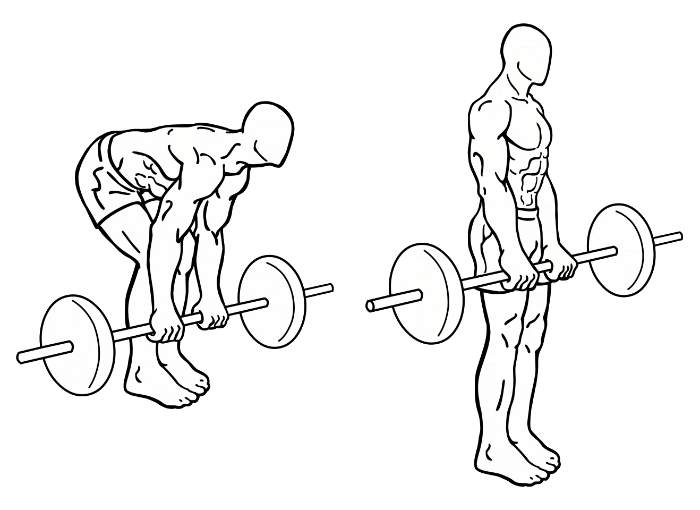
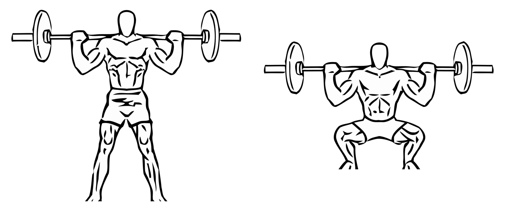
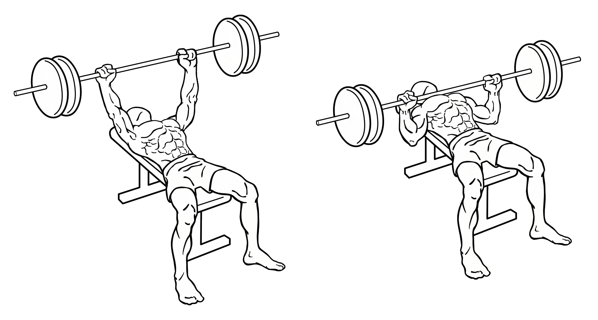

# Increase muscle mass

Muscle mass, like fat mass, is a reflection of work and focus you put into your body. Where a balanced body-fat percentage shows you didn't make bad decisions, muscle mass says you put work into making good ones. Muscle mass is a physical expression of willpower and hard work. It is a reminder to yourself that your actions have a lasting impact.

**Principles to increase muscle mass**

1. Verify that you actually want more muscle rather than less fat
2. Trigger muscle growth with resistance training
3. Modify diet to support muscle growth

**In this chapter**

- What exercises are commonly recommended (both for men and women)
- How to choose your training weight
- Dietary guidelines for muscle development
- How to distinguish high quality from low-quality protein
- How a handful of writers made me ashamed I took 'broscience' fitness advice

## Verify that you actually want more muscle

Keep in mind that most people don't want more muscle, but rather desire greater muscle definition. Many obese people have plenty of muscle mass. The goal there is to reduce fat. For this purpose see the weight loss section.

Before deciding on any course of action, be sure what your goals are. If you want to look in shape, usually losing weight through diet is the best course of action. That doesn't mean you shouldn't do exercise, but rather that you shouldn't rely on exercise alone to look more fit.

**General advice**

- Focus on good technique
- Use free weights where possible
- Rest is as important as training, do not overtrain
- Use the principles of the weight loss section to control fat levels

## Gaining muscle: 2 variables

To increase your lean muscle mass there are many very effective techniques. They all rely on two basic variables:

1. Trigger muscle growth
2. Supply relevant nutrients

Any training program that supplies both of the above will yield results. There isn't one 'good' way of working out for muscle gain. There are however many bad ways.

## Trigger muscle growth with resistance training

Triggering muscle growth is simple in principle. You want to send your muscles the signal that they are not sufficient. Exhausting your muscles by doing heavy things basically gives the signal: "I had to fight/run for my survival and these muscles were barely sufficient".

By stretching your limits in exercise you tell your body to activate the set of genes that cause the growth of muscles. Some people have genes that respond very sensitively to certain stimuli, meaning a little exercise shows a great result. Others need a heavier stimulus.

### Choosing your workout

What matters in choosing your workout is that you train your muscles in a way that exhausts them. Particularly, we're not looking for cardio exhaustion (like stationary bikes) but rather muscle exhaustion (resistance/weight training).

A good workout:

- Trains muscle groups
- Exhausts muscles
- Is safe for long-term usage

In general, it pays off to do exercises that train multiple muscles at the same time. An example would be performing deadlifts rather than a lower-back only machine. Not only does it mean you target more muscles at once, but it also keeps the muscle growth in balance with the muscles in its functional vicinity.

For muscle growth, an important factor is exhaustion. The more you work your muscles to the 'I can not do this any longer' point the more you're triggering the signal to grow. There is some nuance in this as overtraining is counterproductive. This mostly pertains to workout frequency rather than workout intensity though.

Safety is of prime importance. If you do an exercise irresponsibly, you will, in the best case, prevent yourself from working out for a while and in the worst case cause permanent injury. Keep in mind that:

1. Technique comes first
2. Weight and muscle failure come second

To compile your workout, the easiest is usually to ask a personal trainer at your gym to help you out. Often you will as you go along learn more and more about fitness and begin to tweak your workout as you go along. There are some recommendations to get you started in the 'getting started' section later in this chapter.

**Suggested exercises** 

Note: there are many other great approaches, for example with kettlebells. The same principle applies: train till (near) exhaustion of muscles as long as you can maintain proper technique.

What matters here is exhausting your muscles with short and intense exercise. For most people talking to a personal trainer at a gym is the best idea (often a single consult is free). There are many good and bad trainers out there. If you think your trainer doesn't suit you, change to a different one.

| Exercise | Target |
| -------- | ------ |
| Deadlift | Back, arms, legs |
| Barbell squat | Legs, butt, back |
| Bench press | Arms, chest |

The below illustrations show you the basic movements of these exercises[^The images were taken from [Everkinetic](http://db.everkinetic.com/) under the [Creative Commons Attribution-ShareAlike 3.0 Unported (CC BY-SA 3.0)](https://creativecommons.org/licenses/by-sa/3.0)].

The deadlift:

The barbell squat:

The bench press:

### Choosing your weight: 5x5

A repetition (rep) is one movement (e.g., lifting a weight and putting it down). A set is the number of times you do a rep.

A guideline often used is the 5x5, a detailed example of such an exercise plan can be found on the [Stronglifts website](https://stronglifts.com/5x5/). In essence:

- Find a weight where you can do 2 sets of 5 well
- Do 5 sets of 5 reps
- The last 2 sets or so you should just not be able to make 5 (remember, technique comes first!)

The moment you can do 5 sets of 5 reps, up your weight.

Note that this is just one of the many approaches you can take, many of which will get you results. The important thing to note is that hypertrophy (the technical term for muscle cell size increase) is mostly a volume game. More repetitions with more weight means more results. One example of a popular (and effective) philosophy is to not use 5x5 but sets with more repetitions (eight to twelve repetitions for example).

## Modify diet to support muscle growth

The second factor is feeding your body the building blocks it needs to grow muscle. In simple terms: proteins. There is a lot of nuance there that has to do with bioavailability and amino acid makeup, but in essence, it comes down to consuming sufficient high-quality protein.

Muscles are primarily composed of muscle fibres, which are protein structures. When your body is triggered to generate more muscle by exercise, it also needs to get nutrients to work with.

There are two classifications of protein intake that matter when building muscle:

1. Timed protein consumption (less important)
2. Total protein consumption (more important)

Bodybuilders tend to fixate on eating protein before, during and after a workout. The idea is that exercise causes the body to become catabolic (breaking down muscle) and it needs protein to turn anabolic (building muscle) again.

> From research on exercising while fasting we know that there is little to no loss of muscle when eating nothing for hours before, during and after a workout[^See for example [Short-term modified alternate-day fasting: a novel dietary strategy for weight loss and cardioprotection in obese adults.](https://www.ncbi.nlm.nih.gov/pubmed/19793855)].

Additionally, many try to eat meals every 2-3 hours to 'supply a constant stream of nutrients'. This again stems from the faulty idea that not supplying protein will make the body break down muscle.

> Timing protein consumption has shown to be marginally effective at best, and without benefit at worst[^See [The effect of protein timing on muscle strength and hypertrophy: a meta-analysis](https://jissn.biomedcentral.com/articles/10.1186/1550-2783-10-53)].

If you want to be a full-time bodybuilder, go ahead and eat meals every few hours. If you are a regular human gaining muscle, don't worry too much about meal timing. Good rules of thumb are:

- Eating some protein after a workout is good, but not doing it is no issue
- Eating protein every few hours only is marginally better for muscle growth
- Having an adequate total protein intake is what really matters

**Suggested dietary practices**

| Factor | Recommendation |
| ------ | -------------- |
| Calories | Calculate your BMR, add calories you expend in exercise (unless you are aiming for weight loss). |
| Protein intake | Minimum 1.4 times lean body mass. This is the most important. |
| Protein type | High DIAAS score. This is important. See the protein quality section below |
| Protein timing | Regular if possible, max 40 grams per consumption. This is not a high priority. |
| Food types | Low GI, see weight loss section. |

### Choosing your protein intake

There are two factors in determining your dietary makeup for the sake of muscle development:

- Caloric intake
- Protein intake

From the weight loss section we know that the base metabolic rates for humans are about:

- 370 + ( 21.6 x Lean Body Mass in kg )
- Average for women: 370 + ( 14.4 x Body Weight in kg )
- Average for men: 370 + ( 17.3 x Body Weight in kg )

> For a male with an average body fat percentage (20%) weighing 78 kilos that means a BMR of 370 + (17.3 x 78) = **1719 kcal**

Make sure you eat enough when trying to gain muscle. Keep in mind your exercise expenditure and set a daily target.

The rule of thumb for protein consumption is: 1.4x your lean muscle weight in grams. For example:

> A person weighing 80kg with 15% body fat should take about 80 minus 15% (which results in lean body mass) multiplies by 1.4 = 95 grams of protein in periods of muscle gain.

If you have no way of measuring your body fat percentage you can assume the average of 25% for men and 35% for women[^See [Wikipedia page on typical body fat percentages](https://en.wikipedia.org/wiki/Body_fat_percentage#Typical_body_fat_amounts)]. This would come down to multiplying your body weight in kg by 1.05 for men and 0.91 for women to get your minimum protein consumption in grams.

The above is a rule of thumb. Keep in mind that:

- This is a game of averages, don't go manic on exact numbers
- Protein counts as calories, protein shakes too
- Eating protein without exercise will not make your muscles grow

Note that these 2 factors (calorie and protein intake) do not describe a healthy diet. That would include choosing the right amount and type of carbohydrates and fats as well. If you would like to incorporate general health guidelines, read the guidelines in the weight loss section.

### Protein quality

Not all proteins are created equal. Specifically, what matters is the ratio of amino acids and their bioavailability of the source. The currently used method to rate proteins is the *Digestible Indispensable Amino Acid Score* or DIAAS. It takes into account:

- The amino acid needs of a human
- The degree to which a protein is absorbed by humans

You can look up DIAAS tables online. In general animal source proteins (dairy, meat, eggs) are of the highest biological quality. This is why WHEY protein (dairy source) is very popular in bodybuilding.

This doesn't mean that plant proteins don't help muscle growth. However, it does mean that your body doesn't absorb them as well and might need a very diverse group of protein sources.

### The (untrue) protein absorption limit

There is a lot of untrue common sense out there. In the fitness world, it is often referred to as 'broscience'. While it usually doesn't cause any explicit harm, it often tells people to do silly things.

For example, there is no limit to the amount of protein the body can consume in one meal, so no it's not 40 grams. This mantra stems from a misinterpretation of a study that found that 20-40 grams of protein was the most optimal per-meal consumption amount to stimulate muscle growth.

Later studies have found that the body is perfectly capable of absorbing far above 40 grams in one meal. An extreme example is that people who eat one meal a day absorb the protein from their huge meals just fine.

A side note to this issue is that there is a piece of 'common knowledge' that states that higher protein intake leads to kidney stones. A randomized controlled trial however show that this is not the case[^See [Randomized Controlled Trial of a Low Animal Protein, High Fiber Diet in the Prevention of Recurrent Calcium Oxalate Kidney Stones](https://academic.oup.com/aje/article/144/1/25/68797)], that the major impact in generating kidney stones appears to be liquid and mineral intake as confirmed by later studies[^See [Dietary Factors and the Risk of Incident Kidney Stones in Men: New Insights after 14 Years of Follow-up](http://jasn.asnjournals.org/content/15/12/3225.short), a nuance from that study is that men who are not overweight and eat a lot of protein do have an increased risk for an unknown reason.].

### Motivation and consistency

As with losing weight, things like accountability are very important. But while weight loss is an all-day endeavour, exercise is often more about routine and consistency.

For strength training, set triggers throughout the day. Try to make your home and place of work conducive to this. This might work better for some professions than others. Having a pull-up bar in the door to your office is, for example, a great way to do single-rep slow pull-ups throughout the day. Likewise, having space in your office to do a quick one-handed push-up will contribute to your consistency.

## Getting started

Two of the most important principles to remember when it comes to the body are:

1. Temporary changes cause temporary results
2. Consistency beats intensity

Both of those principles point to a single conclusion:

> Choose a simple & sustainable routine and implement it in a way you will stick to it

Too many people decide they want to change their body composition, get started and then stop two weeks later. Someone who does 10 push-ups a day for the rest of their lives will have greater results than someone who has 2 weeks of intense workouts and quits.

Do not chase instant results or over-optimization, especially when getting started. Don't compete with other gym goers for who can lift the heaviest weights. Don't start using fitness supplements unless you are at a point you are willing to call yourself a weightlifter. Don't exercise isolated muscle groups with exercises like bicep curls.

Get yourself a personal trainer or experienced gym buddy. Focus on doing well-executed movements of the following exercises:

1. Squat
2. Deadlift
3. Bench press

Focus on establishing excellent technique and a reliable routine. Lifting heavier and heavier weights is fine, but consider it a side effect of your technical training.

Simplicity. Consistency.

Once you trust yourself to have good technique and a reliable routine, optimise for muscle gain with the principles in this chapter. It may take you a week, it may take you a month. This is not a competition, it is a personal journey to reach your goals.

If you are at a point where you feel like quitting, consider having a look at motivational videos like [Even Ødegård's "Rise and shine"](https://www.youtube.com/watch?v=SuPLxQD4akQ) or [Jocko Willink's "Good"](https://www.youtube.com/watch?v=IdTMDpizis8).

## How I learned to ignore broscience

As my journey into health and fitness began (see weight loss chapter) I also started researching muscle. As any teenage boy insecure about their body will tell you, a little muscle definition never hurt anybody.

Before I knew it I was indoctrinated in the broscience world of fitness. Supplements, meal frequency, high protein diet and using my muscles to make repetitive motions. While I had some results, things were not moving as fast as I hoped.

My personal goals were to obtain:

1. Abs like Thor, please
2. Greek god chiselled muscles

While I was using my muscles very intensely (training 5-7 times a week depending on the season) I was not getting significantly closer to reaching my desired body. I was certainly in shape, but not where I wanted to be.

Enter Pavel Tsatsouline, Tim Ferriss, Martin Berkhan and Ori Hofmekler.

Pavel Tsatsouline is a strength guru who brands himself in line with his Russian background. He goes around calling people 'comrade' and generally just keeps a no-nonsense approach. He taught me through his writings that:

1. Muscle gain and muscle strength are not the same
2. You don't need a huge arsenal of equipment and exercises (squat, deadlift, bench press)
3. Kettlebells are a great one-stop shop

> Doing the perfect kettlebell swing alone is superior to 99 percent of the sophisticated strength and conditioning programs out there. *Pavel Tsatsouline*

Tim Ferriss collected a whole lot of valuable advice on all things health. For muscle gain, I was greatly inspired by the Occam's protocol. This exercise and food protocol uses 30 minutes of exercise a week to gain a lot of muscle in a very short span of time.

While I am not in favour of using this protocol in the long run, it drove home a very powerful point: time spent and results gained are **not proportional**.

> “It is possible to get huge with less than 30 minutes of gym time per week. *Timothy Ferris*

Martin Berkhan runs a blog called Leangains, and while it has been inactive for a while[^At the time of writing] it had a big impact on me. Him and Ori Hofmekler who wrote 'The Warrior Diet' showed me that broscience is wrong most of the time. 

Both of these men promote versions of intermittent fasting and time restricted eating. What they wrote went against common principles like:

- You need to eat every 3 hours for muscle gain
- Your body can only absorb x amount of protein per meal
- You should use machines for workouts
- You need to 'confuse' your muscle by rotating exercises
- Fat should be avoided
- And so on

The message from both was very encouraging: it's not all that complicated.

> Fuckarounditis is a behavioural disorder characterized by a mediocre physique and complete lack of progress, despite significant amounts of time spent in the gym. ... Fuckarounditis most commonly manifests itself as an intense preoccupation with crunches, curls, cable movements, belts, gloves, balance boards, Swiss Balls and Tyler Durden. Fear of squats and deadlifts is another distinguishing trait. Physical exertion is either completely lacking or misapplied (towards questionable or unproductive training practices).  *Martin Berkhan (Read his total 'diagnosis' [here](http://www.leangains.com/2011/09/fuckarounditis.html))*

Many of the things written by them were the precursors for my current views on food and exercise. The principles that kept coming back were:

- Eat enough but not excessive amounts of protein
- Train your muscles until failure
- Use compound exercises that train many muscles at once

Based on these principles I began to experiment on my own body and thus developed my favourite blend of exercise. For me, that meant that my goals developed and changed. I wanted:

1. Low time investment
2. Portability
3. Strength & mobility

After a while, I came to the conclusion that I have no desire to be a muscle monster. I want to be strong and have well-defined muscles. I want to be able to move heavy things, make high jumps and move fluidly.

What this has ended up in is a combination of Pavel's teachings and that of Coach Sommer[^Full name Christopher Sommer] (whose vision will be discussed further in the flexibility and mobility chapter).

I do only 10-20 minutes or so of exercise a day, consisting out of:

- One handed and one-legged push-ups
- Pistol squats
- Press handstands
- Pull-ups
- Kettlebell swings

All required a lot of training in strength and balance, but once I got there, doing an intense set of the above keeps me in good physical shape.

That said, I can't stress enough how important food is for muscle growth and general body composition. I have gone through periods of zero exercise (shame on me) where my body composition barely changed due to food choice and fasting practices.

Over time I learned the mechanisms behind the workings of hypertrophy (muscle cell increase), hyperplasia (increased muscle cell count) and strength systems. Personally, I only learned about the underlying mechanisms after I had experienced the effects firsthand.
