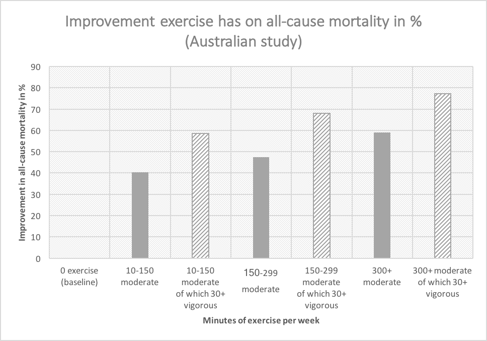
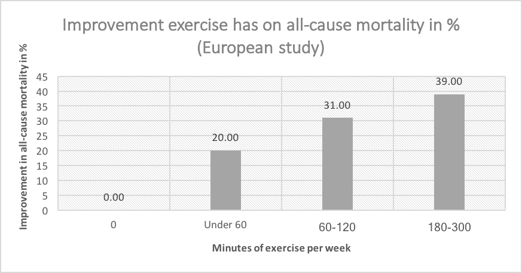

# Live longer and healthier: hormesis

Your body is your most complex and valuable possession. Its anatomy is the result of billions of years of adaptation to complex, varying and hostile environments. These adaptations to hostile stimuli are activated through a process called hormesis. You can't use language to tell your body to activate its self-preservation mechanisms, but there are other ways.

**Principles for using hormesis**

1. Hormesis is the controlled triggering of the body's defences
1. Green and black tea (and how to dose them)
1. Dose exercise for longevity
1. Extreme heat and cold exposure
1. Use different forms of fasting

**In this chapter**

- Ways to safely trigger metabolic self-defence reactions
- Different approaches to fasting for health
- Make sure you get the best time versus output for exercise
- Why I go without food for 5 days every 3 months
- The struggle of cooking bacon on an empty stomach

## Hormesis is the activation of defences

The human body evolved in nature, which can be a very hostile environment. In order to survive as a species, we've had to develop ways to deal with things like:

- Temperature exposure
- Starvation
- Strenuous muscle use
- Toxic chemicals in plants
- Radiation exposure (UV from the sun)

In order to deal with this, the human body has a host of defence mechanisms. Because defence costs energy, these mechanisms are only activated when needed. For example, if we get bombarded with radiation (sun) we develop a shield of melanin pigment (tanning). We call this process of activating defences _hormesis_.

Hormesis has 2 interesting properties:

1. It overcompensates
2. Mechanisms are generalised

The overcompensation means that a little of a stressor can cause a disproportionately strong (and beneficial) defence. The generalised mechanisms mean that the body doesn't have highly specific defences but rather a handful of areas. For example, cold exposure and heat exposure both cause the body to make heat shock proteins.

Because of these two characteristics, we can activate the body's defences with harmless stimuli. These harmless stimuli are sometimes perceived as harmful, causing the body to strengthen itself. For example, saunas (heat exposure) have been shown to decrease a number of disease risks. Likewise, exercise (muscle stress) has many benefits. Drinking tea (a toxin) too can have benefits for health and longevity.

**Hormetic responses in a controlled environment:**

| Trigger | Intensity/frequency |
| ------- | --------- |
| Sauna | More[^As measured by the number of days per week you enter the sauna] & hotter[^Commonly researched temperatures are 80 and 100 degrees celcius] appears to be better[^See [this excellent sauna breakdown](https://www.foundmyfitness.com/reports/sauna-report.pdf) by Dr Rhonda Pattrick] |
| Cold exposure | Colder is better, duration is less important[^20 seconds at 4.4 Celsius appeared equal to 2 minutes at -110 Celsius cryotherapy. See [Effects of long‐term whole‐body cold exposures on plasma concentrations of ACTH, beta‐endorphin, cortisol, catecholamines and cytokines in healthy females](http://www.tandfonline.com/doi/full/10.1080/00365510701516350)]. The minimum temperature seems to be around the 14 Celsius mark[^See [Human physiological responses to immersion into water of different temperatures](https://link.springer.com/article/10.1007/s004210050065)] |
| Intermittent fasting | Common approaches are 16/8[^16 hours of fasting per day, 8-hour eating window] and 5/2[^5 days of regular eating followed by 2 days of fasting or low caloric intake]. |
| Multi-day fasting | While water fasts are most optimal, a 5 day fast mimicking diet approach has many of the same benefits |

This chapter covers things you can expose your body to in a controlled fashion that can result in net positive effects.

## Green versus black tea

Tea is often touted as a healthy drink. It turns out that tea has a likely hormetic response that is dose-dependent. In other words, in some quantities it boosts health and in others it doesn't. A meta-analysis study that analysed 18 green and black tea studies[^See [Tea consumption and mortality of all cancers, CVD and all causes: A meta-analysis of eighteen prospective cohort studies](https://www.researchgate.net/publication/280390906_Tea_consumption_and_mortality_of_all_cancers_CVD_and_all_causes_A_meta-analysis_of_eighteen_prospective_cohort_studies)] found some interesting things:

1. Black tea had a reduced risk of **cancer** and **all-cause** mortality
2. Green tea had a reduced risk of **cardiovascular disease** and **all-cause** mortality

All-cause mortality basically refers to the odds of someone dying for any reason. If you remove some nuance:

- Green tea and black tea seem to increase lifespan
- Green tea seems to reduce cardiovascular disease risk
- Black tea seems to reduce cancer risk

Additionally, there is a dose-dependent response they found that indicates that:

1. Green tea has positive effects for 1-4 cups a day and the effect **decreases** but doesn't reverse if you drink more
2. Black tea has positive effects for 1-2 cups a day but the effect **reverses** if you drink more

The following graph shows the effect of tea dosage on all-cause mortality. Note that this graph is the result of the analysis of a larger number of studies[^It is an adaptation of the results in the aforementioned [Tea consumption and mortality of all cancers, CVD and all causes: A meta-analysis of eighteen prospective cohort studies](https://www.researchgate.net/publication/280390906_Tea_consumption_and_mortality_of_all_cancers_CVD_and_all_causes_A_meta-analysis_of_eighteen_prospective_cohort_studies)], meaning the data is far from perfect. I suspect there will not be clinical studies of tea, so this is likely to be the best information we have for a while.

One can hypothesise that there are substances in tea that are mild toxins. In a low dose these trigger our defences, in higher doses they harm us. I personally translate the above into drinking green tea during the day, with a maximum of 2 cups of black tea.

## Dose exercise for longevity

Exercise is well-known to be healthy. There are however a number of cut-off points for the effectiveness of it, at least from the perspective of longevity. Look at these all-cause mortality improvements from an Australian study[^See [Effect of Moderate to Vigorous Physical Activity on All-Cause Mortality in Middle-aged and Older Australians](https://www.researchgate.net/publication/274570742_Effect_of_Moderate_to_Vigorous_Physical_Activity_on_All-Cause_Mortality_in_Middle-aged_and_Older_Australians), the table in this book is based on table 2 in the paper.]:

| MVPA | VPA | Improvement |
| -------- | ------ | ----------------- |
| 0 | 0 | 0 |
| 10-150 | 0 | 40.4% |
| 10-150 | 30+% | 58.6% |
| 150 - 299 | 0 | 47.5%  |
| 150 - 299 | 30+% | 68%  |
| 300+ | 0 | 59% |
| 300+ | 30+% | 77.3% |

_MVPA: moderate to vigorous activity in minutes per week. VPA: vigorous physical activity as % of exercise. Improvement is relative to no exercise._

In the above study 'vigorous' activity was defined as 6 or more metabolic equivalents (METs). One MET is equivalent to sitting still. Examples of activities that exceed 6 METs are jogging (7 METs), callisthenics (8 METs) and rope jumping (10 METs).

Another study that did a meta-analysis of 6 studies across the US and Europe[^ See [Leisure time physical activity and mortality: a detailed pooled analysis of the dose-response relationship.](https://www.ncbi.nlm.nih.gov/pubmed/25844730)] and found similar results:

| Exercise | Benefit |
| ------------ | --------- | 
| 0 | 0 |
| under 60 | 20% |
| 60-120 | 31% |
| 180-300 | 39% |

_Exercise is defined as the number of minutes per week spent doing 7.5 MET exercise. The benefit is relative to doing no exercise._

The above data suggests that:

- Any exercise is **greatly** better than no exercise
- Vigorous exercise has big proportional benefits (e.g., running versus walking)
- There is a decreasing amount of benefit the more exercise you do
- Around 150 minutes a week with 30% or more of that being vigorous exercise seems to be the optimal return on investment point

I'd like to stress that doing more than 150 minutes of exercise still showed benefits, but that the benefits are less dramatic than the effect of the first few hours.

## Heat & cold exposure

This is not about food, but rather temperature stressors. The body gains a lot of benefit from controlled extreme heat exposure (sauna).

Saunas are in many countries relatively easy to implement as habits, through gyms that offer them. Benefits of saunas include both physical and mental effects. As for frequency, research so far seems to indicate that more is better. Going twice a week beats once, going 5 times beats 4 and so on[^For a well-referenced overview of benefits of sauna use see [dr Rhonda Pattrick's sauna report](https://www.foundmyfitness.com/reports/sauna-report.pdf)].

The opposite of controlled heat exposure, controlled extreme cold exposure (ice baths), also confers a number of benefits[^For a well-referenced overview of cold exposure research check out [dr Rhonda Pattrick's cold stress report](https://www.foundmyfitness.com/reports/cold-stress.pdf)].

Summarising the above two references in a table:

| Effect on body | Stressor(s) causing effect |
| ------ | -------- |
| Athletic endurance | Heat & cold |
| Increased lifespan[^In animal research and human models, it's all very experimental and not at all 100% proven] | Heat & cold |
| Heat shock protein production | Heat & cold |
| Muscle growth | Heat[^Cold when applied right after exercise actually reduces muscle growth gains] |
| Increased insulin sensitivity | Heat |
| Increased neurogenesis[^The creation of new neurons in the brain] | Heat |
| Improved cardiovascular function | Heat |
| Growth hormone release | Heat |
| Increases red blood cell count | Heat |
| Cold shock proteins | Cold |
| Reduced inflammation | Cold |
| White blood cell increase | Cold |
| Increased brown fat & thermogenesis | Cold |

## Fasting & feasting

The human body has two interesting metabolic states:

- Build new stuff
- Destroy/repair broken stuff

The building cycle is important since it is the time when we build new cells, proteins and so on. The destroy/repair state is important since broken cells and components can result in nasty things like cancer.

The caveat here is that these states can't optimally function at the same time. When the build state is dominant the repair state is less active and vice versa.

Interestingly, *eating stimulates building* and *fasting stimulates repair*. In other words, feeding your body will trigger it to use those nutrients. Not feeding your body will allow your body to repair itself on a cellular level.

- Feasting triggers growth
- Fasting triggers repair

One issue our society has is that we don't give the body enough time to enter the fasting restorative mode. We eat pretty much the whole time we're awake.

There are a number of fasting types to be aware of:

| Fasting type | Effect |
| ------------ | ------ |
| Juice fast/cleanse | This is *not* fasting. It will rest your intestines a bit but has little metabolic effect. |
| No calorie fast | Nothing with energy (caloric) content. Coffee/tea is fine, but only without sugar and milk. This is good for fasting but might reduce some of the benefits related to elevated oxidative stress. |
| Water fast | The most effective fast usually. Harder to use in regular life. |
| Full fast | No water, no food. While the purest fast the benefits compared to a water fast are not that much. |

### Ketosis

When talking about fasting we must briefly discuss ketosis. The body usually relies on a glycolytic pathway for energy. In other words, we usually run on carbohydrates. The body mostly supplies energy to the muscle and brain through blood sugar.

For many people, this is the reason they feel low when they have not eaten (low blood sugar) or when they have just eaten (blood sugar spike followed by an insulin spike). There is an alternative energy mechanism called ketosis. In this state, the body does not primarily break down carbohydrates but rather fats. Instead of using blood sugar for primary energy delivery, the body uses ketones.

Being in a state of ketosis has a host of health benefits. The list is very similar to fasting. Indeed a great deal of the benefits of fasting stem from the fact that fasting helps trigger ketosis. Entering a ketotic state is done by depriving the body of carbohydrates which can be done through a rigorous diet or through longer periods of fasting. A ketogenic diet is often over 80% fats as measured by the percentage of kcal consumed. Since longer fasts too result in ketosis they supply benefits similar to the ketogenic diet.

### The benefits of fasting

The average human body can live for 3 days without water and 3 weeks without food[^This is an average based on the survival maxim of "3 minutes without oxygen, 3 days without water, 3 weeks without food". There are actually hilarious studies where [obese people were fasted for 24 days just to see what the muscles in their forearms would do](https://www.jci.org/articles/view/106639). Gotta love 70s science.]. Fasting can either be approached as an intermittent approach (eating only 8 hours a day) or as a multi-day endeavour. On a biological level not eating for a full day is really not that extreme. One might argue that in the human hunter/gather days it was quite common to eat a lot one day (caught an animal) and nothing the next (caught no animal).

Fasting and intermittent fasting have shown a number of interesting effects on both animals and humans. Note that this is very recent research so it's all still very experimental.

So far there are strong indications for:

- Reduced risk for certain cancers
- Reduced risk of mental disease
- Increased lifespan

There are a lot of cellular and metabolic effects that you can read about online[^See my blog post [The science of fasting for longevity & health](https://www.skillcollector.com/post/i-didnt-eat-for-105-hours-science-benefits/)]. While any extreme lifestyle change should be discussed with a medical professional, there are for most people no significant health risks involved in fasting.

There is an additional caveat for women. If the fasting leads to a nutritional deficit they have a higher risk of side-effects, like hormonal and menstrual cycle dysregulation[^See [Intermittent Fasting for Women: What We Know Now](https://www.marksdailyapple.com/women-and-intermittent-fasting/)]. Potentially this is an evolutionary response where the body doesn't want to 'waste' a pregnancy in a nutrient-poor environment. If this troubles you 1) consider periodic over intermittent fasts and/or 2) if you experience side-effects, try a gentler protocol.

### Time-restricted feeding

While not strictly speaking a fasting strategy, time-restricted eating is a time-dependent method of eating. The human body has an internal clock referred to as the circadian rhythm. There are two important factors that help your body calibrate its clock:

- The first moment you are exposed to bright light
- The first moment you use your liver

Bright light is a 'sunrise' mechanism. The liver is used to digest food but is also impacted by, for example, coffee. There are strong indications that eating within a window that falls in the waking 'daylight' time (e.g., 08:00 to 20:00) has health benefits. If you would like an overview of how and why this works watch this [interview with a cancer researcher](https://www.youtube.com/watch?v=8qlrB84xp5g) and this [interview with a time restricted eating researcher](https://www.youtube.com/watch?v=-R-eqJDQ2nU).

### Intermittent fasting (daily)

It takes the body a while to enter recovery mode once you start fasting. When you eat something during a fasted state the countdown timer starts anew. In other words, if you have a juice after fasting for 5 hours, your fast is now broken and you have now fasted for 0 hours.

One approach to implementing fasting into your life is intermittent fasting. Popular approaches include:

- *The 16/8 approach* where you only eat for 8 consecutive hours a day and fast the rest of the day. For example, only eating between 16:00 and 24:00. At what times you set your window doesn't matter (caveats later on), what matters is that for 16 hours you do not eat or drink anything with caloric content. Most fasters do still consume coffee and tea without milk and sugar.
- *The 5/2 approach* in which you eat regularly for 5 days a week, but eat very little or nothing 2 days a week. While health benefits can be found with 2 days of very low on energy consumption, the body will only fully benefit if there is a period of actual fasting.
- *Alternate day fasting* is exactly what it sounds like. You eat for one day and do not eat the next.

**Template: intermittent fasting**

The most popular option (and most compatible with most people's lives) is the 16/8 approach. To get started, choose your eight-hour eating window. Keep in mind that the window needs to:

- Cover all your energy needs. E.g. 08:00 to 16:00 requires dinner before 16:00
- Be conducive to finding food. Evenings work best if you work full time and cook at home.
- Compatible with your daily routine, think work(out), social activities etc.

Other important considerations:

- Most people I know report having the best mental focus when **fasting**.
- After adjusting many people report feeling sluggish when eating too early.
- Eat the right stuff, start with a protein-rich meal (for the sake of satiety). Focus on low GI foods, see the diet section.
- Have backup food on you. E.g., always have a box of nuts with you.
- Be strict but reasonable. Yearly family brunches are a fine reason not to fast.
- Biologically eating earlier in the day is advantageous due to the circadian rhythm

### Fast mimicking diet (periodically)

This is fasting without truly fasting. Longer fasts result in more dramatic health benefits. They are however also harder to do and are not practical for certain target groups. There are, for example, indications that fasting reduces some side effects of chemotherapy[^See [fasting and cancer treatment in humans: A case series report](https://www.ncbi.nlm.nih.gov/pmc/articles/PMC2815756/)]. Having a cancer patient fast is potentially not responsible or doable though.

Dr Valter Longo pioneered a multi-day fasting approach[^See his book [The Longevity Diet](https://www.goodreads.com/book/show/35697130-the-longevity-diet)] that still allows for some nutrition, but is very selective in what one is allowed to eat. The idea is to keep the effects of fasting, while not fasting entirely.

The tenets of this approach are:

- 5 day fast
- Low caloric intake (under 1000 kcal)
- Low protein & carbohydrate (under 10% & 50%)
- High fat (over 40%)

Self-experimenters online also suggest using only high medium-chain-triglyceride oil like coconut oil as an energy source. Supplementation with salt is also advised since the body loses salt when glycogen stores are depleted during fasting.

**Template 1: 5 day fast mimicking diet**

In his book doctor Longo specifically recommends:

**Day one**

- 500 kcal from vegetables (complex carbohydrates)
- 500 kcal from healthy fat (olive oil, nuts)
- 25 grams of plant-based protein (nuts mostly)
- Multivitamin & omega-3 supplementation
- Sugarless tea (max 4 cups)
- Unlimited water

**Day 2-5**

- 400 kcal from vegetables (complex carbohydrates)
- 400 kcal from healthy fat (olive oil, nuts)
- Multivitamin & omega-3 supplementation
- Sugarless tea (max 4 cups)
- Unlimited water

**Day 6**
- Eat complex carbohydrates (e.g. vegetables)
- Minimise protein, saturated fat and sugar intake

**Template 2: Multi-day ketogenic fast mimicking diet**

This is an interpretation of the fast mimicking diet designed to support you reaching ketosis. It is a more die-hard version of a fast mimicking diet and has not been researched like the fast mimicking diet. I recommend using the above fast mimicking diet and only attempt this if you are a self-experimenter who knows what they are doing. *First off, a multi-day fast is quite extreme. Consult a medical professional if this is your first time.*

The rules are simple:

| Hours/day | Rules |
| --- | ----- |
| 24h (day 1) | Coffee, tea, max 4 tablespoon coconut oil. Tsp salt. |
| 48h (day 2) | Water. Max 2 tbsp coconut oil. Tsp salt. |
| 72h (day 3) | Water. Max 1 tbsp coconut oil. Tsp salt. |
| 98h (day 4) | Water. Max 1 tbsp coconut oil. Tsp salt. |
| 122h (day 4) | Water. Max 1 tbsp coconut oil. Tsp salt. |
| day 6 | Breakfast. |

The coconut oil is rich in medium chain triglycerides (MCT) which are easy to convert into ketones. It is recommended to buy a device to measure your blood ketones[^For example, the Abbott Freestyle Optium Neo. You need to get both glucose and ketone strips. Ketone strips are markedly more expensive than glucose ones.]. Urine strips are not very accurate.

Tips to make the most out of your fast:

- Coconut oil is rich in MCTs, but you may elect to buy the more effective c8 MCT oil (in amazon for example).
- Have things to do.
- Don't be around food if you don't have to be.
- Go for a brisk 1-hour walk on the first day (helps get into ketosis by depleting glycogen).
- If you must have coffee/tea the whole duration (suboptimal!) go for teas without antioxidants/caffeine (e.g. chamomile) and coffee without sugar/milk.

## Getting started

I personally view my hormetic responses in three categories of frequency, those being 1) daily 2) weekly and 3) periodic. That division coincidentally also separates the hormetic responses discussed in this chapter by difficulty:

1. Daily - drink tea, of which a maximum of 2 cups black and the rest green & maintain limited eating window
2. Weekly - exercise and heat exposure
3. Periodic - intense fasting

The daily habit of drinking tea is a matter of finding the right teas and having the right equipment. I highly recommend switching to loose leaf tea and trying out a bunch of different flavours. You may even elect to go to a tea tasting (which is indeed a thing).

Maintaining a limited eating window can either take the limited form of intermittent fasting (8 hours) or a more relaxed but still beneficial window of 12 hours. I recommend starting with a 12-hour window, which for most people is enough of a challenge.

Exercise is a more structural habit that people find harder to implement, but has a large impact on quality of life and overall health. As discussed in this chapter there are indications that 1) any exercise is **greatly** better than no exercise and 2) around 150 minutes a week with 30% or more as vigorous exercise seems to be the optimal input/output point. That means that no matter how small you get started you will receive benefit. Try to aim for 150 minutes a week (20 minutes a day or three 50 minute sessions) for optimal results.

The way you implement heat exposure will depend on your access to sauna facilities. If your gym has a sauna you may use it as an after-exercise routine. If not, you might have to look for local bathhouses or spa facilities. If you are serious about increasing your heat exposure I recommend making sure you have some sort of subscription to a facility with saunas, or to buy your own unit. The latter might seem extreme, but over the course of 10 to 20 years it will likely turn out to be vastly cheaper than going to a spa facility if you want to get daily heat exposure. Remember, current research seems to indicate that more is better when it comes to heat exposure for health effects.

The practice of periodic fasting (or mimicked fasting) is very powerful but harder than the above habits since it is so different from most people's idea of 'normal'. The idea of drinking tea or doing more exercise sure is a change, but fasting is not something most people are confronted with regularly. While it is not something to take lightly, it is most certainly not impossible. I feel perfectly comfortable stating that, aside from a few medical conditions, anyone is able to complete a multi-day fast. It is simply how our bodies function. I recommend doing a multi-day fast every quarter (3 months).

## The struggle of cooking bacon on an empty stomach

My latest addition to the list of hormetic triggers is a quarterly multi-day fast as described in this chapter. The biggest challenge I've experienced so far is cooking pancakes with bacon for guests while on an empty stomach for 4 days. The friends in question came over to the Netherlands and stayed over. Since I had previously promised them to bake Dutch pancakes with bacon I spent a good hour baking pancakes and bacon. Let's just say it was a great test of willpower.

Looking back at how I became such an experimenter, I can decidedly say my interest in longevity and health started early. My parents had instilled in me a great curiosity and desire to answer questions. My teachers at the time were unable to satisfy that curiosity with the cookie cutter curriculum of high school. Were I born a decade earlier that would have been that. Luckily, my last year of primary school things like computers at home and school became a thing.

At the beginning of high school, I bought a second-hand laptop (with a loan from my mother that would be paid off using my allowance). Suddenly I had unrestricted and mostly legal access to research papers I didn't understand, audiobooks I understood only 70% of (I was still learning English) and online communities discussing all sorts of things.

One of the first audio books I remember downloading and listening to was from a relatively unknown researcher who was explaining the effect of food on health and lifespan in a very in-depth way. Content like that opened up worlds my parents and teachers never could.

As time went on the internet gained more structure and my understanding of biology improved vastly. I continued to search for answers to questions that mattered to me at the time:

- How do I eat to perform best in sports?
- How do I live as long as possible?
- If medical science is so great, why are people obese?
- And so on

To my frustration, a lot of these questions had not been answered or answered in conflicting ways. After a while, a pattern did emerge, at least in some areas. Two of them were hormesis and homeostasis.

As I went through university, there was one particularly wonderful teacher (hello Andries) who taught courses on homeostasis. In essence, homeostasis is the body stabilising its internal systems. Examples include the management of heart rate to facilitate exercise, or the regulation of hormones to promote muscle growth.

What I learned in those courses was that in many cases illnesses are manifestations of a disbalance in the homeostatic systems of the body. Likewise, we encountered examples where turning a dial on the homeostatic system resulted in benefits ranging from lifespan to muscle growth or cognitive enhancement.

It was the first time the concept of hormesis clicked in my mind. The idea that you could tweak such homeostatic systems with external influences was very exciting. I started hunting for such mechanisms and discovered that many poisons and stressors in low dosages could produce a benefit. From alcohol to saunas there were a host of ways out there to tweak the balance of the body.

I feel incredibly grateful to live in a time where research and interpretation of such research has become very accessible. From podcasts like Dr Rhonda Pattrick's *foundmyfitness* to search engines like Google Scholar, I am learning more and more every year about hormetic triggers and how to use them.

Having already made myself a lab rat I went through a number of pleasant and less pleasant self-imposed experiments. My favourite addition to my daily routine was studying in a local sauna complex, which I discovered to be a hormetic trigger that supports both muscle and brain function. What I would call a lesser success is attempts to drink a glass of olive oil as a meal. I later learned you can totally pull this off with high quality imported olive oil, but that using supermarket level stuff will leave you retching over the kitchen sink.
