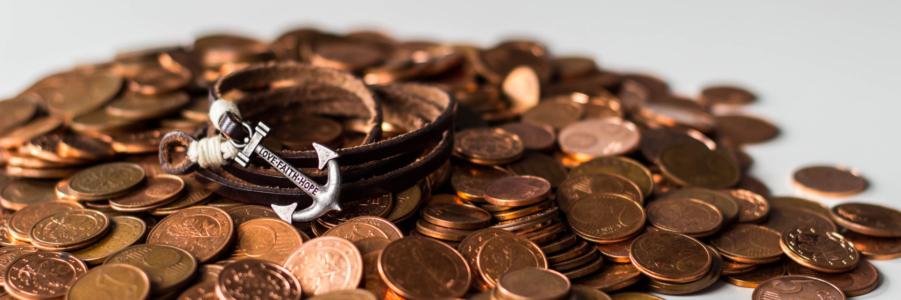

# Update your attitudes towards money

Money is one of the powerful forces that determine the rules of human societies. It is much like culture, religion and law in that it is a shared system of values and beliefs that a large group of people adhere to. And like any set of values and beliefs, understanding it will help you better navigate a society. Denying yourself a healthy relationship with money is like trying to play a game without knowing its rules. By understanding the rules of the monetary system you will learn that it is like fire, not something to fear but something to handle with caution as you harness its power.

**Principles for healthy attitudes towards money**

- Money is neutral
- Money is not a goal
- Having money doesn't make you good or bad
- Money doesn't corrupt differently than any other power
- Having money doesn't mean you robbed others
- The rich don't have an unfair advantage (anymore)

**In this chapter**

- The rich don't have an unfair advantage, those with financial literacy do
- There are evil people and good people, money has little to do with it
- Why over a hundred billionaires committed to giving their money away
- My dad accusing his bank of being broke and being right

## Money is neutral

Money is a resource. It has no brain, it has no emotions and it has no intentions. Like water, it simply flows where directed based on cause and effect. By extension, it can't be good or evil. Examine arguments that people use to call money evil or dirty and substitute money for water. Ask yourself:

- Is water evil because people drown?
- Is water evil because people are dying of thirst?
- Is water evil because it flows only in certain places?

Even though people die because of water for varying reasons, without it life as we know it could not exist. The same is true for money. Don't get me wrong, terrible things are done with and in the pursuit of money. But these are terrible acts done by humans. Terrible acts are done in equal measure for religion, respect, food and passion.

I could make a list of the benefits of money, but I think you know them. You are reading this paragraph on a medium that would not have been created without a monetary system. You have food tonight because the system of money allowed your supermarket to offer a remarkable array of products. Fantastic things like healthcare and the internet would never have arisen without a monetary value system.

There are plenty of issues in the world related to money and the global financial system. But those are not due to money, those are due to bad incentives that make people act against the interest of others. A powerful force, be it money or water, needs to be constrained for the safety of those around it. We build and maintain structures like riverbanks and dykes to prevent water from causing catastrophes. Likewise, a properly set up financial system needs checks and balances that keep those who manage money in check. How that needs to be done is a different discussion altogether. But it is a discussion about managing human actions, not about managing money.

## Money is not a goal

Seeing money as a goal is thoughtless. I have yet to meet a person who expressed a desire for money itself. Humans don't care about money but rather what they think they can get with it:

- Physical objects (car, phone, house)
- Social status (respect, admiration)
- Self-image (confidence, belonging)
- Experiences (travels, events)
- And so on

You wouldn't say your goal in life is having lots of water. Your goal is _never dying of thirst_. Likewise, your goal is never money, but rather a sufficient quantity to facilitate the things you want in your life.

One of the keys to a healthy relationship with money is examining why you are striving to earn it. It all comes down to the previous paragraph: money is just a resource. In the end, many people have similar goals:

- Not to have to work unless they want to
- To travel and see the world
- To feel secure about their survival (food, shelter, etc.)
- To have a purpose in life

In all of these things, money is not the only factor. In fact, you often need far less money than you would expect to achieve the goals above, which is what we'll cover in the coming chapters.

## Having money doesn't make you good or bad

There are people with money who do good things and there are people with money who do bad things. The money, however, is not the reason for either of their behaviour. In the majority of cases people who are generous stay generous when they have money, and people who were frugal remain frugal.

For some reason, there is a common belief that people with money are nefarious. Perhaps the source of that belief is the assumption that the only way to make money is to disadvantage others. While those cases certainly exist, as a rule, money is gained in return for something people want. In many cases, people trade their money for something they desire out of their free will.

Don't get me wrong, there are terrible situations where people are bled dry of their money and have no other viable choice than to pay. Examples of situations like those are healthcare systems that overcharge customers, or predatory loan practices.

But in the majority of cases, people spend money on things that make their life a lot better. Things that used to be incredibly challenging for a human to get. Like food, housing, education, healthcare and technology. In order for people to be able to buy those things, there need to be people offering them. By extension, for people to spend money on things, there need to be people receiving them.

That means that so long as we like having things to spend money on, the people offering them to us will receive money for them and grow wealthy. So long as those people do not abuse their position, there is nothing wrong with that (or them).

## Having money doesn't mean you robbed others

I had initially not included this perspective in this chapter since it seems so obvious to me, but in the past weeks I noticed it's a recurring theme in people with what I consider unhealthy relationships with money.

The example that comes to mind is an exchange on Twitter where a user accused Elon Musk of being an unethical hoarder of resources (money) from 'the rest of us'. Musk took the time to respond with:

> No, it means I created jobs for 50,000 people directly and, through parts suppliers & supporting professions, ~250,000 people indirectly, thus supporting half a million families. What have you done?[^See the [original tweet](https://twitter.com/elonmusk/status/1016731812159254529)]

I'm not saying that on a philosophical level any human should or should not be a billionaire, we can have very lengthy debates about that. But the fact of the matter is that money represents the value others put on your activity and service.

Every time you spend money you in essence say 'I appreciate the effort you took to provide me with this product/service'. The reason Apple (the company) makes so much money is not because they are evil, but because people willingly buy the products they create.

Note that there are most certainly cases where people are unfairly robbed of their money, but that is not fundamentally how economic systems work in most developed countries.

People who make money don't rob others, they do things that others value enough to give them money for it. This goes for small-scale entrepreneurs like your local carpenter as well as large-scale companies like Apple.

## Money doesn't corrupt any differently than any other power

It is well-known that power can have very corrupting effects on humans. Money is indeed a form of power and with that can have a corrupting influence on people. As a species, we have tremendous respect for people in positions of power who resist corruption and are down to earth and humble.  We too appreciate people with financial fortune who handle it gracefully. Did you know that Warren Buffett (one of the most successful investors in the world) whose net worth tops $85 billion still lives in the house he bought for $31,500 in 1958? That is an example of a down-to-earth and humble person, and the world respects him for it.

I can never deny that there are people who are corrupted by money and take despicable actions, but that is true of any form of power and/or authority. From doctors who abuse patients[^See the [former US gymnastics team doctor](https://www.nbcnews.com/news/us-news/larry-nassar-former-usa-gymnastics-doctor-charged-child-porn-n697231)] to fund managers hiking drug prices by a factor 56 for profit[^See [Martin Shkreli](https://en.wikipedia.org/wiki/Martin_Shkreli)], the abuse of power is quite obvious.

Some fall to corruption and some do everything in their power to improve the world. Take The Giving Pledge, an initiative that asks the ultra-rich to commit to giving away the majority of their wealth to philanthropic causes. As of 2017, a total of $733.96 billion was committed by [158 individuals](https://en.wikipedia.org/wiki/The_Giving_Pledge#Signers) like the aforementioned Warren Buffett. These are prime examples of people who want to give back to society even though their fortunes were built by being useful to humankind.

The most important thing here is that there is nothing special about money. Shunning money because it can corrupt means you should be shunning all sorts of power and authority from doctors to teachers and politicians.

## The rich don't have an unfair advantage (anymore)

The nature of compounding returns math means that the more you have, the more you will receive. On the face of it, that translates unceremoniously to "the rich get richer". The thing is that in the past the methods of gaining money the rich had access to were inaccessible to the poor. The recent decades have seen a tremendous development in financial products. While some are ticking time bombs, others open up low-risk sustainable investment vehicles of the ultra-rich to anyone with €50 or more.

- **Real estate investment** used to only be for those who have a big pile of cash ready to invest. By now we have investment vehicles called Real Estate Investment Trusts (REITs) that allow you to own a fraction of a whole bunch of buildings at a fraction of the cost.
- **The stock market** used to be a place for people with money, expertise and a high risk tolerance. Thanks to John Bogle we now have low-cost index funds. This means that entering the stock market with complex diversification and risk management is now incredibly easy and cheap.

The problem in our current system is that knowledge is not equally distributed. With the right knowledge, a couple with cubicle jobs can retire in their thirties, which is exactly the story of the internet legend [Mr Money Mustache](http://www.mrmoneymustache.com/about/) who writes about his personal tactics online. So why do the majority of people work until they have lost the most vital years of their life? Because they do not have the knowledge and systems they need.

This is not a conspiracy by "the 1%". All of the information is out there on the internet. This book is but one example where you will find the information you need. The problem is that the majority of cultures on our planet do not teach their members financial literacy. It feels a bit like the middle ages when the majority of people in western society could not read. The difference this time around is that we have the technology to rapidly teach people, this book is an attempt to use technology to popularise this knowledge.

Finally, there is the undeniable math of compound interest. The longer you let money grow, the faster it grows (we will discuss the finer details in the coming chapters). Instead of seeing this as unfair, try instead to see it as the benefit it is. It means that your own personal financial development will only get easier with time. The longer you let your money grow, the faster you will gain wealth. All you need is the right knowledge.

## Getting started

I have a number of friends who, because of the way they grew up, have what I would call unhealthy views of money. They say things like "money feels dirty" and "rich people must have disadvantaged others to get their wealth". The interesting thing is that when you examine those feelings, they are usually not based in reality. Sure, there are bad people with money. But I would venture to say that there is an equal amount of bad people without money.

When looking at your own attitudes towards money, try to finish the following statements for yourself:

- I think having money is ...
- Rich people are ...
- The idea of winning the lottery makes me feel ...
- The idea of asking for a twenty percent raise makes me feel ...

With these things in mind, ask yourself:

- What in my upbringing may have caused these attitudes?
- Are my assumptions based on actual reality/statistics?

With your background in mind, ask yourself whether your current attitudes will:

- make your life easier or harder?
- put you in a position to help others?

The best way to improve your relationship with money is to learn more about it and start taking control of it. Start maintaining a budget that makes you feel free of money worries, start investing small amounts of money just to see how it works and read more about how other people are dealing with the issue of money. As you learn more about navigating your financial life you will likely find that the reality of money differs greatly from what most people assume.

## The financial bipolarity of my parents

The attitudes of any adult are strongly linked to how they were raised and I am no different. My father is an entrepreneur down to the bone whose last job working for anyone was probably a job he had in a restaurant when he was a teenager. He grew up in the time after the largely communist Yugoslavia broke into pieces. My mother is an entrepreneurial woman but works in the Dutch education system and has been planning for retirement since I was born. Growing up, my father taught me money is just a resource and not too interesting. My mother taught me how to manage money and to plan ahead.

One of the pivotal events that compounded my fathers perspective of money came in the form of his adventures setting up a large starch processing factory in Croatia. He had secured funding through a number of parties and had built a project he was very proud of. I remember going to the opening and walking through this huge complex that was going to deliver employment for people in the region. It was a grand affair with local and international politicians who were using this project in a lesser industrially developed region as a PR opportunity.

In the time after that, the financial crisis of 2007-2008 started to destabilise a number of banks that had committed to supplying funding to my dad's project. It's quite hilarious to hear him tell the story of accusing his bank representative of not having the money to support the project. According to him they puffed their chests and assured him such an assertion was ridiculous. A short while after, the bank in question was in danger of collapse and had to be bailed out by the government of the host country.

Quite understandably, the topic of banks will trigger a monologue from my dad describing banks as corrupt institutions that should have been allowed to collapse for their greed and stupidity.

Listening only to my father could easily result in disdain for the entire financial system and a desire to see it crash and burn. But my mother has always been a balancing force to my father.  She doesn't really preach, but asks questions that make me examine the assumptions I had made:

- Do you think it is good if the retirement money of the entire population goes up in smoke?
- Remember those pictures from history class where people had cartloads of an unstable currency worth one loaf of bread?
- What do you think happens in a country where all the youth is unemployed?

She never told me what to think, but helped me build a more holistic view of money and finance. Her perspective was shaped by being on the inside of a government-funded operation like the Dutch educational system, where from day one you start building a pension for retirement. She has great faith in the ability of the government to provide for the population. And to be fair, historically the Dutch government has been very reliable in taking care of the disadvantaged, ill and elderly.

Being in the middle though I am shaped as much by my father's blatant distrust of the financial system and my mother's near blind trust in the system. I do not believe the government is making the right decisions with regards to pensions in the light of demographic change (the Netherlands has a similar issue with baby boomers as the US), but think this is a problem that improved financial structures can solve and do not require a wholesale implosion of the system.

I am grateful to my parents for exposing me to their views but have learned to go beyond their understandings by learning about the fundamental forces of the world economy. While I'm no economist or stock market wizard, I understand the majority of large forces that govern the system. By listening to the calm and generous voices of people like [Ray Dalio](https://en.wikipedia.org/wiki/Ray_Dalio), [Howard Marks](https://en.wikipedia.org/wiki/Howard_Marks_(investor)) and [Warren Buffett](https://en.wikipedia.org/wiki/Warren_Buffett) I have learned about the structure of the financial world and let it shape my personal strategies.

As time passed, I had to admit that the systems that govern our money do a lot of harm but also a lot of good. Like so many things, it's complicated.
