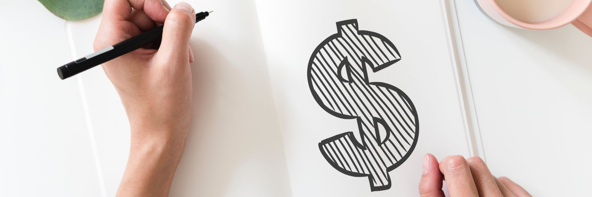

# Manage a budget

There is a unique sense of power and confidence that comes from being in control of your finances. Explicitly defining what you can safely spend takes away all fear and guilt from using your money. A good framework simultaneously makes you feel liberated and helps you save money without decreasing your quality of life.

**Principles of budgeting**

1. Chart your expenses
3. Set up multiple accounts for different purposes
4. Give money a job as soon as it comes in
5. Age your money (spend money you earned last month or longer ago)
6. Automate your finances as much as possible
7. Learn from others

**In this chapter**

- How to calculate your expenses ahead of making them
- How to channel human nature to help you with your budget
- Recommendations for automating your financial life
- How ice cream played a central role in my financial education

## Chart your expenses

Let's get one thing straight: budgeting is about freedom.

I love budgeting. It gives a feeling of control and freedom. After my monthly budget session (30 minutes) I have zero anxiety over money.

The goal of a budget is not to make you feel like you are limiting yourself. It is about being in a situation where you can spend money without the anxiety of wondering whether you can afford something.

A good budget:

- Plans for expenses (rent, food)
- Incorporates fun (a 'guilt free' budget)
- Makes you feel in control

### Certain expenses

Begin by making a list of expenses you know you reliably make on a monthly basis. For many people, this includes things like rent, food and transport.

It is of paramount importance to know exactly which financial responsibilities you have. Below is an example of my budget when I lived in Amsterdam.

| Expense | Average expenditure per month in € |
| ------- | ------------ |
| Rent (incl. gas, water, electricity) | 780 |
| Food | 400 |
| Cell phone plan | 30 |
| Healthcare insurance | 110 |
| Gym membership | 35 |
| Property insurances[^Dutch people insure pretty much everything] | 25 |
| **Total** | 1380 |

The above expenses are things I was 100% sure would be charged to my account.

### Variable expenses

The above are expenses that are out of my control to the point that I can't just decide to not pay for them for a month. Besides these, there were a number of things that were optional, but quite reliably expenses. Go through your bank statements and find patterns.

| Expense | Average expenditure per month in € |
| ------- | ---------------------------------- |
| Massages | 200 |
| Espressos | 20 |
| 'Splurge foods' | 100 |
| Total | **320** |

The above expenses are reliable enough to calculate into your budget in a flexible manner. For me personally the above translated into a monthly budget category 'wellness' of €200 and a 'guilt free spending' of €200 to account for other variable expenses.

### Create spending categories

How you categorise your expenses is up to you, what is important however is that only a very small amount of unforeseen expenses are allowed to be without a category.

For me personally, the budget looked as follows:

| Budget category | Average expenditure per month in € |
| ------- | ------------ |
| Rent (incl. gas, water, electricity) | 780 |
| Food | 400 |
| Cell phone plan | 30 |
| Healthcare insurance | 110 |
| Gym membership | 35 |
| Property insurances[^Dutch people insure pretty much everything] | 25 |
| Wellness | 200 |
| Guilt free | 120 |
| Total | **€1700** |

Based on this table I know that I need €1380 every month to survive and another €320 to do the things I love (massages, irrationally expensive tea).

The above table means that:

- Every month I knew I had (or didn't have) enough money
- I knew how much money to save to have 6 months of living expenses saved (which is a permanent savings goal I save)

### Set up multiple accounts

It is a good idea to have 3 accounts for different purposes. One called 'centre' for automated expenses (your paycheck goes here) of which the card is not in your wallet. One account called 'guilt free' which is in your wallet and contains limited money for food and fun (maximum of €200 on there per week). And one account called 'savings' for stashing money.

The centre account is very important. It is where you set up all automated expense payments. By making sure all your bills are paid automatically, rent and other expenses will never take extra effort or decision power.

The key purpose of the guilt-free card is that your wallet never contains a lot of money. Since cards entered our society your wallet has access to your full wealth and lines of credit. Before paying by card became the norm we were limited by the physical cash we had on us, we can now spend more money at once than we could ever carry in a wallet.

The savings account exists to separate your wealth from your money. Money is the stuff you spend to survive, wealth is the money you use to create freedom of choice in your life. I recommend this to contain 6-12 months of living expenses and the money you have not invested (yet).

### Give money a job as it comes in

Decisions about money and spending should be made ahead of time. This is similar to the advice not to go food shopping when you are hungry. Give your money a job as soon as it comes in and make that decision based on your financial goals.

The key here is to work with rather than against human nature. For example, *have a guilt-free category*. This category is money you can spend without justification. Don't make it too much, but enough for smaller fun expenses.

*Sharing the love* is one of my favourite categories. It is a small budget category that you can only spend on other people. From charities to taking a friend out for dinner. It's a very fulfilling (optional) budget category.

I highly suggest getting a free trial of You Need a Budget (YNAB)[^Use my [referral link](http://bit.ly/free-month-ynab) and get a free month] and giving it a shot. It has been a significantly positive effect on my financial life.

## Age your money

It is surprising how many people live paycheck to paycheck and it has little to do with the amount of income. It seems to be a human habit to want to spend the money that comes in. This is why one of your major goals should be to age your money, meaning you save money up to the point where you pay your expenses from saved money.

In other words, you should spend the money you made in the previous months, or preferably last year. Especially if you have not budgeted before this might sound impossible or undesirable. Funnily enough, once you start charting your expenses and assigning money a job as it comes it, it becomes almost natural to only spend aged money.

Spending aged money will allow you to build up larger financial buffers and as a general rule, reduced financial stress greatly. It means that you have a comfortable buffer, and if you don't have income for a month or two you are not in financial trouble.

## Automate your finances

I mentioned it before in the accounts section, there should be one account dedicated to automatic payments. It is perfectly doable to set up a structure in which the human factor (you) plays no role. By automating as many payments you will:

- Never miss a payment (and thus never fear the consequences)
- Not spend money you shouldn't
- Spend less time and energy on administration

The more you automate and refine your finances the more freedom from money you will feel. All money automation tools you need are free. Banks offer automated transfers, credit cards offer automated payments and most subscriptions can be automated as well.

## Learn from others

There are many great online and offline communities that share their fails and victories. I personally enjoy:

- The Personal Finance subreddit [r/personalfinance/](https://www.reddit.com/r/personalfinance/)
- The [YNAB Method](https://www.youneedabudget.com/method/)
- The Frugal subreddit: [r/frugal/](https://www.reddit.com/r/Frugal/)

## Getting started

Budgeting has an intimidating ring to it for many people. Luckily the reality is not at all scary, complex or painful. When setting up your budgeting structure make sure it is one you feel comfortable with. Don't cut yourself unnecessary slack, but a budget too strict to stick to makes no sense whatsoever.

Begin by charting your expenses. If this seems intimidating, start by only doing the big things:

- Food
- Shelter
- Insurance

You are of course welcome to chart everything in one go, but if you feel like it's too much effort or too confronting be sure to start small.

Once you have an overview of your expenses, set up three bank accounts:

1. **The central account:** where you receive your income, from which you will also pay big and predictable expenses like rent and insurance. The key for this account is that the card for this account is never used to pay for anything. It is only to be used for automated expenses. Set up a weekly automated transfer that sends money to your 'wallet card' described below, if you opt for monthly payment instead there is a bigger risk you will overspend and run out of food money before you planned.
2. **Hot wallet or 'guilt free' account:** of which the card is in your wallet. This card only receives money from the central account. The power of this account is that you do not need to track every expense to it. The money transferred to if from the centre account should be in balance with your budget. From there on you should feel free to use the card as you want. Don't top it up though. Especially in the beginning there will be moments where you realise the card does not have enough money to make an expense (like a coffee or dinner out), this is your budget reminding you that you previously made the rational decision not to spend money on this. It's self-protection.
3. **Savings or investing account:** your centre account should not be holding more money than it needs to. For one, you will be tempted to spend it, plus you will be missing out on interest. This third account is also where you will start building your financial independence from.

If you do nothing else, the above will probably already vastly improve your spending habits. It is however only a basic structure that does not incorporate a proper budget just yet. The next step is to choose a budgeting tool to keep track of expenses. I use [YNAB](https://www.youneedabudget.com) but there are plenty of good tools out there. The key to any successful budget implementation, in my personal opinion, is to make sure money gets a job as soon as it comes in. In practice, this means that the moment your paycheck hits your bank account you should open up your budgeting tool and categorise the money.

For example, using made up numbers: if you received €2000 in wages your first step should be to give €800 the job of rent for next month, €400 to food, and €200 to insurances. The remaining €600 is for you to divide amongst other categories. If you are saving aggressively so you can retire as soon as possible you may put €550 towards investing and €50 towards fun. Or maybe you feel more comfortable spending €200 on fun and €400 on early retirement.

The key priority is to make sure that the moment money comes in, you give it a job. When you are considering making an expense, don't open your bank account to see if you can afford it. Open your budget application instead and check if your budget allows you to buy something. If it does not, you may come to the conclusion the purchase can wait. If not, you will have to take money from one category (investments, savings, etc) and allocate it to another category. Personally, I noticed that I hate removing money from my investment budget category because I know I am sabotaging my own personal financial freedom. In the end, it leads to better decisions.

Once you get used to assigning money a job, you will notice that it feels good to build up bigger and bigger buffers for your expenses. There is an incredible amount of relief that comes from seeing that your 'rent' and 'food' categories have enough in them to survive for a number of months. It takes a while to get there for most people, but you will notice that taking money away from impulsive spending to financial freedom feels very gratifying.

Most likely you will spend half an hour or so every month updating your budget. When you do that, see if you can spot recurring purchases that you can automate into your budget. The more automated a budget is, the more fun it is to maintain.

## How ice cream shaped my financial life

My father has done a lot of entrepreneurial projects in Croatia. For the family that meant we went to visit this sunny Mediterranean country pretty much every summer. One thing that got me and my brothers in a frenzy was the difference in currency. One euro was usually the equivalent of 7 Croatian kunas. The weeks before the holiday we turned the house upside down for kunas, either those left from last holiday or pocket change my dad left lying around.

Money played an important role for us children in the holidays. We each got 10 kunas a day to spend as we saw fit. In practice, this meant it was ice cream money. It's not that my parents didn't buy us ice cream, but we didn't get to decide when they would buy us frozen deliciousness.

After having breakfast we would spend the morning arguing what was the best ice cream to get:

- The water-based ice cream sticks were cheap so we would get 5 of them
- The creamy ice creams were more expensive, often allowing only 1 a day
- The Magnums were often over 10 kunas, meaning getting one meant abstaining from ice cream for a day

Obsessing over ice cream taught me many things about managing money. Especially about balancing the desires you have right this second and how they relate to the possibility of a novel experience (or ice cream) at a later date.

Aside from teaching us the rudimentary principles of a budget, many times we ended up finding ways to make more money. Either we would bet against each other, or we would dive up pretty shells and sell them as necklaces in town.

Once we got older and had our own bank accounts, we no longer had the constraint of 10 kunas a day, but the lessons remained.

While the foundation for my current budgeting skills was laid in my childhood, it took me until university to crystallise it into a solid and specific budget system. University was an exercise similar to my childhood holidays. The Dutch government would give me a specific amount of money each month and I had to survive on it.

The first months I played by ear and mostly managed. I like being self-sufficient, so the idea of asking my parents for food money because I failed to plan properly was horrifying. I knew they would help me, but I viscerally didn't want to need help. Truth be told I had to ask for help anyway in the first year, which fuelled my desire to figure out my finances.

A world opened for me once I started really measuring my expenditures. Using apps to track my spending meant I could at the end of the month diagnose where exactly my money went and why. Not only that, but the act of recording my spending made me think twice about whether the expense was justified.

I reached my budgeting heaven when I discovered You Need A Budget (YNAB). At the time, it was still a standalone piece of software which I bought through the gaming platform steam. It's ironic that my favourite budgeting program was purchased during a game discount sale.

Using YNAB and their structure made me feel excited to do my monthly budget. Honestly, I didn't have enough money to even use the functionality to its fullest extent. I was supposed to save up enough money to cover the expenses for next month, what YNAB calls 'ageing your money'. I started saving towards it and expected to take 6 months to a year to get there.

YNAB really had an impact once I started working. By this time I had a good handle on my money, I knew my expenses and how to manage them in a predictable manner. Now that money actually started flowing in I started accumulating a buffer and even investment money. I was not making all that much, but because I had a good budgeting structure I grew my net worth quicker than any of my friends.

I learned from these developments that what worked for me was to:

- Start budgeting before you have a proper income
- Consider saving a present for your future self (I even labelled saving transactions as such)
- Set aside reasonable money for guilt-free spending

I've now solidified a budget structure I find a joy to work with. I've set aside 6+ months of living expenses so I can take my time switching jobs if I want, have money set aside to invest in different things and get to buy toys & tech without feeling guilty over it. I even have a budget category for money I can only spend on other people (thank you, Tony Robbins for that suggestion).

It was a revelation for me that budgeting doesn't have to be painful but can be fun instead.
