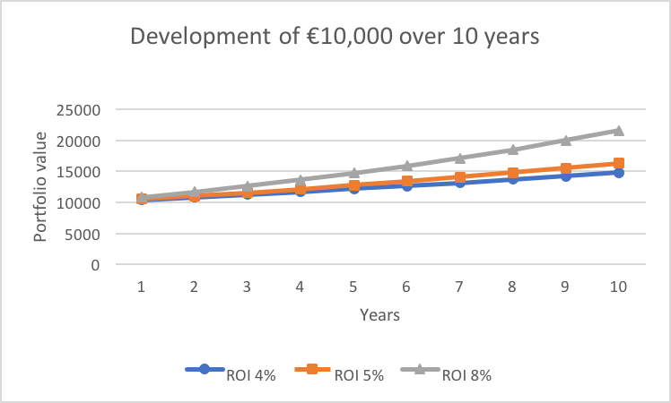

# Have your money generate money

Money is neutral. Like water, it flows where it is directed. But like water, it will slip through your fingers if you don't handle it with care. Consider investing like taking a hike in the woods. If you don't know the way and get lost you will feel afraid and confused. If you know the way and follow the path, however, the same hike will likely be relaxing and wonderful.

**Principles for investing**

1. Remove emotion from the equation
1. Find a low-cost provider of index funds & bond index funds
2. Set your profile to your age in a bond index fund and the rest in a stock index fund
3. Set up automated investing on a monthly basis

**In this chapter**

- Why the rich get richer and how you can use that to your advantage
- How investing doesn't have to be very risky
- The power of compound interest (and danger of compound fees)
- How to actually get started
- How I almost gave up on investing until I called Vanguard

## Remove emotion from the equation

Before we go into the particulars, it is important to stress the importance of logic in this process. Long-term financial planning has no place for emotionally driven decisions, it is based on making a solid plan and sticking to it.

The reality is that markets/investments go up and down. The biggest danger to any investor is making bad emotional decisions at key moments. Recessions, for example, happen every few years pretty reliably (every 1 to 10 years). They are hard and nearly impossible to predict, but it is inevitable that you will encounter them. Have a look at the [Wikipedia page for US recessions](https://en.wikipedia.org/wiki/List_of_recessions_in_the_United_States) for a little taste of how common they are.

The fact of the matter is that on the long term, these recessions don't matter all that much for disciplined investors. In fact, a recession is a great opportunity, the stock market is 'on sale' so to speak.

Remember that in the financial independence chapter we discussed that the long-term performance of a portfolio makes it safe to assume you can withdraw 4% every year. **This includes recessions**. Based on the available data, we know the best decision to make is to use proven strategies and stick to them.

There is a maxim amongst stock traders: "Sell high, buy low". Warren Buffet's "be fearful when others are greedy and greedy when others are fearful" sends a similar message. What they mean by that is that when stock prices fall in a recession, many people panic and sell their investments while disciplined and intelligent investors buy instead. Anyone with a long-term perspective knows that recessions are temporary. If you look at history you can rationally conclude that selling your investments when the stock markets go down is a terrible decision. In fact, great fortunes are made by those who invest heavily in times of crisis.

The highs and lows that occur periodically in stock markets are like seasons, only a bit less predictable. Selling your investments when things are bad is like selling your sunglasses because the weather has been dark and gloomy for a few weeks.

The short of it is that you should make the best plan you can based on logic and data and stick to it. When emotions try to convince you to deviate from that plan, ignore them.

## Buy index funds & bond index funds

Investing is basically people who have money right now giving it to people who have no money but do have the expertise/opportunity to turn money they are given now into more money at a later point. A real-world example is a real estate developer lending money because he believes building an apartment complex will net him more profit than the money he loans. Another example is a high tech startup (think Google, Tesla, Airbnb) asking investors to give them money now in exchange for the profits they will generate later (which is done through giving then shares in the company).

Let's say I have a small chicken business with 10 chickens that each produce an egg a day, which I can sell for €10 to my neighbours. That means I have a €10 daily income (€1 for every egg). This would equal 10 times 365 equals €3650 yearly revenue.

Let's say you have €1000 available to invest and believe investing in my egg business is a good idea. You offer to give me this €1000,- in return for 25% of my egg profit (which would give you 25% of €10, so €2.50 every day). In essence, you are saying that 1) you have money but not the expertise/time/will to build a business using that money but 2) believe that I will be able to build a business using your money.

> When you buy shares in a company, you are buying the rights to their profits from that moment onward.

This would give you 2.50*365 = €912.50 every year. So after 2 years, you would have €1825 which is a lot more than the €1000 you gave me. So why would I agree to trade your money for 25% of the profits? Well, perhaps I:

1. Want to buy more chickens so I make even more money (which is also good for you since you own a percentage)
2. I am short on cash and need money now rather than later
3. I took out a loan to buy the chickens, and want to pay it back

It's a silly example, but this is the basic mechanic of how the stock market operates.

The sections below will cover the essential concepts for you to start your investment journey and why:

- Low-cost index funds beat high fee mutual funds
- Stock index funds beat individual stocks
- Bond index funds beat individual bonds
- Low-cost asset providers beat investment fees of most banks

### Individual assets are risky

Let's say we buy 5 of the 100 stocks of a fictional company called Acme Incorporated. This means we own 5% of the company and have a right to 5% of their profits every year.

So long as Acme does well we will gain 5/100 = 5% of their substantial profits. But what if Acme goes bankrupt? Then we lose it all...

### Index funds for stocks

To decrease the risk of our investments, we can buy shares of an index fund instead of buying shares in a company.

> An index fund buys stocks of the top performing companies in a region/sector.

For example, the S&P 500 index fund buys shares in 500 big and reliable companies on the US market. If you buy 1 share in the S&P 500 index you, in essence, own a small portion of 500 companies.

> An index fund like the S&P 500 is basically like betting on the 500 companies that have proven to generate profits.

Why is this good? If one of the companies fails, the other 499 are still up and running. You spread your risk across many ventures without having to manage a complex share portfolio. Examples of an index 'market' are:

- Big US companies (S&P 500)
- Smaller companies that look like they will grow (Vanguard Global Small Cap)
- Sustainable companies (Sustainable Europe Index Fund)
- Companies in healthcare (Vanguard Health Care Index Fund)

Note that index funds too are not without risk and will certainly move up and down as market seasons change. They are however the easiest way to minimise your risk and make it very likely your money will grow considerably over the long-term. No investment is without risk, but as far as stocks go picking them individually is as risky and complex (if not more) as performing an open heart surgery and should be avoided by the vast majority of consumers (and in fact, many professionals should be shying away from it as well).

### Bond index funds

You can also lend money to governments and corporations. These loans are called bonds. You offer the bond issuer money right now and they promise to give you back a set amount later. Common bond issuers are governments and corporations.

> A government bond allows you to give a government money and at the end of the term (e.g., a year) they give you back more.

So what if a government can't pay you back? It has happened before (Greece, Iceland, etc.) and will certainly happen again. You can buffer against this by buying an index of bonds.

A share of a bond index means you are investing small amounts in many bonds at the same time. If you invest in a bond index you are at less risk of a government failing to pay their debts.

### Do not pay humans to pick stocks

If you decide to look at the investment marketplace you will be confronted with mutual and hedge funds. In essence, these places have humans decide what investments to put money into. In theory, it sounds great. Give your money to a professional investor and they promise to do better than a passive index fund which makes no 'intelligent' decisions.

The problem is that funds that have humans do not beat index funds over time. Sure, some of them beat index funds in some years, but over time between 90% and 100% do not beat the market. There are plenty of studies done on this[^See for example, [Does Past Performance Matter? The Persistence Scorecard](https://us.spindices.com/documents/spiva/persistence-scorecard-december-2016.pfd) or the [SPIVA scorecard](https://us.spindices.com/multimedia-center/what-is-spiva)] that always come to the same conclusion. One of the issues is that even if such a fund would beat an index fund, they pay the humans that make decisions for the company a lot of money. This means that the fees they charge you are larger than the amount they can beat the market.

Interestingly, this issue is very much known about in investment circles. Consumers new to the market though tend to fall to the sales pitches of smart sounding people in suits. If this seems far-fetched, read [Why Even Experienced Fund Managers Don't Beat The Market](http://www.businessinsider.com/why-even-experienced-fund-managers-dont-beat-the-market-2014-8) by The Economist or [How Many Mutual Funds Routinely Rout the Market? Zero](https://www.nytimes.com/2015/03/15/your-money/how-many-mutual-funds-routinely-rout-the-market-zero.html) by the New York Times.

### Why the rich get richer

When you invest, your returns will be compounded. This year you get returns on your money, next year you get returns on the returns of last year as well! **This is way more powerful than you think.**

> €100 invested in the S&P 500 in 1928 would be €328,645.87 in 2016

One could argue that the above is an extreme example, but the concept holds true. Compound interest gives you more money the longer you have it invested.

Here are some demo calculations (assuming 4% returns):

| Monthly investment | Years | Total invested | Outcome |
| ------------------ | ----- | -------------- | ------- |
| €500 | 30 | €180,000 | €349,970 |
| €500 | 40 | €240,000 | €592,959 |
| €1000 | 30 | €360,000 | €699,940 |
| €1000 | 40 | €480,000 | €1,185,918 |

The power of compound interest can hardly be overstated. You can see in the above example that 4% is already quite powerful, but from the previous chapter, we know that most countries perform between 5% and 8% over time. The difference between 4%, 5% and 8% may seem rather boring, but in reality it is life changing.

In the first few years you can see the difference start to develop:

But when we zoom out we see that the above difference grows spectacularly big the more years pass:

Compound interest is no joke. A well-invested portfolio will grow faster and faster over time.

### Fees are dangerous!

Don't take your bank/broker fees for granted.

They have a huge impact. My provider charges me a yearly fee of 0.15% for example. Have a look at the impact of fees if you invest €100,000 for 30 years with a 7% return rate.

| Invested | Fee | Outcome |
| -------- | --- | ------- |
| €100,000 | 1%  | €574,349 |
| €100,000 | 2%  | €432,194 |
| €100,000 | 3%  | €324,340 |

The difference between a fee of 1% and 3% is **over €250,000**! Take your time to find a good provider that charges low fees. it will pay off massively in the long term.

You can see the effect visually in the graph below. Note that similar to the compound return graphs, fees also compound. This means that over time they will have more and more impact.

## Age in bonds, rest in stocks

The rule of thumb for risk management is to have your age as a percentage invested in bond index funds and the rest in stock index funds. If you are 30 years old for example, you keep 30% of your investments in bond indexes and 70% in stock indexes. The reason for this is that bonds tend to be more predictable with lower returns and stocks tend to fluctuate more but offer higher potential returns.

The reasoning behind this is that when you are young you have more tolerance for fluctuations in your wealth portfolio. Historically we know recessions balance themselves out in the long run. The problem is that if you are 89 years old, you don't want to wait 10 years for the stock market to recover.

For that reason, this rule of thumb can be used to make your portfolio more predictable as you grow older.

## Set up automated investing

Humans are not good at managing emotions when it comes to money. Since the stock market is bound to go up and down, you need to make sure you buffer against making bad decisions.

### Decide on a strategy and stick to it

If, for example, there is a downturn in the financial market, you should not allow yourself to even consider selling any of your investments. Not if you set up a well-diversified strategy.

If you want to talk to a financial advisor, be sure to talk to a fiduciary, not just any financial advisor. A fiduciary is a registered professional who by law has to act in your best interest. Anyone can call themselves a financial advisor and often they get a commission on the financial products they sell you. They are basically salespeople who do not have your best interests at heart. A fiduciary on the other hand is required by law to be neutral (e.g. to not get a commission). Be sure to ask your fiduciary whether they have a dual registration as a broker as well, some of them try to circumvent the rules for fiduciaries that way.

Personally, I have created a 'Personal Investment Policy' with a number of rules. The point of such an approach is to make sure that you make investment decisions ahead of time so you don't make bad decisions in the heat of the moment. Some of my personal rules:

- 50% or more of my wealth should be in index funds (bonds/stocks based on age)
- 50% or less is allowed to be in revenue generating investments (e.g., real estate rental)
- 10% or less in speculative assets (stocks I manually pick)
- I will only consider investments with a 6% or above return
- And so on

The above is not a template for you, but an example of the conclusions I reached based on my personal risk tolerance and research.

### Find a platform

In most cases, your bank will be way too expensive to use for investment purposes. It is important to realise that there is no high or low quality of the same financial product. A share in Google is a share in Google no matter where you buy it[^Of course there are types of shares, but so long as we are talking about the same asset the place you buy it has no impact].

Most countries have a low-cost broker, also referred to as a discount broker. In Europe [DEGIRO](https://www.degiro.eu) is active in many countries. Often you can find a list of platforms by searching the internet with the query "discount broker *country*" where *country* is the country or region you are in.

### Automate your investing

You should be automating your finances as much as possible. Not only will this buffer your emotional reactions to stock market changes, but it will cause a cost averaging effect. This is sometimes called diversifying over time. The fact is that the stock market fluctuates a lot during any given year. If you invest your money once a year in one big chunk you run the risk that the time at which you bought was inopportune. By spreading out your investments you protect yourself from that scenario.

Make sure to have your investment platform deduct monthly chunks of money into your investment account. If you have no income but want to invest a chunk of savings you built over time you have two considerations. The first being putting everything on your investment portfolio at once (lump sum investing) and the other being investing it over time (dollar cost averaging or DCA). When it comes to investing a large sum you already have available, the Vanguard study [Dollar-cost averaging just means taking risk later](https://personal.vanguard.com/pdf/s315.pdf) found that in two-thirds of the time lump sum investing beats dollar cost averaging. From their summary:

> We conclude that if an investor expects such trends to continue, is satisfied with his or her target asset allocation, and is comfortable with the risk/return characteristics of each strategy, the prudent action is investing the lump sum immediately to gain exposure to the markets as soon as possible.

They do add that if an investor is more risk-averse they may choose to dollar cost average instead, with the knowledge this will cost them returns:

> But if the investor is primarily concerned with minimizing downside risk and potential feelings of regret (resulting from lump sum investing immediately before a market downturn), then DCA may be of use.

Rightfully so they remind us that making an emotion-based decision is likely to cause a reduction in returns: 

> Of course, any emotionally based concerns should be weighed carefully against both (1) the lower expected long-run returns of cash compared with stocks and bonds, and (2) the fact that delaying investment is itself a form of market-timing, something few investors succeed at.

### Balancing your risk

The first step is to find a low-cost provider of investment assets. Specifically, we are looking for parties offering index funds and ETFs (exchange-traded funds) of index funds, which are basically slices of assets. If you would buy a full chunk of an index fund you may have to pay hundreds or thousands for 1 unit. An ETF allows you to buy smaller chunks of an index. This means there is no big barrier to entry for small investors.

Since we are trying to maximally diversify our portfolio across the world's markets we are looking for 2 things:

1. A world index fund
2. A world bond index fund

There are those who will gravitate towards index funds of a specific region. Many US investors will, for example, have a larger element of their portfolio in the S&P 500 which tracks the US market. Likewise, a Japanese investor may decide to invest in the Nikkei index. This is called the "home bias", the tendency of investors to invest in their own country. The fact of the matter is that the largest level of diversification is investing in the whole planet instead of a specific country.

Based on your risk profile you can lean more towards the stock index (considered riskier but with higher payoff) or more towards the bond index (considered less risky but with lower returns).

The rule of thumb often used is:

> Invest your age in bonds and the rest in stock.

In other words, a 23-year-old would invest 23% of his/her money into a bond index fund and 77% into a stock market index fund. If you have a higher tolerance for risk you can decide to alter this ratio.

Make sure to rebalance your portfolio on a yearly basis. Meaning that if your stocks do very well and are now 90% of your portfolio, move some over into bonds to get back to the original ratio. Many investment platforms offer automated services for this.

### Rules of thumb for trust

While not accurate in all cases, usually it pays off to assume:

- Mutual funds are not worth your money since they charge high fees
- Vanguard is a trustworthy player
- Don't take advice from someone who gains commissions from things they sell you

## Getting started

In the previous chapters, you should have gotten a clear overview of how much money you want to accumulate in order to live the life you desire. This chapter should have given you a pretty clear idea of how to get started setting up your investment portfolio.

Your first step is to find a provider of low-cost index funds. This will depend greatly on the country that you reside in. The most important factors are that they 1) provide world index funds and 2) their fees are low. Low fees are generally well under 1% a year. My providers charge between 0.16% and 0.3% depending on the financial product. Take your time comparing providers, your decision will impact your trajectory greatly. Better to spend 2 weeks figuring out the best option rather than make an impulsive decision and find out years later you missed out on a lot of money because of fees.

Once you have established what provider of low-cost index funds (both bond and stock) you are going to be investing with, open an account with them. Some will allow you to do this online while others will require physical forms to be filled out. If you are confused about anything give them a call. Any provider worth their salt will have great service. If they don't they are probably no good. Once you open your account see if they offer an automatically rebalanced portfolio setup where you can specify a bond/stock ratio. If you can't find this option, call them and ask if this is possible. If not, ask their advice on how to rebalance your portfolio.

Now that your profile is set up, make sure to set a monthly automated investment amount. Be sure to balance this out with your budget. I personally have a number of automatic transfers in my budgeting software YNAB that reflect the automatic deductions my investment provider takes out of my account. I can't stress enough how important it is to automate this process. You want to set it up in such a way that you don't even notice it is happening. The only time you should be looking at it is at periodic reviews and when your income increases and you want to increase your monthly invested amount.

The idea of long-term investing is that you ride the wave of wealth generation the world's companies are producing. There will be plenty of ups and downs, just keep investing and riding that wave. Remember: you will encounter recessions. The winners will be those who calmly look at history and say 'this has happened before, and it will again'. The losers will be those that panic and deviate from their plan.

## How I learned to put my money  to work

I had just started university when the occupy movement gained traction. As I mentioned in the previous chapters, my years of university taught me a lot about money. The occupy movement popularised knowledge of all sorts of things like:

- The 1%
- The rich get richer
- Unfair banking practices

I understood very little about the underlying systems at the time. As I gradually learned more, I think I came to some conclusions that the occupy movement didn't intend.

The 1% richest in the world earn over €30,250 a year. Something a public school teacher can easily make in my country. I understood that the movement meant to point at difference within the US, but it lost some wind for me in the grand perspective of the world. I did learn that all happiness and health outcomes of a people are linked to income disparity. On all accounts, I'm happy to live in the Netherlands.

The rich get richer took me a while to internalise. It expresses that having money somehow gets you more money. It made no sense to me until I saw a graph of compound interest. Suddenly it made sense, based on basic math we can say that the more you have the more and faster you gain money. This felt like the best news ever! Who cares about the billionaires and aristocrats, you are telling me that as my life goes on I will progressively get more and more money? The race gets easier as I go along? Sign me up.

The unfairness of the banking and investing world did strike me as a fundamental disservice to humanity. As I found out about wonderful tools like low-cost index funds, I also found out most major Dutch banks charge a stupid and unfair amount of fees for you to buy financial products with them. I then discovered that this is a great time to be alive, there are multiple new players shaking up the industry with low cost and high-quality solutions (looking at you Brand New Day and Degiro).

All in all, the occupy movement firmly taught me one thing:

> I need to learn the rules of the game called "money"

In the following years, I started looking at the game of money in more detail. Soon enough I found that things were not as bad as they seemed. There was a stark contrast between two camps, the people who:

- Achieved what I wanted to achieve had simple advice
- Wanted to sell me their financial products said investing is complicated

After reading a number of books I was sold on stock and bond index funds. I had read about a company called Vanguard that offered products structured in a fair way and was determined to get started with them. I did what I thought made sense:  I called my bank to ask about the possibility to buy Vanguard ETFs.

The result was depressing. I was treated like an annoyance. As a twentysomething-year-old wanting to invest I had a few thousand euros available, which was a lot of money for me. The phone call went along the lines of this:

- Bank: "Hello, this is Bank"
- Me: "Hello, this is your customer Mentor. I would like to invest in Vanguard ETFs but can't seem to find the way to do this on your website."
- Bank: "We offer investment services through another department, how much are you wanting to invest?"
- Me: "I am just starting out and am looking to build up a solid portfolio for the coming 40 years."
- Bank: "Sigh. Well sir, I think for a person your age this is not the right avenue to explore. We like to deal with larger clients who let us manage their wealth."
- Me: "I get that and I intend to become one of those people. What are your fees?"
- Bank: "That really depends."
- Me: "Sir, I just want to know what your transaction and management fees are."
- Bank: "Sigh. That question is not so straightforward. There are many types of fees that differ per product and client."
- Me: "Can you give me an example?"
- Bank: Goes on to explain ridiculous fees.
- Me: "Thank you for your time, sir"
- Bank: Hangs up.

I was so utterly disappointed. Was this the kind of person I would have to deal with if I wanted to grow my wealth? Was the banking sector filled with dead-eyed snobbish 'advisors' that would not give me the light of day until I was a millionaire?

The day was still young, so I resolved to give the Vanguard corporation itself a call. Turns out they have an Amsterdam office. I expected to be talking to a receptionist who would connect me to an even worse banker. After all, this was the company behind the assets my bank would trade for me.

- Vanguard: "Hello this is X from Vanguard"
- Me: "Hello, my name is Mentor. I am looking to start a portfolio and have read many recommendations for Vanguard."
- Vanguard: "That is good to hear! It's always exciting when a person decides to start investing"
- Me: Confused. Is that enthusiasm? "So can I open an account with you directly?"
- Vanguard: "Ah sir, I'm afraid we don't do dealings with consumers directly in the Netherlands. We only do that in the US."
- Me: "Ok, thank you for your time"
- Vanguard: "But I'm happy to talk you through the types of products we have available in the Netherlands and their pros and cons if you would like?"
- Me: Astonished face. "Yes please."
- Vanguard: Takes a full half hour to talk me through all the options, answers all my questions in detail.
- Me: "So what company can I buy your products at?"
- Vanguard: "I'm afraid Vanguard doesn't recommend specific brokers."
- Me: "Any personal advice?"
- Vanguard: "Sure thing. I prefer working with broker Binck but have also heard good things about Brand New Day which was founded by some founders of Binck after they left. I have not heard good things about most traditional banks."
- Me: "Thank you very much for taking the time to help."
- Vanguard: "My pleasure, call back anytime."

I was astonished. This person just took 45 minutes out of his day to help a young guy who obviously is not a millionaire. That same day I called Binck and Brand New Day. Both took a great deal of time answering my questions. They gave me advice on diversification, tax structuring, lifetime cycles and all sorts of things I hadn't thought about. And neither of them tried to pressure me into buying anything.

That day I learned that there are kind and helpful people who are trying to do good in the banking industry. Sure, there are arrogant numbskulls who I imagine live up to the stereotypes the occupy movement put forth. But when I looked around, I found people doing their best to subvert the system to benefit regular people with regular incomes.

The helpful new companies did everything the advice I had received in the past years told me to do:

- Use low-cost index funds that reinvest dividends
- Have low transaction fees (a matter of looking for the lowest one)
- Automate the whole investment portfolio

The months following, I set up an automated portfolio and let my broker automatically deduct money from my account on a monthly basis. Of course, those transactions go into my budget as "present for future Mentor".
