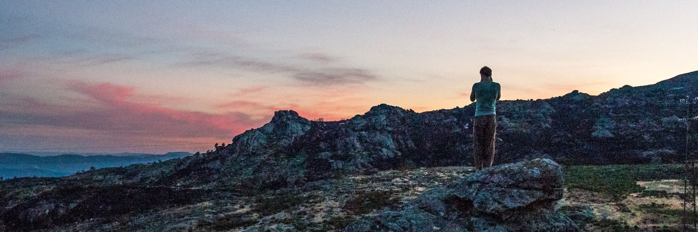

# About me

I find writing about myself and what I do very challenging. A big part of it is that the way our society tells us to present ourselves tends to not give a good picture of a person. I'll attempt to give you a few different angles and hope that it gives you a little insight into the oddball behind this book.

## Education

My primary school was a small establishment in the village right outside our city's border. My class had a size of 8 people, most of which were girls for the majority of the 8 years of Dutch primary school. In the last two years, two other boys joined, one of which became my best friend and the other my bully.

High school in the Netherlands is a very segmented system. From year one onwards you start either on a 4, 5 or 6-year track depending on what your teachers decide you are capable of. There are some standardised tests involved, but at least on paper, it is the judgement of the teacher that determines where you go. My mother asked me if I wanted to do a bilingual high school track geared towards teaching us English by having a large portion of our classes in English. I loved the idea so my mom signed me up. Later I learned this caused quite some drama in my primary school as the teachers there felt bypassed (we had to sign up before the teachers had given their advice on where to send me).

In year 4 of 6, we were required to choose between a number of 'profiles' for our continued education. Basically, it was a split between the hard sciences like math/physics and what they called 'social subjects' like economics and arts. Me and my friends came to the conclusion that with the science profiles we would be able to pursue any study/career, whereas choosing the social track would limit our options. Needless to say, we chose science over society.

Choosing what university to go to and what study to pursue was an interesting process. I was held back a grade in the 5th out of 6 years, mostly because of the strain of my parents divorcing that year. In the Netherlands there is no difference in university ranking like in the US or UK, and the majority of those studies didn't have a limit on applicants, meaning in practice you could just apply and get in (for most study programs the limits are set based on expected applications, but the spots are in most cases not scarce). When reaching the end of high school, a number of studies caught my eye, and obviously they were ones that had the most intense selection criteria. My Dutch equivalent of a guidance counsellor kept (in different words every time) telling me to set my sights lower. If anything, that made me more determined to get in. After visiting the University College in Maastricht (UCM) I had made my decision to go there. I resolved to apply until I got in. Even if it took a couple of times, which luckily it didn't.

University was a lot of fun. The structure of my degree meant I got to choose my courses every 8 weeks. Basically, there were level 1, 2 and 3 courses, where to take a level 2 you needed certain level 1's and to take a 3 you needed a number of 2's. The department was mostly social science and humanities, but they had a great selection of sciences. After I found out getting an exemption to prerequisite courses was easy to obtain if you could convince the course coordinator, I didn't take a single level 1 course in my time there. I spent most of my time learning about human biology like homeostasis, immunology and genetics. Aside from biology, I rekindled my interest in computer science with some programming and data mining courses. Due to the nature of the degree, it was mandatory to also take social science and humanities courses. I discovered I liked anthropology and spent a number of courses analysing the discourse of science and technology.

During my bachelor's degree, I learned a lot about nutrition, mostly through experimental science. I decided to do a 1-year course in nutrition on the side. I disagreed with a great part of the course but finished it anyway. At this point, I came to the conclusion that people with a degree in a certain field are not to be trusted if they can't back up their claims with solid references. At the same time, it made me more rigorous in finding solid references for the nutrition and health protocols like intermittent fasting I was reading about at the time.

After finishing my bachelor's degree, I worked for a while and decided to do a master's degree. Honestly, the primary reason I did it was because I felt like I would leave something unfinished if I didn't. I worked in Amsterdam at the time and basically filtered master's programs based on the criteria of being a science and taking max 1 year. The result was an information science degree in game studies. That year was very educational and a lot of fun. Learning about the psychology and prototyping of games was very educational, plus I got to play with toys like the latest VR headsets.

## Trampolines and martial arts

I was a very active and mobile kid. One day when I was rolling on the floor, my mother asked me if I would like to try trampolining as a sport. It turns out she had done some classes when she was little with a guy that was still teaching. Obviously, I said yes. The result was that trampolining became one of the most impactful elements in my life.

Trampolining is a bit like gymnastics, only there is less stretching and more flipping. I was doing double flips by the time I finished primary school and developed a keen aerial body awareness. My coach did not believe in recreational sports so as soon as me and my fellow trampolinists were even remotely capable of competing he sent us to do competitions. The first few years were mostly me cracking under pressure and losing pretty much all the time. There were plenty of times the competition day ended in tears. The things I had practised in training never came out the way I had intended, and while I usually had a decent difficulty score my execution was pretty shitty. I learned to use this feeling as fuel to want to get better, and through a lot of ups and downs did so.

After a couple of years, I stopped losing everything and actually started winning here and there. At this point, my coach told me to participate in international competitions. Looking back, this was one of the most enjoyable aspects of doing trampolining. We travelled around Europe to Belgium, Germany, Denmark and the United Kingdom. The competitive trampolining scene is well-developed but not huge, so after a while there were a lot of familiar faces and friendships. By the time I was mid high school I had participated in two junior world championships, one in the Netherlands and one in Canada. I never won, but ended right about in the middle. Mostly it was exciting to perform amongst the next level performers at the event. Especially the Russians and Chinese were known to take things to the next level. Though my personal favourites were always the Australians who were doing well but were mostly having fun.

While I spent most of my time trampolining, my middle brother went down the martial arts rabbit hole. He started with judo, went on to jiujitsu and ended with competitive nunchuck fighting. The same way I drew my brothers to try trampolining (which they both did for some time) he drew me and the youngest brother to try martial arts. As little boys, we often engaged in physical fights, not because we were angry but just because it seemed like fun. I did jiujitsu for a while, once a week, next to trampolining and found I enjoyed it. Between high school and university, I would go on to spend a few months in China doing kung fu, which was physically taxing but not actually that useful in combat. I've since then continued to do martial arts on and off. Ninjutsu while in university and Shorinji Kempo for a shorter period while working in Amsterdam.

## Things I get paid for

My first real job was being a waiter through a temp agency. Basically, my supplement habits at sports were cutting deep into my pocket money so I needed additional revenue. The only easy way for me to get a job was to register at a temp agency, who would send me here and there to be a waiter or to wash dishes in a restaurant. The work was not exactly fun and the hours often late, but I was proud to be generating my own money.

Towards the end of high school, I had resolved to do a gap year and was torn between kung fu in China or freediving in Thailand. I ended up going to China, which came with a price tag of about €3000. At the time this seemed like an impossible amount of money to make within a year. I couldn't say no to the challenge though and decided to go for it. I had since obtained my license to teach trampolining and gymnastics and was teaching gymnastics after school to primary school kids. It paid five times as much as my waitering jobs, though the hours I could work were limited.

What started as a once a week engagement grew to me managing three locations across three villages. In addition, I had found a company that paid €10 an hour for someone to clean houses. It was a solid three times as much as minimum wage, so I went for it. I started skipping a lot of classes in high school, but because I was above 18 and my grades were on the high end they gave me a bit more leeway. I did have a heated discussion with the department coordinator who was not happy with me. I found the school system to be ineffective and small-minded. I was juggling multiple jobs, competitive trampolining and school while this lady was threatening to expel me because I missed too many classes. I argued that my grades were better than the vast majority of the class, but she seemed to prefer the letter of the rules to their spirit (it ended up ok). In the end, I managed to get the money together, though it pushed my physical and mental limits. 

In university, I decided that I preferred being paid money for my skill rather than my time. I registered as a freelancer and started selling websites and online stores. This was also the period of time where I started my funded company. Me and a friend participated in a program called 3 Day Startup where over a weekend we were challenged to think of an idea, prototype it and pitch it to investors. I had, for a while, been walking around with the idea of a USB stick that performed computer maintenance. It was born out of the fact that family members would constantly ask me to speed up their computers, and me being annoyed at doing such a repetitive task. I convinced some other attendees to work on it with me. This resulted in an investment that allowed us to launch CleanPC. It was not a commercial success, but one of the most educational experiences I've had. I made all the mistakes I now know beginners to make. The founders of the company were pretty much strangers I had met during a weekend, we had no vesting structure for our company shares and the skillset of the team was not balanced at all. This experience helped me avoid mistakes later in my career and I think back fondly to this time.

After graduating from my bachelor's degree I noticed that while I was trained in biology/anthropology, the job market seemed to value my programming skills more, so that is what I started developing more. I went from working for other people as a programmer and business consultant to freelancing as a teacher for programming boot camps and schools. I noticed that I very much enjoy teaching and figuring out how to help others understand things that I had taken a long time to learn. My first teaching engagement grew from "hey, can you come give a workshop?" to teaching for half a day 5 days a week. The other half of the day I was finishing up my master's. Looking back I seem to have a habit of periodically having a year where I do multiple full-time engagements. It again pushed my limits and taught me how to deal with getting up at 6 and getting home at 8 while still spending time on staying healthy and happy.

## So what do you do?

By now I have no idea how to explain what I do. I was trained as a biologist, anthropologist and information scientist but make my money by teaching, coding and writing. In the meantime, I spend a lot of time engineering my finances to build towards full financial freedom.

If a programmer asks me what I do I answer I'm a full stack developer who enjoys working with node.js and react.js. If an entrepreneur asks me what I do I tell them about my previous companies that include CleanPC and a number of VPN projects, some of which I sold and others I still run. If a scientist asks me what I do I tell them that I regularly read studies related to human disease, ageing and longevity. If I'm not sure who is asking, I tend to say I'm a programmer since they stop asking questions after that.

I honestly have no idea 'what I do' currently. I like to think I'm having fun building things I think should exist.