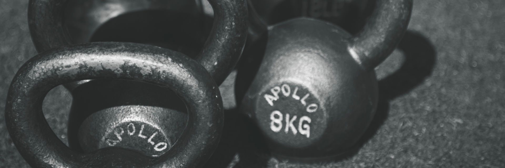
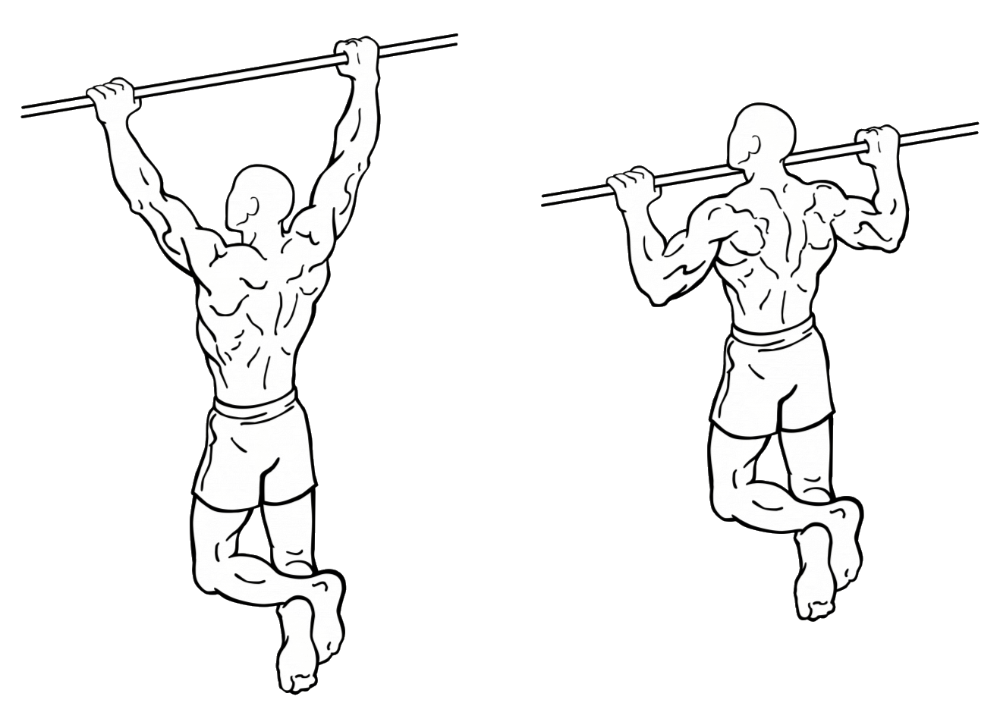

# My health habits

This section details the habits and techniques I have chosen to implement in my life. These are of course subject to change.

It is important to point out that I:

- chose these habits to suit my personal lifestyle & goals
- regularly add and subtract habits & routines

Another very important thing to mention is that I consider none of my choices dogma. They are very strong guidelines. For example:

- if I want a blacklisted food for a specific reason (e.g., pizza in Croatia, because childhood memories) go for it
- if I have never tried a food (e.g., visiting a new country) ignore the rules

I do have to note that these scenarios only happen a handful of times a year. And even then I simply can't handle very sweet things like cake or candy. My body and taste have adjusted to not like it.

## Food & fasting habits

The way I eat does not have a specific diet name. It is a blend of low GI diet, Paleo diet, longevity diet and personal preference.

**Element 1: what I eat**

In essence, I eat low GI/GL and have for about 10 years now. 

| Status | What | Notes |
| ------ | ---- | --- |
| Never | Added sugar | Highest GI, unbuffered by fibre. No value. |
| Never | White grains, potato | High GI, have nothing I can't get elsewhere |
| Limited | Peanut, dark grains, legumes | I used to not eat these at all but changed based on the recent publication of Dr Longo's Longevity research. |
| Limited | Fruits | Preference for berries and less sweet ones |
| Limited | Meat | Terrible for the environment[^Beef and lamb are terrible, pork is 5 times better (from the perspective of greenhouse gasses) and chicken/fish/eggs are even better than that. Dairy falls even lower on the harm scale. See [this food versus impact chart](https://www.weforum.org/agenda/2016/12/your-kitchen-and-the-planet-the-impact-of-our-food-on-the-environment)]. Fish and eggs are far better (though not perfect), I choose [asc](https://www.scsglobalservices.com/services/aquaculture-stewardship-council-asc) label farmed wish when possible. |
| Unlimited | Vegetables | Low GI, nutrients |
| Unlimited | Fish | Studies so far seem to find a 'more is better' dose/benefit relationship. I prefer farmed fish with a good sustainability rating. |
| Unlimited | Nuts | Good for health, but easy to eat too much of[^I have a multi-kilogram bucket at home so eating multiple handfuls while working is easy. While not a direct health risk it can mess up caloric intake].
| Unlimited | Eggs, fermented dairy | Eggs are a great source of all sorts of things[^And do not pose a risk to your cardiovascular health the way most people think. See [my writeup on why we believe cholesterol to be bad](https://www.skillcollector.com/post/history-of-cholesterol-research/)]. Milk poses a health risk to humans, but not when fermented[^Humans do not need cow's milk, and in fact, do worse health wise when drinking a lot of milk. Fermented milk products do not have this downside. See for example, [this analysis on health risk based on fermented and raw milk consumption](https://www.naturalmedicinejournal.com/journal/2015-02/milk-vs-fermented-milk-products-risk-mortality-and-fracture)]. |

In practice, I notice that there are certain foods I eat a lot:

- ** High-quality olive oil** has great health benefits and seems to have a 'more is better' health impact in studies I've read so far. The key for me personally is using high quality only. That means that if it does not taste good when you drink it from a glass, it is not good enough. Good oil should be aromatic and leave a slight tingling sensation in your throat. You may be tempted to think of it as expensive, but on a cost per calorie basis, it is an incredibly cheap food (especially when bought in bulk). Average daily consumption: 50-100 grams.
- **Nut mix** of walnut, almond, cashew, hazelnut and brazil nuts. I buy this per 10 kilos from an online store that has a great unsalted nut mix product. Average daily consumption: 50-100 grams.
- **100% chocolate**, preferably raw chocolate. It's one of my favourite things to have together with a dose of mixed nuts.

**Element 2: when I eat**

I have an 8-10 hour eating window each day. Usually, I work backwards from when I will eat the latest that day:

- Alone? 12:00 to 22:00
- Friends? 14:00 to 00:00
- Party? 16:00 to 02:00 (or make an exception)

Consistency in your eating window really helps you maintain your discipline and routine, but after 6 years I have no lapses anymore.

**Element 3: regular fasts**

Every 3 months I fast for 4-5 days non-stop. My goal here is to reach ketosis and maintain it in a fasted state for multiple days. See the hormesis chapter on the full health benefits of this, the short version is that it pushes the body into an extreme repair mode. Based on the fast mimicking diet research I supplement with MCT rich oil in the first days. Usually in the form of 2 teaspoons coconut oil.

An average fast looks like:

- Day 1-2: tea, 2-4 tsp coconut oil, salt
- Day 2-4: water, salt, 2 tsp coconut oil
- Rest of the days: water

The purpose of tea in the first days is to keep my mind satisfied. I am aiming to eliminate this in the coming year.

The purpose of the salt is to compensate for the salt lost during fasting. This is for me personally compounded by the fact that I take saunas.

The purpose of the coconut oil is to give my body fuel to kick into ketosis. Also, it prevents me from being too cranky.

I measure my blood levels of ketones with the Abbott Optium Neo. My average statistics look like this:

| Hours fasted | Ketone levels in mmol |
| ------------ | --------------------- |
| 24 | 0.5 |
| 48 | 1.5 |
| 72 | 3 |
| 96 | 2-4 |

The exact levels fluctuate based on how much I moved around and how much coconut oil I consumed on a given day.

## Exercise

For me personally exercise needs to be:

- Location independent
- Equipment agnostic
- Intense but not debilitating

Based on the strength and muscle maintenance principles discussed earlier in this book my daily workout is a collection of the below depending on the equipment I have available:

- One-handed and one-legged push-ups
- Pistol squats
- Press handstands
- Kettlebell swings
- Pull-ups

One-handed and one legged push-ups:

Pistol squat:

Press handstand:

Kettlebell swing:

Pull-up:

These exercises cover the strength angles most important to me and are mostly multi-muscle compound exercises.

This is complemented by the following stretch routine:

| Exercise | Pulses |
| -------- | ------ |
| Pancakes | 5 |
| Nose to knee (in pancake) | 2 x 5 per leg |
| Side stretch (in pancake) | 5 per leg |
| Achilles stretch | 5 per leg |
| Quad stretch | 2 x 5 per leg |
| Glute stretch | 5 per leg |
| Bridge (elevated feet) | 10 pushes towards hands |
| Plow stretch | 10 |

Forward pancake:

Side pancake:

Straddle side stretch:

Achilles stretch:

Reclined quad stretch:

Glute stretch:

Elevated bridge:

Knees by ears:

A pulse (see table above the images) is actively pushing down into a stretch until it is very uncomfortable but not painful. I hold this for 5-30 seconds depending on how tight I am that day.

While not entirely full body, this routine stretches the parts of my body that I know to get tense from my daily life. Ideally, this routine is preceded or followed by a sauna or other heat exposure.

## Hormesis

Strictly fasting is a form of hormesis so it would fall under this section. Aside from that, I use heat and cold regularly through:

- Cold showers
- Saunas
- Hot baths

I take cold showers in the morning to wake up. If I feel cold when waking up I'll start with a brief warm shower.

The saunas are a minimum of 20 minutes at the maximum temperature available. This is easier in infrared saunas, but I prefer the hotter Finnish variety. Ideally, I have one on a daily basis. When a sauna is not available usually a bath is (e.g., at a hotel). I don't consider sauna sessions a set part of my routine. It is nice to have, but contrary to exercise I am fine with a week without.

I regularly take a day to go to a spa with many saunas and cold plunge baths. I generally spend a full day there, preferably with a companion. Sauna establishments are very common in the Netherlands and other northern European countries. Fun fact, these places, as a rule, require you to go naked (mixed gender). It's hilarious to see my non-(northern)European friends freak out over this.

## Blood values

I regularly visit my doctor for blood checks. This is an uncommon practice in the Netherlands and I had some explaining to do before they would let me do 'frivolous' tests. For me, it was as simple as explaining that I live an aberrant lifestyle and would like to make sure my body is responding well to it. I am required to pay what my insurance does not.

The things I usually have tested are:

- Lipid panel (LDL, HDL, Triglycerides)
- Hormonal
    - TSH (thyroid)
    - Testosterone
- Vitamins & minerals
    - Vitamin D
    - Vitamin B12
    - Iron
    - Magnesium
- Haematology panel
- Predictive/directional markers
    - Homocysteine
    - Hba1c
    - C Reactive protein
    - AST

## Supplements

My primary philosophy for supplements is that they should be used for correcting deficiencies and not taken blindly. Taking supplements you don't need can lead to excesses. In some cases that is harmless, in others it is detrimental.

There are exceptions to this. Some supplements are quite harmless and can positively benefit health (or at least not impact it negatively). Personally, I take:

- Fish oil from Nordic Oils (from low food chain fish)
- Magnesium (citrate, bisglycinate, chelated)
- Lithium Orotate (just to emphasise, the 5mg dose I use is a mineral supplement, not a psychiatric drug)
- Collagen from Great Lakes (hydrolysed, flavourless)

The first has the potential to stave off declining vision (my 23andme and family history predict I will need glasses) as well as have a positive effect on mental function. The only thing to be aware of is that fish oil might be contaminated with toxins like heavy metals. Most supplements filter these out, but to be safe I tend to go with high-quality brands that preferably source the oil from smaller fish.

Magnesium is a common deficiency and many magnesium supplements are of low quality. I take different types that seem to have different effects due to the tissues they end up in. I keep a keen eye on my magnesium levels in my blood checks to make sure I don't overdo it.

Collagen is naturally found in skin and tendons. I started taking it as a way to support my tendons when I was developing my flexibility. It is not easy to measure the effect so this is the supplement that comes closest to me taking it 'blind'.

Based on my blood values, I periodically take other supplements. Mostly vitamin D since it goes a bit low in the darker months.

Take note that if a certain deficiency pops up without a clear reason (e.g., vitamin D in winter) you should have a look at your lifestyle to check if there is a clear cause.
