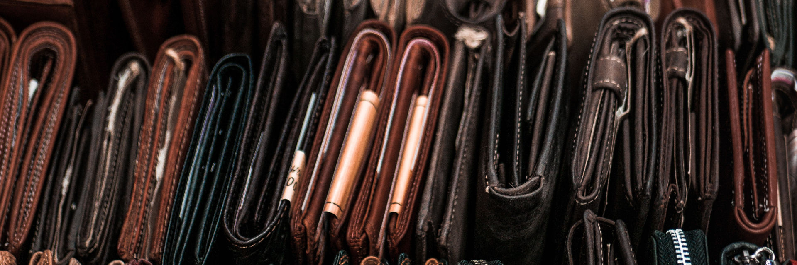

# My financial structure

Let me start by saying that finances are very specific to a person's needs and situation. The needs of a programmer living and working in South Africa is different from the same job position in Sweden.

My current setup is geared towards a life in Amsterdam. These numbers are not meant to be a recommendation. They serve as an example of the applied principles.

My financials revolve around three elements:

1. Managing money for now (budget)
2. Planning money for later (calculate needs)
3. Managing money for later (investing)

While points 2 and 3 seem linked I consider them entirely separately.

## Managing money (budget)

Human nature is part of us, so I designed my habits in such a way that it works with rather than against my nature.

### 3 bank accounts

- Wallet account
- Hub account
- Savings account

The wallet account's card is in my wallet (surprise). It never contains more than €100 or so. It should cover my daily needs of food and small sporadic spending. The key here is that anything out of the ordinary can't simply be paid from this card. If I have the impulse to buy a pair of shoes, this card should not cover that. Why? Well:

- The extra expense is now an extra hassle, making me reconsider
- I never make expenses based on money I shouldn't spend (like rent money)
- I see money as scarce since the card is not linked to my other money

It is, in essence, a self-protection measure.

The second account is the hub account. This is the account that manages bigger inflows and outflows. It takes in my income and spends regular expenses like:

- Rent
- Insurance
- Food (automatic transfer per week to my wallet card)
- Sports club membership

The key to this account is that the card is not in my wallet. It really never is. There is no expense that is too big for my limited wallet card that can't wait a few hours for me to manually transfer money from my centre to my hub account.

Another highlight is that as much as possible of my finances on this account are automated. There is no mandatory expense I have that I need to manually pay. If I drop off the map for 2 years I will never come back to a pile of checks and repo men. This has as advantages that:

- I never think about my expenses, they just happen
- I never miss a payment
- I don't feel any 'pain' paying mandatory expenses

Do note that I add all expenses in my budget and review them periodically to see if I can cut any of them down or out.

The third account is a savings account with a higher interest percentage than my hub account. The hub account holds 6 months of expenses, the rest goes into the savings account to garner some interest (even though it is quite low).

## Budgeting

I love budgeting. When I started I thought I would hate it, but it has turned into a source of pleasure for me. At no point am I in any doubt as to what I can and cannot afford, and I know exactly how long my money will last me.

I personally use You Need A Budget (YNAB) to manage my expenses. It is a very good tool for managing the week by week operation of your budget.

The YNAB principle that had the most impact on me was "give every euro a job". In other words, when money comes in I give it a category, even if that category is 'buffer'. What that means is that I started adding more money than I needed to categories like rent and food. After a few months of using it, I noticed I had 'aged my money'. I was spending the money that came in 2 months ago because the system had helped me plan ahead.

I have three sections in YNAB:

1. Obligations & survival
2. Desires
3. Investable wealth

The first contains things like rent, food, insurances and a buffer for unexpected expenses. The second (desired) was all the things I want out of life. I have chosen to include the categories:

- Wellbeing (money for massages, wellness etc)
- Guilt-free (spend on whatever, no strings)
- Sharing the love (money I can only spend on others)
- Saving goals (snowboard)
- Getaway fund (travel money)

The last category has a number of categories for different types of investments I allow myself to make (for which there are rules I have set).

## Planning money for later

This section is essential. If you don't know where you are going, you will never get there. The assumptions I work with are a 4% safe withdrawal rate[^which should according to the creator of the 4% rule be fine to live off of it indefinitely] which translates to needing 25 times your desired yearly income invested. 

Based on the prices in Amsterdam I have set up the following goals currently:

| **Stage** | **Monthly** | **Yearly** | **4% nest egg** |
| --------- | ----------- | ---------- | ----------------- |
| Survival (rent, food, insurance) | 800 + 400 + 200 = 1400 | 16.8k | 420k |
| Joyful (wellness, toys, travel) | 1400 + 300 + 300 + 200 = 2200 | 26.4k | 660k |
| The Life (megatravel, megatoys, megahouse) | 2200 + 500 + 500 + 1000 = 4200 | 50.4k | 1.26m |
| Me +1[^Me plus a partner I can sustain entirely to join my adventures] | 8200 | 100.8k | 2.52m |

## Investing money

My investment philosophy is quite straightforward and basically a copy of Warren Buffett's advice: invest your age in bonds and the rest in stocks. Of course, you should spread the risk by buying index funds of bonds and stocks instead of individual ones.

Operationally I invest with 3 parties:

- Brand New Day (index funds)
- Binck (individual stocks)
- Degiro (individual stocks)

The reason I also use stockbrokers that offer individual stocks is that I can't help myself. Like all human beings I think I have some sort of unique understanding that will help me predict the future slightly better than my neighbour. To satisfy this urge I have a small amount of play money that I am allowed to put into stocks. I consider this money lost. It's more like gambling than a long-term plan.

Brand New Day, on the other hand, is my favourite broker in the Netherlands. They offer a limited selection of index funds at exceptionally low fees. I have three accounts with them:

- World index (age in bonds rest in stocks)
- High-risk small cap and developing nation index (small amount)
- Tax-advantaged account specific to the Netherlands

Every month a set amount of my income is automatically transferred to these low-cost accounts which will keep on growing over the coming decades.
