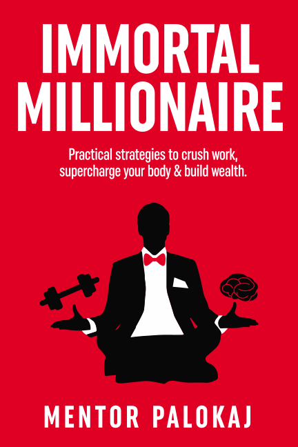

# Immortal Millionaire

[Click here to open the official Immortal Millionaire eBook website](https://immortalmillionaire.com/)

This is a book I've been meaning to write. In essence it compiles the things I wish I knew about health, productivity and finance earlier in life.

Note: this page is not very useful if you've not yet read the book. It contains the book contents in a reference format that is not very easy to read.

If you've not yet read the book [get 3 free chapters here](https://immortalmillionaire.com/) to get a taste of it.

**LICENSE**

As you can see, everything is on Github under the "Creative Commons Attribution-NonCommercial-NoDerivatives" license. This means you can read the whole book for free if you'd like. I'm selling user friendly EPUB, Amazon Kindle and PDF versions on [the official Immortal Millionaire ebook website](https://immortalmillionaire.com/).

If you have questions, requests or feedback hit me up on twitter at [@actuallymentor](https://www.twitter.com/actuallymentor).

## Table of contents

<ul>
    <li><a href="./0.0 - title page and toc.html">0.0 - title page and toc.md</a></li>
    <li><a href="./0.1 - why this book.html">0.1 - why this book.md</a></li>
    <li><a href="./0.2 - how to read this book.html">0.2 - how to read this book.md</a></li>
    <li><a href="./1.0 - form new habits.html">1.0 - form new habits.md</a></li>
    <li><a href="./1.1 - motivate yourself.html">1.1 - motivate yourself.md</a></li>
    <li><a href="./1.2 - work productively.html">1.2 - work productively.md</a></li>
    <li><a href="./1.3 - learn faster.html">1.3 - learn faster.md</a></li>
    <li><a href="./1.4 - enhance your cognition.html">1.4 - enhance your cognition.md</a></li>
    <li><a href="./2.1 - lose weight.html">2.1 - lose weight.md</a></li>
    <li><a href="./2.2 - increase muscle mass.html">2.2 - increase muscle mass.md</a></li>
    <li><a href="./2.3 - increase muscle strength.html">2.3 - increase muscle strength.md</a></li>
    <li><a href="./2.4 - develop flexibility and mobility.html">2.4 - develop flexibility and mobility.md</a></li>
    <li><a href="./2.5.1 - live longer and healthier - diet.html">2.5.1 - live longer and healthier - diet.md</a></li>
    <li><a href="./2.5.2 - live longer and healthier - blood tests and supplements.html">2.5.2 - live longer and healthier - blood tests and supplements.md</a></li>
    <li><a href="./2.5.3 - live longer and healthier - hormesis.html">2.5.3 - live longer and healthier - hormesis.md</a></li>
    <li><a href="./3.0 - update your attitudes towards money.html">3.0 - update your attitudes towards money.md</a></li>
    <li><a href="./3.1 - reach financial independence & retirement.html">3.1 - reach financial independence & retirement.md</a></li>
    <li><a href="./3.2 - manage a budget.html">3.2 - manage a budget.md</a></li>
    <li><a href="./3.3 - have your money generate money.html">3.3 - have your money generate money.md</a></li>
    <li><a href="./4.0 - about me.html">4.0 - about me.md</a></li>
    <li><a href="./4.1 - my productivity habits.html">4.1 - my productivity habits.md</a></li>
    <li><a href="./4.2 - my health habits.html">4.2 - my health habits.md</a></li>
    <li><a href="./4.3 - my financial structure.html">4.3 - my financial structure.md</a></li>
</ul>
